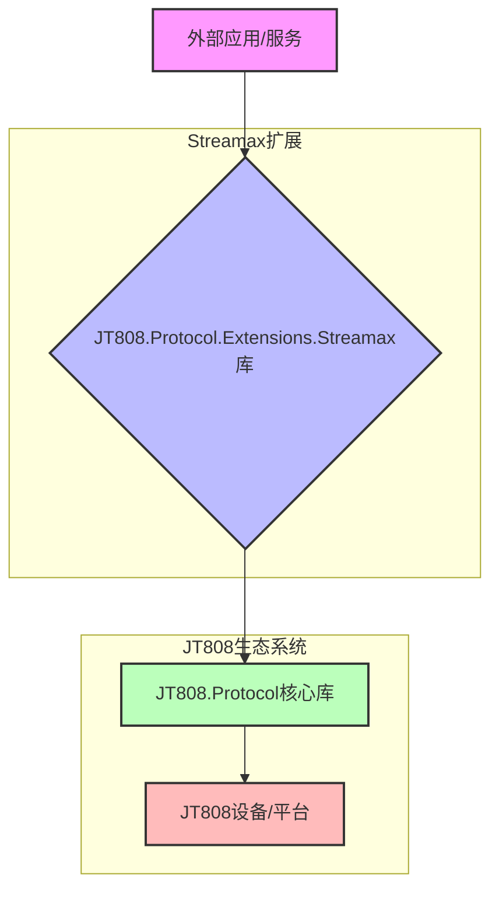
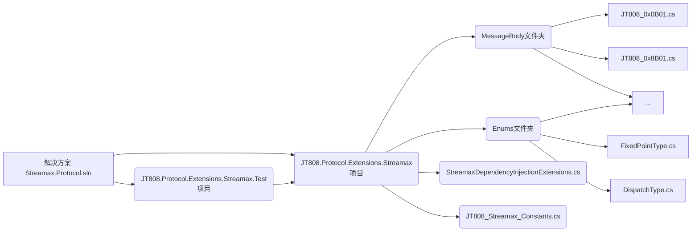
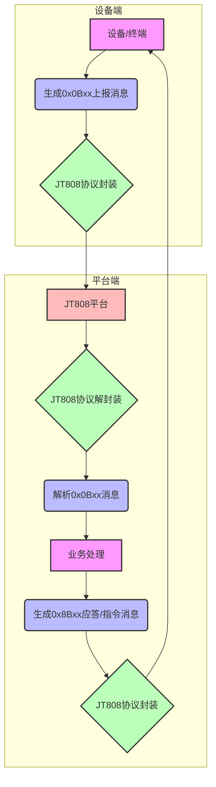

# 概述


# Streamax.Protocol 项目架构概述

## 1. 项目简介

Streamax.Protocol 项目旨在为锐明交通的 JT808 协议提供业务扩展功能，特别是针对公交业务场景。该项目是一个 C# 库，专注于定义和处理与 JT808 协议相关的特定消息体和业务逻辑，弥补了标准 JT808 协议在特定行业（如公交）应用中的不足。

*   **目的声明**：扩展 JT808 协议以支持锐明交通的公交业务特定需求。
*   **核心目标**：
    *   定义锐明公交业务所需的 JT808 扩展消息体结构。
    *   提供消息的编码、解码和处理机制（通过集成 JT808.Protocol 库实现）。
    *   简化开发人员在 .NET 环境中集成锐明公交业务协议的过程。
*   **目标受众**：使用 C#/.NET 平台开发基于 JT808 协议的公交业务相关系统的开发人员和企业。
*   **技术领域和上下文**：该项目属于物联网 (IoT) 和车载通信领域，具体涉及车辆数据传输协议（JT808）的扩展和应用。它作为一个库，通常会集成到更大的服务端或车载设备端应用程序中。

## 2. 技术架构

### 2.1 高层架构概述

Streamax.Protocol 项目的架构遵循模块化和可扩展的设计原则。它作为一个独立的 .NET 标准库，通过扩展现有的 JT808 协议框架来引入锐明交通的特定业务逻辑和消息定义。整个解决方案由一个核心库项目和一个相应的测试项目组成，以确保扩展协议的正确性和稳定性。

### 2.2 组件分解及职责

该项目主要包含以下核心组件：

*   **JT808.Protocol.Extensions.Streamax (核心库)**[^1]：
    *   **职责**：定义所有锐明公交业务扩展协议的消息体结构、枚举和常量。提供将这些自定义消息集成到 JT808 协议处理流程中的机制（如通过依赖注入）。
    *   **子组件**：
        *   `MessageBody` 文件夹[^2]：包含所有自定义 JT808 消息体（如 0x0B01, 0x8B01 等）的 C# 类定义。每个类都对应一个特定的消息 ID，定义了消息的字段、数据类型和编码规则。
        *   `Enums` 文件夹[^3]：包含协议中使用的各种枚举类型，如 `FixedPointType`, `DispatchType`, `ViolationType` 等，用于标准化协议字段的值。
        *   `StreamaxDependencyInjectionExtensions.cs`[^4]：提供依赖注入扩展方法，方便将 Streamax 协议相关的服务和配置注册到 .NET 应用程序的服务容器中。
        *   `JT808_Streamax_Constants.cs`[^5]：定义协议中使用的各种常量，如消息 ID、状态码等。
*   **JT808.Protocol.Extensions.Streamax.Test (测试项目)**[^6]：
    *   **职责**：包含核心库中所有扩展协议消息体的单元测试和集成测试。确保消息的序列化、反序列化以及业务逻辑的正确性。

### 2.3 设计模式与架构原则

*   **协议扩展模式**：通过定义新的消息 ID 和消息体结构，对现有 JT808 协议进行扩展，而不是修改其核心。
*   **依赖注入 (DI)**：通过 `AddStreamaxConfigure()` 方法支持依赖注入，使项目易于集成到 ASP.NET Core 或其他支持 DI 的应用程序中，提高了模块间的解耦性。
*   **数据结构与行为分离**：消息体类（位于 `MessageBody`）主要作为数据载体，定义协议的数据结构；具体的编码/解码逻辑可能由 JT808.Protocol 核心库处理，而扩展库则专注于结构定义。
*   **模块化**：项目结构清晰，消息体、枚举、常量等分别存放在独立的文件夹中，提高了代码的可维护性和可读性。

### 2.4 系统关系与边界

该项目作为 JT808 协议生态系统中的一个**扩展层**存在。它的边界在于处理锐明交通特有的 JT808 消息。它与 JT808.Protocol 核心库紧密集成，依赖其提供的基本协议处理能力（如封包、解包、校验等），而 Streamax.Protocol 库则在此基础上定义了具体的消息内容。



## 3. 实现细节

### 3.1 主要入口点与代码示例

该库的主要入口点是其依赖注入扩展方法，它允许开发者轻松地将 Streamax 协议相关的服务配置到应用程序中。

```csharp
// 在 Startup.cs 或程序入口处
IServiceCollection serviceDescriptors = new ServiceCollection();
serviceDescriptors.AddJT808Configure() // 注册JT808核心服务
                  .AddStreamaxConfigure(); // 注册Streamax扩展协议服务
```

此处的 `AddStreamaxConfigure()` 方法[^4]是核心库提供的一个扩展方法，负责将所有自定义消息的编解码器或相关服务注册到 `IServiceCollection` 中。

### 3.2 核心模块与实现亮点

*   **消息体定义**[^2]：`MessageBody` 文件夹下的每个 `.cs` 文件都代表一个特定的 JT808 扩展消息体，例如 `JT808_0x0B01.cs` 定义了运营登记消息的结构。这些类通常会包含 `JT808` 协议库提供的特性（Attributes）来标记字段的字节顺序、长度和编码方式。
*   **枚举定义**[^3]：`Enums` 文件夹下的枚举为协议字段提供了类型安全的定义，避免了魔法数字，增加了代码的可读性和可维护性。
*   **依赖注入扩展**[^4]：通过封装复杂的服务注册逻辑，使得用户只需要一行代码就能完成 Streamax 扩展协议的配置，极大地简化了集成过程。

### 3.3 配置方式与文件示例

项目通过依赖注入进行配置。没有显式的配置文件（如 `appsettings.json`）来配置协议本身的行为。所有的配置都在代码中通过 `AddStreamaxConfigure()` 方法进行，通常是注册消息解析器或协议处理器。

### 3.4 外部依赖与集成示例

*   **JT808.Protocol**：该项目是 JT808.Protocol 库的扩展，因此对其有核心依赖。其集成方式是在调用 `AddStreamaxConfigure()` 之前调用 `AddJT808Configure()`。
*   **NuGet**：项目以 NuGet 包的形式分发[^7]，方便其他 .NET 项目引用和管理。

### 3.5 组件关系图



## 4. 关键特性

该项目通过定义一系列特定消息，扩展了 JT808 协议在公交领域的应用。以下是主要的关键特性及其对应的消息 ID：

*   **运营登记**[^8]：
    *   **消息ID**：0x0B01
    *   **实现亮点**：定义了公交车辆上线运营时的登记信息，可能包含线路、班次等。
*   **到离站信息上报**[^9]：
    *   **消息ID**：0x0B02
    *   **实现亮点**：用于车辆到达或离开公交站点时上报相关信息，如站点ID、时间等。
*   **进出定点信息上报**[^10]：
    *   **消息ID**：0x0B03
    *   **实现亮点**：上报车辆进出特定地理定点（如调度站、停车场）的信息。
*   **违规信息上报**[^11]：
    *   **消息ID**：0x0B04
    *   **实现亮点**：上报车辆在运营过程中发生的违规行为信息。
*   **考勤**[^12]：
    *   **消息ID**：0x0B05
    *   **实现亮点**：用于驾驶员或车辆的考勤信息上报。
*   **发车通知**[^13]：
    *   **消息ID**：0x8B01
    *   **实现亮点**：服务端向车辆发送发车指令。
*   **业务变更指令**[^14]：
    *   **消息ID**：0x8B02
    *   **实现亮点**：服务端向车辆下发业务变更的指令。
*   **考勤应答**[^15]：
    *   **消息ID**：0x8B05
    *   **实现亮点**：车辆对考勤请求的应答。
*   **业务请求应答**[^16]：
    *   **消息ID**：0x8B09
    *   **实现亮点**：车辆对服务端业务请求的应答。
*   **升级通知**[^17]：
    *   **消息ID**：0x8B0A
    *   **实现亮点**：服务端向车辆发送升级通知或指令。

这些特性通过 `MessageBody` 文件夹中的 C# 类来实现，每个类都精确地映射了协议中定义的字段和数据类型。

## 5. 核心流程与机制

该项目的核心流程围绕着 JT808 协议的消息交换机制展开，主要分为两个方向：设备上报消息（0x0Bxx 系列）和平台下发消息（0x8Bxx 系列）。

### 5.1 核心业务流程

1.  **设备数据上报流程**：
    *   **触发**：公交车辆终端根据业务需求（如到达站点、检测到违规、定时上报等）生成特定消息。
    *   **消息构建**：车辆终端按照 Streamax 扩展协议的消息体定义构建二进制数据包。
    *   **传输**：通过 JT808 协议的通信链路将数据包发送到中心平台。
    *   **平台处理**：中心平台接收到数据包后，利用 JT808.Protocol.Extensions.Streamax 库解析消息，提取业务数据，并进行相应的处理（如数据入库、调度决策、告警等）。
    *   **应答**：平台可能根据业务逻辑发送应答消息给设备（如 0x8001 通用应答）。

2.  **平台指令下发流程**：
    *   **触发**：中心平台根据业务需求（如发车指令、业务变更）生成指令消息。
    *   **消息构建**：平台利用 Streamax 扩展协议的消息体定义构建二进制指令数据包。
    *   **传输**：通过 JT808 协议的通信链路将指令包发送到目标车辆终端。
    *   **设备处理**：车辆终端接收到指令包后，解析消息，执行相应的操作（如更新状态、启动业务流程）。
    *   **应答**：设备可能发送应答消息给平台（如 0x8B05 考勤应答，0x8B09 业务请求应答），表示指令执行结果。

### 5.2 流程图



### 5.3 数据转换与状态管理

由于未提供具体消息体文件内容，此部分为推测：

*   **数据转换**：消息体类会负责 C# 对象与字节数组之间的相互转换。这通常通过 JT808.Protocol 库提供的序列化/反序列化机制，结合消息体类上定义的特性（Attributes）来完成。
*   **状态管理**：项目本身作为一个协议扩展库，不直接管理业务状态。状态管理由集成该库的上位应用程序（如公交调度平台）负责。协议消息仅作为状态变更或信息上报的载体。

## 6. 结论与建议

### 6.1 架构总结与评估

Streamax.Protocol 项目成功地将锐明交通的公交业务扩展协议整合到 JT808 协议框架中。其架构清晰，模块化程度高，通过依赖注入简化了集成。项目专注于协议的消息体定义，遵循了“单一职责”原则，提高了可维护性和可测试性。

*   **优点**：
    *   **清晰的职责划分**：消息体、枚举和常量分离，易于理解和维护。
    *   **易于集成**：通过 `AddStreamaxConfigure()` 依赖注入扩展，简化了在 .NET 应用中的集成。
    *   **测试覆盖**：独立的测试项目确保了协议消息的正确性。
    *   **可扩展性**：通过添加新的消息体类，可以方便地扩展新的业务协议。

### 6.2 识别的优势与最佳实践

*   **命名规范**：文件和类命名清晰，与 JT808 消息 ID 对应，便于查找和理解。
*   **NuGet 分发**：作为 NuGet 包提供，遵循了 .NET 生态系统的最佳实践，方便版本管理和引用。
*   **协议导向设计**：项目围绕协议消息展开，结构紧凑，目标明确。

### 6.3 潜在改进领域

*   **详细文档**：虽然 README 提供消息对照表，但缺乏每个消息体内字段的详细描述（如字段含义、数据范围、编码规则等），这通常需要在每个消息体类的代码注释中或独立的协议文档中提供。
*   **示例丰富性**：除了基本的 DI 注册，可以提供更多关于如何构建和解析具体消息的完整端到端示例，尤其是在涉及复杂字段（如位域、数组）时。
*   **错误处理策略**：作为协议库，可以考虑提供更丰富的错误码或异常处理机制，以指导集成方更好地处理协议层面的错误。

### 6.4 增强建议与下一步

*   **加强内部文档**：在每个消息体类中添加详细的 XML 注释，解释每个字段的含义、数据类型和约束，便于其他开发者理解和使用。
*   **提供高级使用示例**：针对特定复杂消息（如 0x0200_0x14 视频相关报警）提供更详细的 C# 示例代码，展示如何填充所有字段并进行编码/解码。
*   **性能考量**：对于高并发或高性能要求的场景，可以探索消息体序列化/反序列化的性能优化（尽管这可能更多依赖于 JT808.Protocol 核心库）。

---
[^1]: [核心库项目文件](https://github.com/lishewen/Streamax.Protocol/tree/master/JT808.Protocol.Extensions.Streamax)
[^2]: [消息体文件夹](https://github.com/lishewen/Streamax.Protocol/tree/master/JT808.Protocol.Extensions.Streamax/MessageBody)
[^3]: [枚举文件夹](https://github.com/lishewen/Streamax.Protocol/tree/master/JT808.Protocol.Extensions.Streamax/Enums)
[^4]: [依赖注入扩展文件](https://github.com/lishewen/Streamax.Protocol/blob/master/JT808.Protocol.Extensions.Streamax/StreamaxDependencyInjectionExtensions.cs)
[^5]: [常量文件](https://github.com/lishewen/Streamax.Protocol/blob/master/JT808.Protocol.Extensions.Streamax/JT808_Streamax_Constants.cs)
[^6]: [测试项目文件](https://github.com/lishewen/Streamax.Protocol/tree/master/JT808.Protocol.Extensions.Streamax.Test)
[^7]: [NuGet 包](https://www.nuget.org/packages/JT808.Protocol.Extensions.Streamax/)
[^8]: [运营登记消息体](https://github.com/lishewen/Streamax.Protocol/blob/master/JT808.Protocol.Extensions.Streamax/MessageBody/JT808_0x0B01.cs)
[^9]: [到离站信息上报消息体](https://github.com/lishewen/Streamax.Protocol/blob/master/JT808.Protocol.Extensions.Streamax/MessageBody/JT808_0x0B02.cs)
[^10]: [进出定点信息上报消息体](https://github.com/lishewen/Streamax.Protocol/blob/master/JT808.Protocol.Extensions.Streamax/MessageBody/JT808_0x0B03.cs)
[^11]: [违规信息上报消息体](https://github.com/lishewen/Streamax.Protocol/blob/master/JT808.Protocol.Extensions.Streamax/MessageBody/JT808_0x0B04.cs)
[^12]: [考勤消息体](https://github.com/lishewen/Streamax.Protocol/blob/master/JT808.Protocol.Extensions.Streamax/MessageBody/JT808_0x0B05.cs)
[^13]: [发车通知消息体](https://github.com/lishewen/Streamax.Protocol/blob/master/JT808.Protocol.Extensions.Streamax/MessageBody/JT808_0x8B01.cs)
[^14]: [业务变更指令消息体](https://github.com/lishewen/Streamax.Protocol/blob/master/JT808.Protocol.Extensions.Streamax/MessageBody/JT808_0x8B02.cs)
[^15]: [考勤应答消息体](https://github.com/lishewen/Streamax.Protocol/blob/master/JT808.Protocol.Extensions.Streamax/MessageBody/JT808_0x8B05.cs)
[^16]: [业务请求应答消息体](https://github.com/lishewen/Streamax.Protocol/blob/master/JT808.Protocol.Extensions.Streamax/MessageBody/JT808_0x8B09.cs)
[^17]: [升级通知消息体](https://github.com/lishewen/Streamax.Protocol/blob/master/JT808.Protocol.Extensions.Streamax/MessageBody/JT808_0x8B0A.cs)
