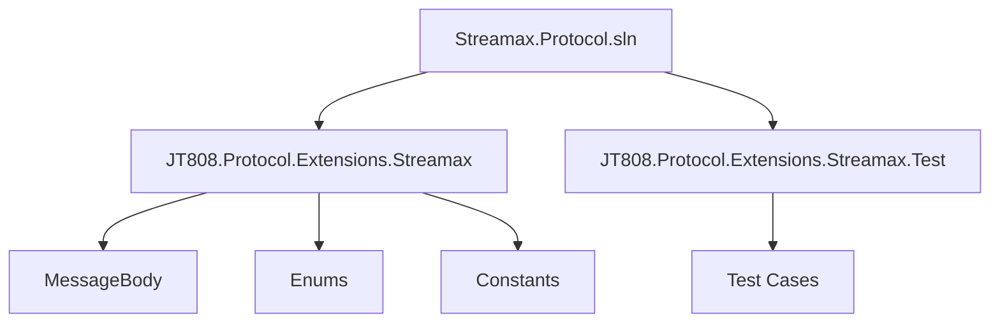
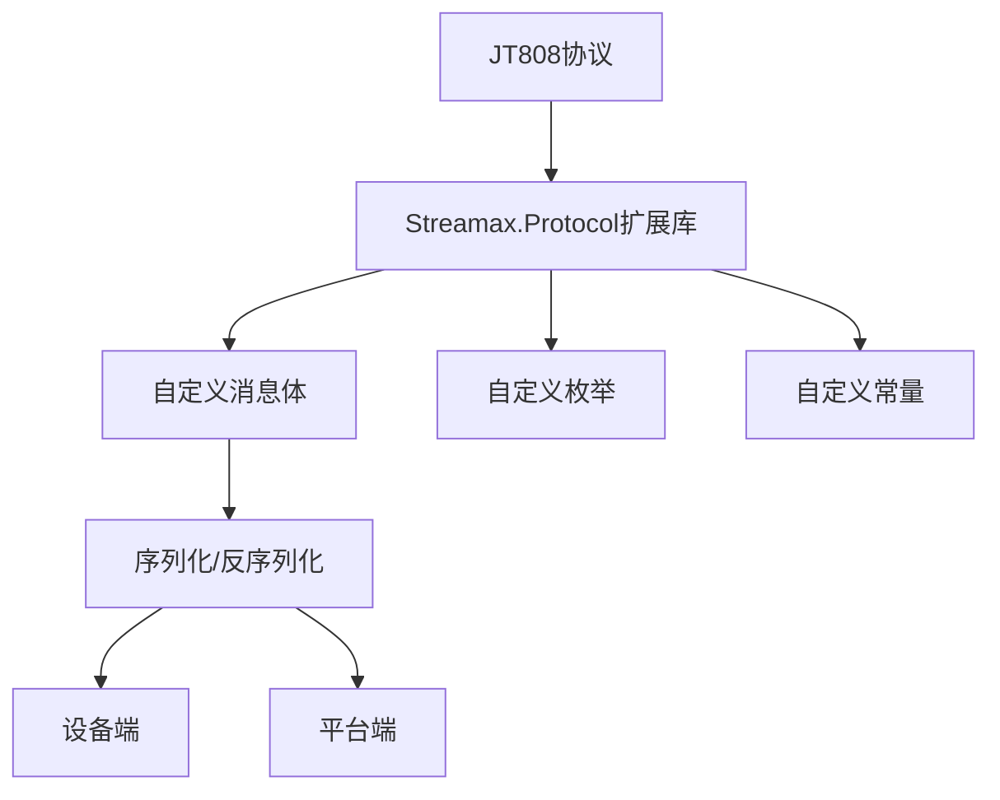
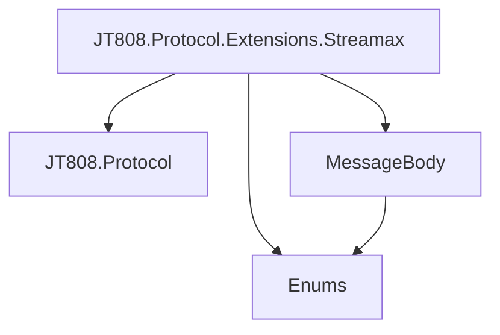

# 附录与术语表

# 附录与术语表

## 目录
1. [引言](#引言)
2. [项目结构](#项目结构)
3. [核心组件](#核心组件)
4. [架构概述](#架构概述)
5. [详细组件分析](#详细组件分析)
6. [依赖分析](#依赖分析)
7. [性能考量](#性能考量)
8. [故障排除指南](#故障排除指南)
9. [结论](#结论)
10. [附录](#附录)
    10.1. [协议参考资料](#协议参考资料)
    10.2. [术语解释](#术语解释)
    10.3. [外部链接](#外部链接)
11. [参考文献](#参考文献)

## 引言
本文档旨在为 Streamax.Protocol 项目提供全面的附录和术语表，帮助用户深入理解协议细节和相关背景知识。Streamax.Protocol 是一个基于 JT808 协议扩展的库，用于处理特定业务场景下的消息通信。

## 项目结构
该项目主要包含以下几个部分：

- **JT808.Protocol.Extensions.Streamax**: 核心库，包含了对 JT808 协议的扩展，定义了消息体、枚举和常量。
- **JT808.Protocol.Extensions.Streamax.Test**: 单元测试项目，用于验证核心库的功能。



## 核心组件

### 枚举 (Enums)
项目定义了多种枚举类型，用于表示协议中的各种状态、类型和代码。[^1]

- `AttendanceType`: 考勤方式，如员工卡考勤、输工号考勤。[^2]
- `AttendType`: 考勤类型，如上班、下班、签到。[^3]
- `DeviceAddress`: 设备地址，如车载信息终端、报站显示屏前屏。[^4]
- `DeviceErrorCode`: 设备故障编码，如卫星定位模块异常、通信模块异常。[^5]
- `DeviceType`: 设备类型，如车载信息终端、报站显示屏、路牌等。[^6]
- `DispatchType`: 调度类型，如全程、区间、放站。[^7]
- `FixedPointType`: 定点类型，如公交首末站、停车场、加油站等。[^8]
- `PointType`: 到离站类型，如到站、离站、客流。[^9]
- `RegistrationType`: 业务登记类型，如发车、进场。[^10]
- `RequestCode`: 业务请求代码，如请求排班、请求交班、请求加油等。[^11]
- `TrafficType`: 业务类型，如上行、下行、环行、进场、出场等。[^12]
- `UpdateResultCode`: 升级结果代码，如成功、连接服务器失败、验证失败等。[^13]
- `ViolationType`: 违规类型，如超速行车、低速行车、滞站等。[^14]

### 常量 (Constants)
`JT808_Streamax_Constants` 类定义了扩展协议中使用的消息ID。[^15]

- `JT808_0x0B01`: 运营登记。
- `JT808_0x0B02`: 到离站信息上报。

### 消息体 (MessageBody)
项目定义了多种消息体，用于封装不同业务场景下的数据。

- `JT808_0x0200_0x14`: 视频相关报警。[^16]
- `JT808_0x0200_0x15`: 异常驾驶行为报警详细描述。[^17]
- `JT808_0x0200_0x16`: 线路编码。[^18]
- `JT808_0x0200_0x17`: 业务类型。[^19]
- `JT808_0x0200_0xE4`: 限速值。[^20]
- `JT808_0x0B01`: 运营登记。[^21]
- `JT808_0x0B02`: 到离站信息上报，包含乘客计数项列表。[^22]
- `JT808_0x0B03`: 进出定点信息上报。[^23]
- `JT808_0x0B04`: 违规信息上报。[^24]
- `JT808_0x0B05`: 考勤。[^25]
- `JT808_0x0B06`: 校时请求。[^26]
- `JT808_0x0B07`: 行车计划请求。[^27]
- `JT808_0x0B08`: 业务登记。[^28]
- `JT808_0x0B09`: 业务请求。[^29]
- `JT808_0x0B0A`: 升级结果上报。[^30]
- `JT808_0x0B0B`: 设备故障上报。[^31]
- `JT808_0x8B01`: 发车通知。[^32]
- `JT808_0x8B02`: 业务变更指令。[^33]
- `JT808_0x8B05`: 考勤应答。[^34]
- `JT808_0x8B06`: 校时应答。[^35]
- `JT808_0x8B09`: 业务请求应答。[^36]
- `JT808_0x8B0A`: 升级通知。[^37]

## 架构概述
Streamax.Protocol 扩展库是基于 JT808 协议的，通过定义自定义消息体和枚举来扩展其功能，以满足特定的业务需求。它遵循了消息的序列化和反序列化机制，确保数据在设备和平台之间正确传输。



## 详细组件分析

### 消息体 `JT808_0x0B02` (到离站信息上报) 示例
`JT808_0x0B02` 消息体用于上报车辆到站或离站的信息，其中包含了线路编号、到离站类型、业务类型、场站站点编号、车站序号、标志字段、地理位置信息（纬度、经度、高程）、车速、方向、时间、当前乘客数、车门数以及乘客计数项列表等详细信息。[^22]

```csharp
public class JT808_0x0B02 : JT808MessagePackFormatter<JT808_0x0B02>, JT808Bodies, IJT808Analyze
{
    // ... (属性定义) ...

    /// <summary>
    /// 乘客计数项
    /// </summary>
    public struct PersonItem
    {
        /// <summary>
        /// 门编号
        /// </summary>
        public byte DoorNo { get; set; }
        /// <summary>
        /// 上客数
        /// </summary>
        public byte UpPersonCount { get; set; }
        /// <summary>
        /// 下客数
        /// </summary>
        public byte DownPersonCount { get; set; }
    }

    // ... (序列化和反序列化方法) ...
}
```

### 枚举 `TrafficType` (业务类型) 示例
`TrafficType` 枚举定义了多种业务类型，例如上行、下行、环行、进场、出场、加油、维修等。[^12]

```csharp
public enum TrafficType
{
    上班 = 0x01,
    下班 = 0x02,
    签到 = 0x03
}
```

## 依赖分析
Streamax.Protocol 扩展库主要依赖于 JT808.Protocol 库，通过实现其接口和继承其类来扩展功能。各个消息体之间相互独立，但会引用枚举类型来规范数据。



## 性能考量
该库的性能主要取决于消息的序列化和反序列化效率。通过使用 `JT808MessagePackFormatter` 和 `IJT808Analyze` 接口，库能够高效地处理消息数据。

## 故障排除指南
- **消息解析失败**: 检查消息体的定义是否与实际接收到的数据格式一致，特别是字段的顺序、长度和数据类型。
- **枚举值不匹配**: 确保使用的枚举值与协议规范中定义的值相符。
- **序列化/反序列化异常**: 检查 `Serialize` 和 `Deserialize` 方法的实现，确保正确处理了所有字段。

## 结论
Streamax.Protocol 扩展库为 JT808 协议提供了强大的功能扩展，能够满足特定业务场景下的通信需求。通过本文档提供的附录和术语表，用户可以更好地理解和使用该库。

## 附录

### 协议参考资料
- **JT/T 808-2019 道路运输车辆卫星定位系统车载终端通讯协议及数据格式**: 这是 JT808 协议的官方标准文档，详细定义了协议的各个方面。建议查阅此文档以获取最权威的信息。

### 术语解释

- **JT808 协议**: 中国交通部发布的道路运输车辆卫星定位系统车载终端通讯协议及数据格式标准。
- **消息体 (Message Body)**: 协议中用于承载具体业务数据的数据结构。
- **枚举 (Enum)**: 一组命名的常量，用于表示有限的、预定义的值集合。
- **序列化 (Serialization)**: 将数据结构或对象状态转换为可存储或传输格式的过程。
- **反序列化 (Deserialization)**: 将序列化后的数据恢复为原始数据结构或对象状态的过程。
- **GprsId (线路编号)**: 用于标识特定线路的唯一编号。
- **WorkerId (员工编号)**: 用于标识员工的唯一编号。
- **BCD (Binary-Coded Decimal)**: 二进制编码的十进制，一种用四个二进制位表示一个十进制数字的编码方式。

### 外部链接
- **JT808 协议开源实现**: [https://github.com/jt808/JT808.Protocol](https://github.com/jt808/JT808.Protocol)
- **Streamax 官方网站**: (如果存在，可在此处添加)

## 参考文献
[^1]: [Enums 文件夹](https://github.com/lishewen/Streamax.Protocol/tree/master/JT808.Protocol.Extensions.Streamax/Enums)
[^2]: [AttendanceType.cs](https://github.com/lishewen/Streamax.Protocol/blob/master/JT808.Protocol.Extensions.Streamax/Enums/AttendanceType.cs)
[^3]: [AttendType.cs](https://github.com/lishewen/Streamax.Protocol/blob/master/JT808.Protocol.Extensions.Streamax/Enums/AttendType.cs)
[^4]: [DeviceAddress.cs](https://github.com/lishewen/Streamax.Protocol/blob/master/JT808.Protocol.Extensions.Streamax/Enums/DeviceAddress.cs)
[^5]: [DeviceErrorCode.cs](https://github.com/lishewen/Streamax.Protocol/blob/master/JT808.Protocol.Extensions.Streamax/Enums/DeviceErrorCode.cs)
[^6]: [DeviceType.cs](https://github.com/lishewen/Streamax.Protocol/blob/master/JT808.Protocol.Extensions.Streamax/Enums/DeviceType.cs)
[^7]: [DispatchType.cs](https://github.com/lishewen/Streamax.Protocol/blob/master/JT808.Protocol.Extensions.Streamax/Enums/DispatchType.cs)
[^8]: [FixedPointType.cs](https://github.com/lishewen/Streamax.Protocol/blob/master/JT808.Protocol.Extensions.Streamax/Enums/FixedPointType.cs)
[^9]: [PointType.cs](https://github.com/lishewen/Streamax.Protocol/blob/master/JT808.Protocol.Extensions.Streamax/Enums/PointType.cs)
[^10]: [RegistrationType.cs](https://github.com/lishewen/Streamax.Protocol/blob/master/JT808.Protocol.Extensions.Streamax/Enums/RegistrationType.cs)
[^11]: [RequestCode.cs](https://github.com/lishewen/Streamax.Protocol/blob/master/JT808.Protocol.Extensions.Streamax/Enums/RequestCode.cs)
[^12]: [TrafficType.cs](https://github.com/lishewen/Streamax.Protocol/blob/master/JT808.Protocol.Extensions.Streamax/Enums/TrafficType.cs)
[^13]: [UpdateResultCode.cs](https://github.com/lishewen/Streamax.Protocol/blob/master/JT808.Protocol.Extensions.Streamax/Enums/UpdateResultCode.cs)
[^14]: [ViolationType.cs](https://github.com/lishewen/Streamax.Protocol/blob/master/JT808.Protocol.Extensions.Streamax/Enums/ViolationType.cs)
[^15]: [JT808_Streamax_Constants.cs](https://github.com/lishewen/Streamax.Protocol/blob/master/JT808.Protocol.Extensions.Streamax/JT808_Streamax_Constants.cs)
[^16]: [JT808_0x0200_0x14.cs](https://github.com/lishewen/Streamax.Protocol/blob/master/JT808.Protocol.Extensions.Streamax/MessageBody/JT808_0x0200_0x14.cs)
[^17]: [JT808_0x0200_0x15.cs](https://github.com/lishewen/Streamax.Protocol/blob/master/JT808.Protocol.Extensions.Streamax/MessageBody/JT808_0x0200_0x15.cs)
[^18]: [JT808_0x0200_0x16.cs](https://github.com/lishewen/Streamax.Protocol/blob/master/JT808.Protocol.Extensions.Streamax/MessageBody/JT808_0x0200_0x16.cs)
[^19]: [JT808_0x0200_0x17.cs](https://github.com/lishewen/Streamax.Protocol/blob/master/JT808.Protocol.Extensions.Streamax/MessageBody/JT808_0x0200_0x17.cs)
[^20]: [JT808_0x0200_0xE4.cs](https://github.com/lishewen/Streamax.Protocol/blob/master/JT808.Protocol.Extensions.Streamax/MessageBody/JT808_0x0200_0xE4.cs)
[^21]: [JT808_0x0B01.cs](https://github.com/lishewen/Streamax.Protocol/blob/master/JT808.Protocol.Extensions.Streamax/MessageBody/JT808_0x0B01.cs)
[^22]: [JT808_0x0B02.cs](https://github.com/lishewen/Streamax.Protocol/blob/master/JT808.Protocol.Extensions.Streamax/MessageBody/JT808_0x0B02.cs)
[^23]: [JT808_0x0B03.cs](https://github.com/lishewen/Streamax.Protocol/blob/master/JT808.Protocol.Extensions.Streamax/MessageBody/JT808_0x0B03.cs)
[^24]: [JT808_0x0B04.cs](https://github.com/lishewen/Streamax.Protocol/blob/master/JT808.Protocol.Extensions.Streamax/MessageBody/JT808_0x0B04.cs)
[^25]: [JT808_0x0B05.cs](https://github.com/lishewen/Streamax.Protocol/blob/master/JT808.Protocol.Extensions.Streamax/MessageBody/JT808_0x0B05.cs)
[^26]: [JT808_0x0B06.cs](https://github.com/lishewen/Streamax.Protocol/blob/master/JT808.Protocol.Extensions.Streamax/MessageBody/JT808_0x0B06.cs)
[^27]: [JT808_0x0B07.cs](https://github.com/lishewen/Streamax.Protocol/blob/master/JT808.Protocol.Extensions.Streamax/MessageBody/JT808_0x0B07.cs)
[^28]: [JT808_0x0B08.cs](https://github.com/lishewen/Streamax.Protocol/blob/master/JT808.Protocol.Extensions.Streamax/MessageBody/JT808_0x0B08.cs)
[^29]: [JT808_0x0B09.cs](https://github.com/lishewen/Streamax.Protocol/blob/master/JT808.Protocol.Extensions.Streamax/MessageBody/JT808_0x0B09.cs)
[^30]: [JT808_0x0B0A.cs](https://github.com/lishewen/Streamax.Protocol/blob/master/JT808.Protocol.Extensions.Streamax/MessageBody/JT808_0x0B0A.cs)
[^31]: [JT808_0x0B0B.cs](https://github.com/lishewen/Streamax.Protocol/blob/master/JT808.Protocol.Extensions.Streamax/MessageBody/JT808_0x0B0B.cs)
[^32]: [JT808_0x8B01.cs](https://github.com/lishewen/Streamax.Protocol/blob/master/JT808.Protocol.Extensions.Streamax/MessageBody/JT808_0x8B01.cs)
[^33]: [JT808_0x8B02.cs](https://github.com/lishewen/Streamax.Protocol/blob/master/JT808.Protocol.Extensions.Streamax/MessageBody/JT808_0x8B02.cs)
[^34]: [JT808_0x8B05.cs](https://github.com/lishewen/Streamax.Protocol/blob/master/JT808.Protocol.Extensions.Streamax/MessageBody/JT808_0x8B05.cs)
[^35]: [JT808_0x8B06.cs](https://github.com/lishewen/Streamax.Protocol/blob/master/JT808.Protocol.Extensions.Streamax/MessageBody/JT808_0x8B06.cs)
[^36]: [JT808_0x8B09.cs](https://github.com/lishewen/Streamax.Protocol/blob/master/JT808.Protocol.Extensions.Streamax/MessageBody/JT808_0x8B09.cs)
[^37]: [JT808_0x8B0A.cs](https://github.com/lishewen/Streamax.Protocol/blob/master/JT808.Protocol.Extensions.Streamax/MessageBody/JT808_0x8B0A.cs)