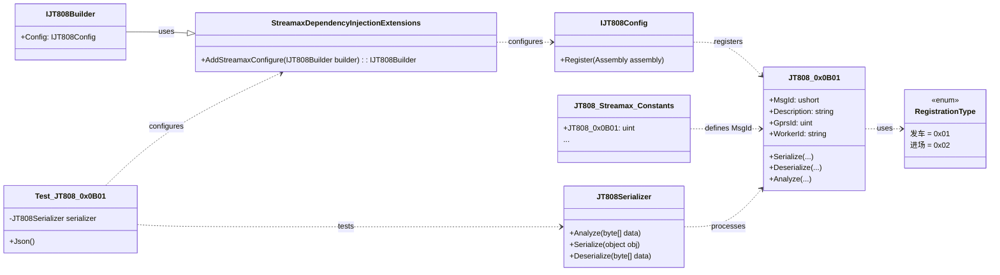

# 贡献指南


# 贡献指南

## 目录
1. [引言](#引言)
2. [项目结构](#项目结构)
3. [核心组件](#核心组件)
4. [架构概览](#架构概览)
5. [详细组件分析](#详细组件分析)
6. [依赖分析](#依赖分析)
7. [性能考量](#性能考量)
8. [故障排除指南](#故障排除指南)
9. [结论](#结论)
10. [参考](#参考)

## 引言
本项目 `Streamax.Protocol` 是一个针对锐明808公交业务的扩展协议库。它旨在提供对锐明特定JT808协议消息的解析、序列化和反序列化支持。作为 `JT808.Protocol` 库的扩展，它通过定义锐明私有协议消息体和相关枚举，使得开发者能够方便地集成和处理这些定制化的消息。本贡献指南旨在为希望参与本项目开发的贡献者提供详细的指导，包括代码规范、提交流程、测试要求以及常见的协作流程，以确保项目的代码质量和协作效率。

## 项目结构
`Streamax.Protocol` 项目采用清晰的模块化结构，主要分为核心库和测试项目。


*   **`/LICENSE`**: 项目的许可文件。
*   **`/README.md`**: 项目的介绍、安装指南和基本使用方法。
*   **`/Streamax.Protocol.sln`**: Visual Studio 解决方案文件，包含所有项目。
*   **`/JT808.Protocol.Extensions.Streamax/`**:
    *   这是核心库项目，包含了锐明扩展协议的所有定义和实现。
    *   **`/MessageBody/`**: 存放了各种锐明定制JT808消息体的C#类定义。每个文件对应一个特定的消息ID，例如 `JT808_0x0B01.cs` 定义了运营登记消息的结构。这些类通常实现 `JT808MessagePackFormatter` 和 `JT808Bodies` 接口，负责消息的序列化、反序列化和分析。
    *   **`/Enums/`**: 包含了消息体中使用的各种枚举类型定义，例如 `RegistrationType.cs` 定义了业务登记类型。
    *   **`StreamaxDependencyInjectionExtensions.cs`**: 提供了便捷的扩展方法，用于将锐明协议扩展集成到使用依赖注入的应用程序中。
    *   **`JT808_Streamax_Constants.cs`**: 定义了所有锐明扩展协议消息的常量ID，便于统一管理和引用。
    *   **`JT808.Protocol.Extensions.Streamax.csproj`**: 项目文件，定义了项目的引用和构建设置。
*   **`/JT808.Protocol.Extensions.Streamax.Test/`**:
    *   这是项目的单元测试项目，包含了对核心库中各种消息体和功能的测试用例。
    *   **`JT808_0x0B01_Test.cs` 等**: 针对特定消息体的测试类，确保消息的序列化、反序列化和分析功能正常工作。
    *   **`JT808.Protocol.Extensions.Streamax.Test.csproj`**: 测试项目文件。

## 核心组件

### 1. 消息体定义 (MessageBody)
消息体是本项目的核心，每个消息体类都定义了特定锐明扩展协议消息的数据结构和处理逻辑。
*   **文件路径**: `/JT808.Protocol.Extensions.Streamax/MessageBody/`
*   **示例**: `JT808_0x0B01.cs`[^1] (运营登记)
    *   每个消息体类都继承自 `JT808MessagePackFormatter<T>` 并实现 `JT808Bodies` 和 `IJT808Analyze` 接口。
    *   `MsgId` 属性定义了消息的唯一ID。
    *   `Description` 属性提供了消息的中文描述。
    *   包含消息体中各个字段的属性（例如 `GprsId` 和 `WorkerId`）。
    *   `Serialize` 方法负责将C#对象序列化为字节数组。
    *   `Deserialize` 方法负责将字节数组反序列化为C#对象。
    *   `Analyze` 方法（如果实现 `IJT808Analyze`）负责将消息内容解析为JSON格式，便于调试和查看。

### 2. 枚举类型 (Enums)
枚举类型用于定义消息体中某些字段的取值范围，提高代码的可读性和类型安全性。
*   **文件路径**: `/JT808.Protocol.Extensions.Streamax/Enums/`
*   **示例**: `RegistrationType.cs`[^2] (业务登记类型)
    *   定义了如 `发车` (0x01) 和 `进场` (0x02) 等常量。

### 3. 依赖注入扩展 (StreamaxDependencyInjectionExtensions)
该组件提供了方便的扩展方法，使得在ASP.NET Core等支持依赖注入的框架中，能够轻松地注册和使用锐明协议扩展。
*   **文件路径**: `/JT808.Protocol.Extensions.Streamax/StreamaxDependencyInjectionExtensions.cs`[^3]
*   **核心方法**: `AddStreamaxConfigure(this IJT808Builder jT808Builder)`
    *   通过调用 `jT808Builder.Config.Register(Assembly.GetExecutingAssembly())`，将当前程序集中定义的所有JT808消息体注册到 `JT808.Protocol` 框架中，使其能够识别和处理这些定制消息。

### 4. 消息ID常量 (JT808_Streamax_Constants)
该文件集中定义了所有锐明扩展协议消息的ID常量，便于在代码中引用和管理。
*   **文件路径**: `/JT808.Protocol.Extensions.Streamax/JT808_Streamax_Constants.cs`[^4]
*   **示例**: `public const uint JT808_0x0B01 = 0x0B01;`

## 架构概览
`Streamax.Protocol` 项目的架构是基于 `JT808.Protocol` 库的扩展。它遵循模块化和可插拔的设计原则，通过依赖注入机制将自定义的协议消息体注册到主协议框架中。



**工作流程概览**:
1.  **初始化**: 应用程序启动时，通过调用 `AddStreamaxConfigure` 方法，将 `Streamax.Protocol` 库注册到 `JT808.Protocol` 框架中。
2.  **消息定义**: 开发者在 `MessageBody` 文件夹中定义新的锐明扩展协议消息体，并实现其序列化、反序列化和分析逻辑。
3.  **消息处理**: 当接收到锐明扩展协议消息的字节流时，`JT808.Protocol` 框架会根据消息ID，自动查找并使用对应的消息体类进行反序列化，将其转换为C#对象。反之，C#对象也可以被序列化为字节流发送。
4.  **测试**: 单元测试项目确保了消息体的正确性，验证了序列化和反序列化过程的准确性。

## 详细组件分析

### 1. `StreamaxDependencyInjectionExtensions.cs` - 扩展协议的注册[^3]

这个文件是 `Streamax.Protocol` 库与 `JT808.Protocol` 主框架集成的关键。它提供了一个简洁的扩展方法，使得在基于 .NET Core 的应用中，能够通过依赖注入的方式轻松启用锐明协议扩展。

**代码示例**:
```csharp
using System;
using System.Collections.Generic;
using System.Reflection;
using System.Text;

namespace JT808.Protocol.Extensions.Streamax
{
    public static class StreamaxDependencyInjectionExtensions
    {
        public static IJT808Builder AddStreamaxConfigure(this IJT808Builder jT808Builder)
        {
            // 通过反射注册当前程序集中定义的所有JT808消息体
            jT808Builder.Config.Register(Assembly.GetExecutingAssembly());
            return jT808Builder;
        }
    }
}
```

**解释**:
`AddStreamaxConfigure` 是一个对 `IJT808Builder` 接口的扩展方法。当你在应用程序的启动配置中调用 `AddStreamaxConfigure()` 时，它会获取当前执行的程序集（即 `Streamax.Protocol` 库所在的程序集），并将其注册到 `JT808.Protocol` 框架的配置中。这意味着，所有在该程序集中定义的、符合 `JT808.Protocol` 规范的消息体（例如 `JT808_0x0B01`）都将被框架识别，从而能够进行自动的序列化和反序列化操作。这种设计极大地简化了扩展协议的集成过程，开发者无需手动注册每一个消息类型。

### 2. `JT808_0x0B01.cs` - 运营登记消息体[^1]

这个文件定义了锐明扩展协议中“运营登记”消息（消息ID：0x0B01）的具体结构和处理逻辑。它是消息体定义的典型代表。

**代码示例**:
```csharp
using JT808.Protocol.Formatters;
using JT808.Protocol.Interfaces;
using JT808.Protocol.MessagePack;
using System;
using System.Collections.Generic;
using System.Text;
using System.Text.Json; // 用于分析

namespace JT808.Protocol.Extensions.Streamax.MessageBody
{
    /// <summary>
    /// 运营登记
    /// </summary>
    public class JT808_0x0B01 : JT808MessagePackFormatter<JT808_0x0B01>, JT808Bodies, IJT808Analyze
    {
        public ushort MsgId => 0x0B01; // 消息ID

        public string Description => "运营登记"; // 消息描述
        
        /// <summary>
        /// 线路编号
        /// </summary>
        public uint GprsId { get; set; }
        /// <summary>
        /// 员工编号
        /// </summary>
        public string WorkerId { get; set; }
        /// <summary>
        /// 跳过数据体序列化 (通常为false)
        /// </summary>
        public bool SkipSerialization => false;

        // 反序列化方法：将字节流转换为C#对象
        public override JT808_0x0B01 Deserialize(ref JT808MessagePackReader reader, IJT808Config config)
        {
            JT808_0x0B01 value = new();
            value.GprsId = reader.ReadUInt32(); // 读取线路编号
            var length = reader.ReadCurrentRemainContentLength(); // 读取剩余内容的长度
            value.WorkerId = reader.ReadString(length); // 读取员工编号
            return value;
        }

        // 序列化方法：将C#对象转换为字节流
        public override void Serialize(ref JT808MessagePackWriter writer, JT808_0x0B01 value, IJT808Config config)
        {
            writer.WriteUInt32(value.GprsId); // 写入线路编号
            writer.WriteString(value.WorkerId); // 写入员工编号
        }

        // 分析方法：将消息内容解析为JSON格式
        public void Analyze(ref JT808MessagePackReader reader, Utf8JsonWriter writer, IJT808Config config)
        {
            JT808_0x0B01 value = new();
            value.GprsId = reader.ReadUInt32();
            writer.WriteNumber($"[{value.GprsId.ReadNumber()}]线路编号", value.GprsId);
            var length = reader.ReadCurrentRemainContentLength();
            var virtualHex = reader.ReadVirtualArray(length);
            value.WorkerId = reader.ReadString(length);
            writer.WriteString($"[{virtualHex.ToArray().ToHexString()}]员工编号", value.WorkerId);
        }
    }
}
```

**解释**:
`JT808_0x0B01` 类是 `JT808.Protocol` 框架中消息体定义的标准范例。
*   它通过 `MsgId` 属性明确了自身对应的协议消息ID。
*   `GprsId` 和 `WorkerId` 属性分别代表了消息体中的“线路编号”和“员工编号”字段。
*   `Deserialize` 方法负责从接收到的原始字节数据中，按照协议定义的顺序和长度，逐一读取字段，并将其填充到 `JT808_0x0B01` 对象的相应属性中。
*   `Serialize` 方法则执行相反的操作，将 `JT808_0x0B01` 对象的属性值，按照协议规范的顺序和格式，写入到字节流中，以便发送。
*   `Analyze` 方法提供了一个便捷的调试工具，可以将消息的二进制内容解析成易于阅读的JSON格式，这对于理解协议数据和排查问题非常有帮助。

### 3. `RegistrationType.cs` - 业务登记类型枚举[^2]

这个文件定义了一个简单的枚举类型，用于规范消息体中某个字段的取值。

**代码示例**:
```csharp
using System;
using System.Collections.Generic;
using System.Text;

namespace JT808.Protocol.Extensions.Streamax.Enums
{
    /// <summary>
    /// 业务登记类型
    /// </summary>
    public enum RegistrationType
    {
        发车 = 0x01,
        进场 = 0x02
    }
}
```

**解释**:
`RegistrationType` 枚举定义了两种业务登记类型：`发车` (0x01) 和 `进场` (0x02)。在消息体中如果需要表示业务登记类型，可以直接使用这个枚举，而不是硬编码的数字，从而提高了代码的可读性和可维护性，并减少了潜在的错误。

## 依赖分析

`Streamax.Protocol` 项目的依赖关系主要体现在以下几个方面：


*   **`JT808.Protocol.Extensions.Streamax` (核心库)**:
    *   **依赖 `JT808.Protocol` 库**: 这是最核心的外部依赖，提供了JT808协议的基础框架、消息序列化/反序列化机制和依赖注入构建器 (`IJT808Builder`, `IJT808Config`, `JT808MessagePackReader`, `JT808MessagePackWriter` 等)。
    *   **依赖 `System.Reflection`**: 用于 `StreamaxDependencyInjectionExtensions` 中注册当前程序集的所有消息类型。
    *   **依赖 `System.Text.Json`**: 用于消息体的 `Analyze` 方法，将消息内容解析为JSON格式。
    *   **内部依赖 `MessageBody` 类**: 消息体类是核心库的主要组成部分。
    *   **内部依赖 `Enums`**: 消息体类会引用 `Enums` 中定义的枚举类型。
    *   **内部依赖 `JT808_Streamax_Constants`**: 消息体类和测试类会引用这里定义的消息ID常量。

*   **`JT808.Protocol.Extensions.Streamax.Test` (测试项目)**:
    *   **依赖 `JT808.Protocol.Extensions.Streamax`**: 直接引用核心库，以便测试其中的消息体和功能。
    *   **依赖 `Xunit`**: 作为单元测试框架。
    *   **依赖 `Microsoft.Extensions.DependencyInjection`**: 用于在测试环境中构建依赖注入容器，模拟应用程序的启动配置，以测试 `AddStreamaxConfigure` 方法。

**组件耦合与内聚**:
*   **高内聚**: 消息体类内部负责自身数据的序列化、反序列化和分析，职责单一，内聚性高。枚举类也只负责定义类型。
*   **低耦合**: 核心库与外部 `JT808.Protocol` 库通过接口 (`IJT808Builder`, `IJT808Analyze` 等) 进行交互，降低了直接耦合。消息体之间通常是独立的，通过消息ID进行区分。

## 性能考量

本项目作为协议扩展库，其性能主要体现在消息的序列化和反序列化效率上。
1.  **二进制协议**: JT808协议本身是二进制协议，相比文本协议（如JSON、XML），其解析和生成通常效率更高，数据量更小。
2.  **`MessagePack` 优化**: 项目底层使用了 `MessagePack` 相关的技术（通过 `JT808.Protocol` 库），这是一个高效的二进制序列化格式，通常比 .NET 自带的二进制序列化器更快，并且产生的字节流更紧凑。
3.  **避免不必要的装箱/拆箱**: 在 `Serialize` 和 `Deserialize` 方法中，应尽量避免不必要的装箱和拆箱操作，尤其是在处理大量消息时，这会影响性能。
4.  **字符串处理**: 字符串的编码和解码（例如 `Encoding.UTF8.GetString` 或 `Encoding.UTF8.GetBytes`）会带来一定的性能开销。在协议中，如果字符串长度是固定的或者有明确的长度字段，可以优化处理方式。
5.  **内存分配**: 频繁的对象创建和销毁会导致GC压力。在 `Deserialize` 方法中，如果能够复用对象或使用对象池，可以减少内存分配。

**优化建议**:
*   **基准测试**: 对于关键的消息体（例如高频发送/接收的消息），可以编写基准测试（如使用BenchmarkDotNet）来衡量序列化和反序列化的性能，并识别潜在的瓶颈。
*   **内存优化**: 关注 `Deserialize` 和 `Serialize` 方法中的内存分配情况，尽量减少临时对象的创建。
*   **字符串编码**: 确保字符串编码与协议规范一致，避免不必要的字符集转换。

## 故障排除指南

由于本项目是 `JT808.Protocol` 的扩展，常见的故障通常与消息体的定义、序列化/反序列化错误或集成问题相关。

1.  **消息解析失败或数据不正确**:
    *   **检查消息ID**: 确保接收到的消息ID与消息体类中定义的 `MsgId` 匹配。
    *   **检查字段顺序和类型**: 在 `Deserialize` 和 `Serialize` 方法中，仔细核对字段的读取/写入顺序、数据类型和长度是否与锐明协议文档完全一致。二进制协议对字节顺序和长度非常敏感。
    *   **检查字节序**: 确保数值类型（如 `uint`, `ushort`）的字节序（大端/小端）与协议规范一致。JT808协议通常使用大端序。
    *   **使用 `Analyze` 方法调试**: 利用消息体中的 `Analyze` 方法将原始字节流解析为JSON格式，这能帮助你直观地看到每个字段的解析结果，从而快速定位问题。
    *   **运行单元测试**: 确保相关的单元测试（例如 `JT808_0x0B01_Test.cs`[^5]）通过，这些测试覆盖了消息的序列化和反序列化过程。

2.  **依赖注入配置问题**:
    *   **`AddStreamaxConfigure` 未调用**: 确保在应用程序的 `Startup.cs` 或等效的配置代码中，正确调用了 `serviceDescriptors.AddJT808Configure().AddStreamaxConfigure();`。如果未调用，`JT808.Protocol` 框架将无法识别锐明扩展消息。
    *   **程序集未加载**: 确保 `Streamax.Protocol.Extensions.Streamax.dll` 及其依赖项已正确部署到应用程序的运行环境中。

3.  **编译错误**:
    *   **缺少引用**: 检查项目文件 (`.csproj`) 中是否缺少对 `JT808.Protocol` 或其他必要NuGet包的引用。
    *   **命名空间问题**: 确保代码中使用了正确的 `using` 命名空间。

## 结论

`Streamax.Protocol` 项目为锐明808公交业务扩展协议提供了一个健壮且易于使用的实现。通过清晰的项目结构、模块化的消息体定义以及利用依赖注入的集成方式，它大大简化了与锐明设备进行协议通信的开发工作。本贡献指南详细阐述了项目的内部机制和协作流程，希望能够帮助所有贡献者高效地参与到项目的开发中来。遵循代码规范、编写全面的单元测试、积极参与代码审查，将是确保项目持续高质量发展的关键。

## 参考

[^1]: [JT808_0x0B01.cs](https://github.com/lishewen/Streamax.Protocol/blob/master/JT808.Protocol.Extensions.Streamax/MessageBody/JT808_0x0B01.cs)
[^2]: [RegistrationType.cs](https://github.com/lishewen/Streamax.Protocol/blob/master/JT808.Protocol.Extensions.Streamax/Enums/RegistrationType.cs)
[^3]: [StreamaxDependencyInjectionExtensions.cs](https://github.com/lishewen/Streamax.Protocol/blob/master/JT808.Protocol.Extensions.Streamax/StreamaxDependencyInjectionExtensions.cs)
[^4]: [JT808_Streamax_Constants.cs](https://github.com/lishewen/Streamax.Protocol/blob/master/JT808.Protocol.Extensions.Streamax/JT808_Streamax_Constants.cs)
[^5]: [JT808_0x0B01_Test.cs](https://github.com/lishewen/Streamax.Protocol/blob/master/JT808.Protocol.Extensions.Streamax.Test/JT808_0x0B01_Test.cs)
