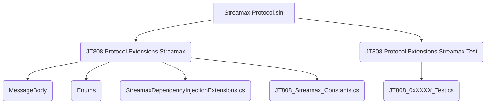
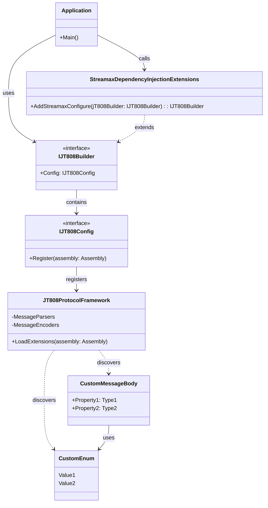
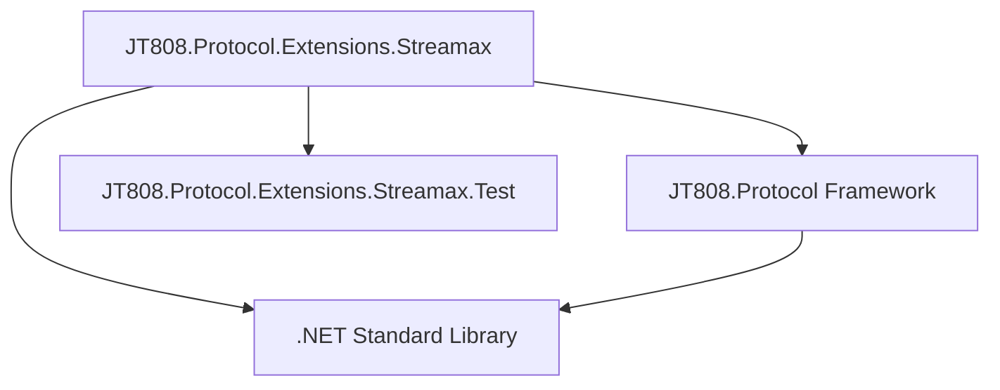

# 集成与扩展指南


# 集成与扩展指南

## Table of Contents
1. [Introduction](#introduction)
2. [Project Structure](#project-structure)
3. [Core Components](#core-components)
4. [Architecture Overview](#architecture-overview)
5. [Detailed Component Analysis](#detailed-component-analysis)
6. [Dependency Analysis](#dependency-analysis)
7. [Performance Considerations](#performance-considerations)
8. [Troubleshooting Guide](#troubleshooting-guide)
9. [Conclusion](#conclusion)
10. [References](#references)

## Introduction

本指南旨在详细讲解如何将Streamax的私有协议扩展集成到现有的JT808协议系统中，如何自定义扩展点，以及在集成过程中常见的场景和注意事项。通过阅读本文档，您将全面了解Streamax协议扩展的设计理念、实现方式和使用方法，从而能够高效地在您的项目中利用这些扩展。

JT808协议是交通运输部发布的道路运输车辆卫星定位系统车载终端通信协议。在实际应用中，为了满足特定业务需求，常常需要对标准协议进行扩展。Streamax.Protocol项目提供了一套针对JT808协议的扩展实现，旨在简化这些私有扩展的集成和使用。

## Project Structure

Streamax.Protocol项目结构清晰，遵循了.NET项目的标准组织方式，主要包含一个解决方案文件和两个核心项目：一个用于协议扩展的库项目，另一个用于测试这些扩展的测试项目。



*   **Streamax.Protocol.sln**: 整个解决方案的入口文件，管理所有项目。
*   **JT808.Protocol.Extensions.Streamax**: 这是核心的协议扩展库。
    *   **MessageBody**: 包含Streamax自定义的JT808协议消息体定义。这些文件以`JT808_0xXXXX_YY.cs`的格式命名，其中`0xXXXX`代表JT808消息ID，`YY`可能代表该消息ID下的具体扩展字段或子消息。例如，`JT808_0x0200_0x14.cs`定义了JT808协议0x0200消息的扩展字段0x14的数据结构。
    *   **Enums**: 包含与Streamax扩展相关的枚举定义，例如设备类型、调度类型等。这些枚举在自定义消息体中被广泛使用，用于表示特定的状态或类型。
    *   **StreamaxDependencyInjectionExtensions.cs**[^1]: 这是将Streamax协议扩展集成到JT808协议框架中的关键文件。它提供了一个扩展方法，用于自动化注册所有自定义的协议元素。
    *   **JT808_Streamax_Constants.cs**: 可能包含Streamax扩展相关的常量定义，例如特定的消息ID或字段值。
*   **JT808.Protocol.Extensions.Streamax.Test**: 单元测试项目，用于验证Streamax协议扩展的正确性。每个测试文件通常对应一个特定的JT808消息ID，并模拟该消息的编码和解码过程。

## Core Components

Streamax协议扩展的核心组件主要围绕JT808协议的消息体扩展和其在.NET依赖注入框架中的集成。

1.  **自定义消息体 (MessageBody)**:
    这些文件定义了Streamax针对JT808协议的私有扩展消息结构。每个文件通常对应一个JT808消息ID下的特定扩展数据单元。例如，`JT808_0x0B0B.cs`定义了消息ID为0x0B0B的完整消息体，而`JT808_0x0200_0x14.cs`则定义了JT808标准消息0x0200中的一个扩展属性ID为0x14的数据结构。这些消息体通常包含自定义的字段，并可能引用`Enums`文件夹中的枚举类型。

2.  **枚举 (Enums)**:
    为了更好地定义和解析自定义消息体中的字段，项目引入了多种枚举类型。这些枚举提供了清晰、类型安全的方式来表示特定的值，例如：
    *   `DeviceType.cs`: 设备类型。
    *   `DispatchType.cs`: 调度类型。
    *   `FixedPointType.cs`: 固定点类型。
    这些枚举在自定义消息体中被广泛使用，确保了数据的一致性和可读性。

3.  **依赖注入扩展 (StreamaxDependencyInjectionExtensions.cs)**[^1]:
    这是实现协议扩展无缝集成的核心。通过提供一个扩展方法，它允许开发者在应用程序启动时，将Streamax定义的所有协议扩展（包括自定义消息体和相关解析逻辑）自动注册到JT808协议框架中。这大大简化了集成过程，避免了手动注册每一个自定义协议元素的繁琐。

## Architecture Overview

Streamax协议扩展的架构设计旨在提供一种可插拔、易于集成的方式来扩展JT808协议。其核心思想是利用.NET的反射机制和依赖注入，将自定义的协议定义动态地加载到JT808协议框架中。



**架构流程：**

1.  **应用程序启动**: 当应用程序启动时，开发者会通过JT808协议框架提供的构建器（`IJT808Builder`）来配置协议服务。
2.  **调用扩展方法**: 开发者调用`StreamaxDependencyInjectionExtensions`中的`AddStreamaxConfigure`扩展方法[^1]。
3.  **程序集注册**: `AddStreamaxConfigure`方法获取当前正在执行的程序集（即包含Streamax协议扩展定义的程序集），并将其注册到JT808协议构建器的配置中。
4.  **框架扫描与加载**: JT808协议框架在内部接收到这个程序集后，会利用反射机制扫描该程序集。它会查找所有符合特定约定（例如，实现了特定接口或带有特定特性）的自定义消息体、解析器、编码器等。
5.  **运行时可用**: 一旦扫描完成并加载成功，Streamax定义的JT808协议扩展就能够在JT808协议框架的运行时中被识别和处理，无论是进行消息的编码还是解码。

这种架构的优势在于其**解耦性**和**可扩展性**。Streamax协议扩展作为一个独立的库存在，可以方便地集成到任何使用JT808协议框架的应用程序中，而无需修改JT808协议框架的核心代码。

## Detailed Component Analysis

### 1. `StreamaxDependencyInjectionExtensions.cs`[^1]

这是Streamax协议扩展的入口点，负责将所有自定义的协议定义注册到JT808协议框架中。

**代码示例:**

```csharp
using System;
using System.Collections.Generic;
using System.Reflection;
using System.Text;

namespace JT808.Protocol.Extensions.Streamax
{
    public static class StreamaxDependencyInjectionExtensions
    {
        /// <summary>
        /// 将Streamax协议扩展配置添加到JT808构建器中
        /// </summary>
        /// <param name="jT808Builder">JT808协议构建器</param>
        /// <returns>JT808协议构建器</returns>
        public static IJT808Builder AddStreamaxConfigure(this IJT808Builder jT808Builder)
        {
            // 获取当前执行的程序集，即包含Streamax协议扩展定义的程序集
            // 并将其注册到JT808协议构建器的配置中
            jT808Builder.Config.Register(Assembly.GetExecutingAssembly());
            return jT808Builder;
        }
    }
}
```

**功能详解:**

*   **扩展方法**: `AddStreamaxConfigure`是一个`IJT808Builder`的扩展方法。这意味着您可以在任何`IJT808Builder`实例上直接调用此方法，例如：
    ```csharp
    // 假设您的应用程序启动时有一个JT808Builder实例
    var builder = new JT808Builder();
    builder.AddStreamaxConfigure(); // 轻松集成Streamax扩展
    ```
*   **自动化注册**: 核心逻辑在于`jT808Builder.Config.Register(Assembly.GetExecutingAssembly());`。`Assembly.GetExecutingAssembly()`获取当前`JT808.Protocol.Extensions.Streamax`程序集。`jT808Builder.Config.Register()`方法则指示JT808协议框架扫描此程序集，自动发现并注册其中定义的所有符合JT808协议扩展规范的消息体、解析器和编码器。这极大地简化了扩展的集成过程。

### 2. 自定义消息体 (`MessageBody` 文件夹)

`MessageBody`文件夹包含了所有Streamax自定义的JT808协议扩展消息体。这些类通常继承自JT808协议框架提供的基类，并使用特定的特性（Attributes）来标记字段的编码和解码规则。

**示例：`JT808_0x0B0B.cs` (假设内容)**

虽然没有提供具体的文件内容，但根据命名约定，`JT808_0x0B0B.cs`可能定义了消息ID为0x0B0B的完整消息体。一个典型的消息体定义可能包含以下结构：

```csharp
// 假设的JT808_0x0B0B.cs内容
using JT808.Protocol.Attributes; // 假设JT808协议框架提供了特性
using JT808.Protocol.Enums;
using JT808.Protocol.Formatters;
using JT808.Protocol.MessageBody;
using System.Collections.Generic;

namespace JT808.Protocol.Extensions.Streamax.MessageBody
{
    /// <summary>
    /// 0x0B0B 消息体：自定义报警信息
    /// </summary>
    [JT808Formatter(typeof(JT808_0x0B0B_Formatter))] // 假设需要自定义格式化器
    public class JT808_0x0B0B : JT808MessageBody // 假设继承自JT808消息体基类
    {
        public override ushort MsgId => 0x0B0B; // 消息ID

        /// <summary>
        /// 报警类型
        /// </summary>
        [JT808Property(0, DataType.Byte)] // 假设使用特性标记字段
        public byte AlarmType { get; set; }

        /// <summary>
        /// 报警时间
        /// </summary>
        [JT808Property(1, DataType.DateTime)]
        public DateTime AlarmTime { get; set; }

        /// <summary>
        /// 设备ID
        /// </summary>
        [JT808Property(2, DataType.String, Length = 10)]
        public string DeviceId { get; set; }

        // 可能包含更多自定义字段，甚至嵌套其他自定义结构
    }
}
```

**自定义扩展点:**

要自定义新的协议扩展点，您需要：

1.  **定义新的消息体类**: 在`MessageBody`文件夹下创建新的C#类，例如`JT808_0xXXXX.cs`或`JT808_0xYYYY_0xZZ.cs`。
2.  **继承基类**: 通常，这些类需要继承JT808协议框架提供的特定基类（例如`JT808MessageBody`），以便框架能够识别它们。
3.  **使用特性标记字段**: 利用JT808协议框架提供的特性（如`JT808Property`），标记消息体中的每个字段，指定其在协议中的位置、数据类型、长度等编码/解码信息。
4.  **定义自定义格式化器（可选）**: 如果您的消息体包含复杂的数据结构或需要特殊的编码/解码逻辑，您可能需要实现自定义的格式化器（Formatter）。

### 3. 枚举 (`Enums` 文件夹)

`Enums`文件夹中的枚举类型为自定义消息体提供了类型安全的常量定义，增强了代码的可读性和可维护性。

**示例：`FixedPointType.cs` (假设内容)**

```csharp
// 假设的FixedPointType.cs内容
namespace JT808.Protocol.Extensions.Streamax.Enums
{
    /// <summary>
    /// 固定点类型
    /// </summary>
    public enum FixedPointType : byte
    {
        /// <summary>
        /// 停车点
        /// </summary>
        ParkingPoint = 0x01,
        /// <summary>
        /// 兴趣点
        /// </summary>
        InterestPoint = 0x02,
        // 更多类型...
    }
}
```

**作用:**

这些枚举在自定义消息体中作为字段的类型，例如在`JT808_0x0B0B`中，`AlarmType`字段可能是一个枚举类型，而不是简单的`byte`，这样可以更清晰地表达其含义。

## Dependency Analysis

Streamax协议扩展库的依赖关系相对简单，主要依赖于JT808协议框架本身以及.NET标准库。



*   **JT808.Protocol.Extensions.Streamax**：
    *   **依赖 JT808.Protocol (Framework)**：这是核心依赖，Streamax扩展是建立在JT808协议框架之上的。它依赖于框架提供的`IJT808Builder`、`JT808MessageBody`基类、特性（Attributes）以及其他辅助类。
    *   **依赖 .NET Standard Library**：作为C#项目，它自然依赖于.NET标准库中的基本类型、集合、反射等功能。
*   **JT808.Protocol.Extensions.Streamax.Test**：
    *   **依赖 JT808.Protocol.Extensions.Streamax**：测试项目需要引用被测试的协议扩展库。
    *   **依赖 JT808.Protocol (Framework)**：测试也可能直接或间接地使用JT808协议框架的组件进行断言或模拟。
    *   **依赖 测试框架 (如 NUnit/XUnit)**：虽然图中未明确列出，但测试项目通常会依赖于一个单元测试框架。

**依赖耦合度分析：**

*   **低耦合**: Streamax协议扩展与JT808协议框架之间的耦合度较低。扩展库通过实现框架定义的接口和继承基类来与框架交互，而不是直接修改框架内部代码。这种设计使得扩展可以独立开发和部署。
*   **高内聚**: `JT808.Protocol.Extensions.Streamax`内部的组件（消息体、枚举、依赖注入扩展）之间具有较高的内聚性，它们共同服务于Streamax协议扩展的目标。

## Performance Considerations

在JT808协议扩展的实现中，性能主要受以下几个方面的影响：

1.  **消息体的复杂性**:
    *   **影响**: 自定义消息体中字段的数量、数据类型（特别是字符串和列表等变长字段）、嵌套结构的深度都会影响消息的编码和解码性能。字段越多、结构越复杂，处理所需的时间就越长。
    *   **优化建议**:
        *   **精简字段**: 只包含必要的字段，避免传输冗余数据。
        *   **选择合适的数据类型**: 尽量使用占用空间小、解析效率高的数据类型。例如，如果一个数值范围确定，使用`byte`或`short`而不是`int`或`long`。
        *   **避免过度嵌套**: 复杂的嵌套结构会增加解析的难度和开销。
        *   **优化变长字段处理**: 对于字符串或字节数组等变长字段，确保其长度编码方式高效。

2.  **反射机制的开销**:
    *   **影响**: `StreamaxDependencyInjectionExtensions.cs`中使用`Assembly.GetExecutingAssembly()`和`Register()`方法，这通常会涉及到反射机制来扫描程序集并发现协议定义。反射操作在首次加载时会有一定的性能开销，因为它需要检查类型、成员和特性。
    *   **优化建议**:
        *   **一次性注册**: 确保`AddStreamaxConfigure()`方法只在应用程序启动时调用一次，避免在运行时频繁调用，从而最小化反射的开销。
        *   **缓存**: 优秀的JT808协议框架内部通常会对反射结果进行缓存，以提高后续消息处理的效率。

3.  **编码/解码器的效率**:
    *   **影响**: 协议框架内部的编码器和解码器实现效率直接影响消息处理的吞吐量。如果自定义消息体需要自定义格式化器，那么这些格式化器的实现质量至关重要。
    *   **优化建议**:
        *   **使用高效算法**: 在自定义格式化器中，使用高效的字节操作和数据转换算法。
        *   **避免不必要的内存分配**: 减少在编码和解码过程中不必要的内存分配，以降低垃圾回收的压力。
        *   **基准测试**: 对关键的编码/解码逻辑进行基准测试，找出性能瓶颈并进行优化。

4.  **测试用例的性能**:
    *   **影响**: `JT808.Protocol.Extensions.Streamax.Test`中的测试用例虽然不直接影响运行时性能，但它们可以作为性能测试的参考。如果测试用例执行缓慢，可能间接反映了消息体或编码/解码逻辑的复杂性。
    *   **优化建议**:
        *   **精简测试数据**: 使用最小化的有效数据进行测试。
        *   **关注核心逻辑**: 测试应重点关注消息的编码和解码逻辑，而不是其他辅助功能。

总的来说，Streamax协议扩展在设计上已经考虑了易用性和可扩展性。在实际应用中，性能优化应主要关注自定义消息体的设计、编码/解码逻辑的实现以及确保依赖注入的注册过程只在启动时执行一次。

## Troubleshooting Guide

在集成和使用Streamax协议扩展时，可能会遇到一些常见问题。本节提供了一些故障排除的指导。

### 1. 协议扩展未生效

**现象**: 应用程序无法正确解析或编码Streamax自定义的JT808消息，或者在日志中看到“未知消息ID”等错误。

**可能原因**:
*   **未调用 `AddStreamaxConfigure`**: 最常见的原因是没有在应用程序启动时调用`AddStreamaxConfigure`扩展方法[^1]，导致Streamax的协议定义未被注册到JT808协议框架中。
*   **程序集未被正确引用**: `JT808.Protocol.Extensions.Streamax`程序集没有被主应用程序项目正确引用。
*   **程序集加载问题**: 在某些复杂的部署环境中，程序集可能没有被正确加载到应用程序域中。

**解决方案**:
*   **检查启动代码**: 确保在应用程序的启动配置中（例如ASP.NET Core的`Startup.cs`或控制台应用程序的`Main`方法中）调用了`builder.AddStreamaxConfigure()`。
*   **检查项目引用**: 确认主应用程序项目已添加对`JT808.Protocol.Extensions.Streamax`项目的引用。
*   **检查部署**: 确保在部署应用程序时，`JT808.Protocol.Extensions.Streamax.dll`文件与主应用程序的DLL文件在同一个目录下。

### 2. 自定义消息体解析错误

**现象**: 应用程序可以识别消息ID，但解析出的消息体字段值不正确，或者在解析过程中抛出异常。

**可能原因**:
*   **消息体定义与协议不符**: 自定义消息体类（在`MessageBody`文件夹中）的字段定义（顺序、数据类型、长度等）与实际的Streamax协议规范不一致。
*   **特性使用错误**: `JT808Property`或其他特性使用不当，例如索引错误、数据类型不匹配、长度计算有误。
*   **自定义格式化器逻辑错误**: 如果为复杂消息体实现了自定义格式化器，其编码或解码逻辑可能存在缺陷。
*   **枚举值不匹配**: 消息体中使用的枚举值与实际协议中的编码值不对应。

**解决方案**:
*   **仔细核对协议文档**: 对照Streamax的详细协议文档，逐一核对自定义消息体中每个字段的定义，包括字段顺序、数据类型、字节长度和编码方式。
*   **检查特性参数**: 确保`JT808Property`等特性中的参数设置正确，特别是索引、数据类型和长度。
*   **调试格式化器**: 如果使用了自定义格式化器，对其进行详细的单元测试和调试，确保其在各种情况下都能正确编码和解码数据。
*   **检查枚举定义**: 确认`Enums`文件夹中的枚举值与协议中对应的数值完全一致。

### 3. 编译或引用错误

**现象**: 在编译项目时，出现找不到类型或命名空间的错误。

**可能原因**:
*   **缺少必要的NuGet包**: JT808协议框架本身可能需要通过NuGet包引入，如果缺少，则相关的接口和类将无法找到。
*   **命名空间引用错误**: 在自定义消息体或使用扩展方法的代码文件中，没有正确引用`JT808.Protocol.Extensions.Streamax`或其他JT808协议相关的命名空间。

**解决方案**:
*   **安装NuGet包**: 确保您的项目已安装JT808协议框架所需的NuGet包（例如`JT808.Protocol`）。
*   **添加using声明**: 在需要使用Streamax扩展或JT808协议框架的C#文件的顶部，添加正确的`using`声明，例如`using JT808.Protocol.Extensions.Streamax;`。

### 4. 性能问题

**现象**: 消息处理速度慢，CPU或内存占用高。

**可能原因**:
*   **消息体过于庞大或复杂**: 传输的数据量过大，或者消息体结构过于复杂，导致编码解码效率低下。
*   **频繁的反射操作**: 如果在不恰当的时机重复调用注册方法，会导致不必要的反射开销。

**解决方案**:
*   **优化消息体设计**: 参照[性能考虑](#performance-considerations)章节的建议，精简消息体字段，优化数据类型。
*   **确保一次性注册**: 确保`AddStreamaxConfigure()`只在应用程序启动时执行一次。

通过遵循这些故障排除步骤，您应该能够解决在集成和使用Streamax协议扩展过程中遇到的大多数问题。

## Conclusion

本指南详细介绍了Streamax协议扩展的集成与使用。我们分析了项目的结构、核心组件以及架构设计，重点讲解了`StreamaxDependencyInjectionExtensions.cs`在协议扩展集成中的关键作用。通过利用.NET的依赖注入和反射机制，Streamax协议扩展提供了一种高效、可插拔的方式来扩展JT808协议，使得开发者能够轻松地将自定义的协议消息体集成到现有系统中。

通过遵循本指南中的步骤和建议，您可以：

*   **轻松集成**: 利用`AddStreamaxConfigure`扩展方法，快速将Streamax协议扩展集成到您的JT808协议应用程序中。
*   **灵活自定义**: 了解如何在`MessageBody`文件夹中定义和扩展自定义消息体，以满足特定的业务需求。
*   **高效开发**: 掌握如何利用枚举来提高消息体定义的可读性和类型安全性。
*   **解决问题**: 参照故障排除指南，快速定位并解决集成过程中可能遇到的问题。

Streamax协议扩展为JT808协议的定制化提供了强大的支持，帮助开发者构建更加灵活和功能丰富的物联网通信系统。

## References

[^1]: [StreamaxDependencyInjectionExtensions.cs](https://github.com/lishewen/Streamax.Protocol/blob/master/JT808.Protocol.Extensions.Streamax/StreamaxDependencyInjectionExtensions.cs)

