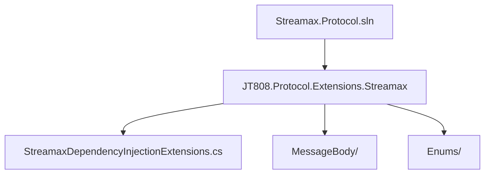
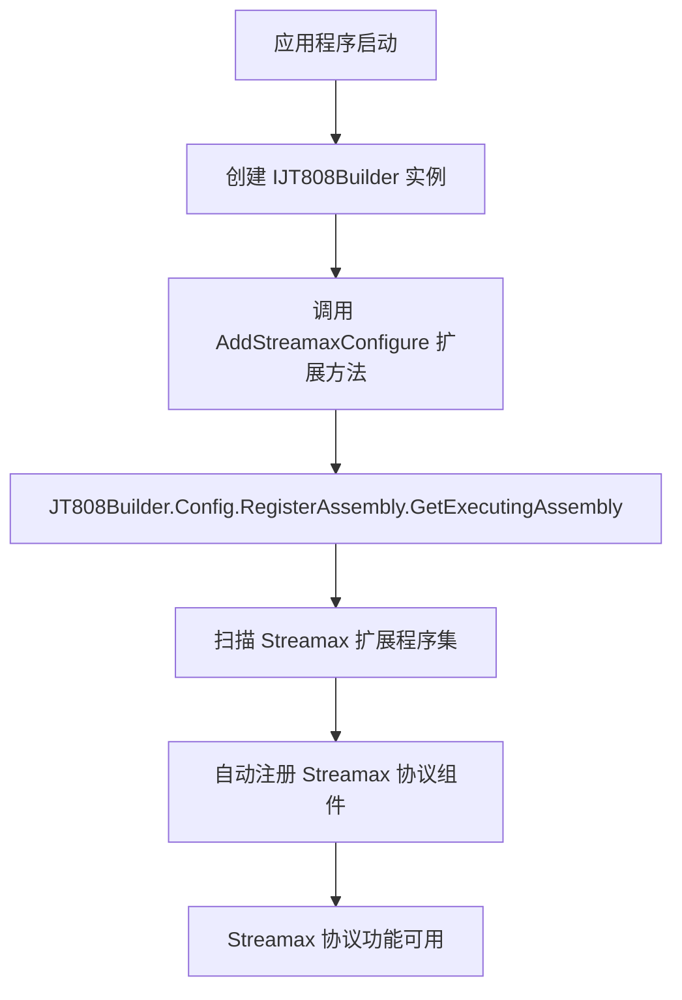
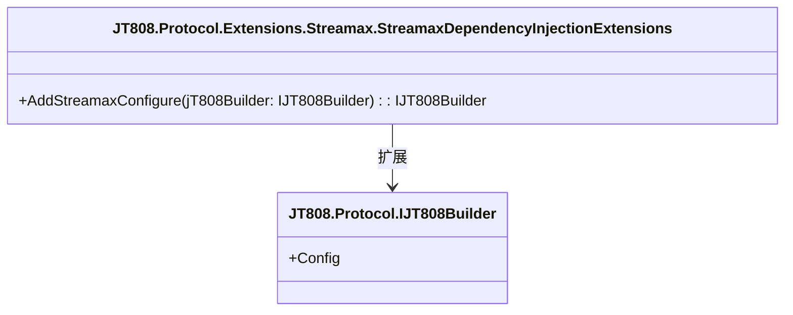

# 依赖注入与扩展机制


# 依赖注入与扩展机制

## 目录
1. [引言](#引言)
2. [项目结构](#项目结构)
3. [核心组件](#核心组件)
4. [架构概览](#架构概览)
5. [组件详细分析](#组件详细分析)
6. [依赖分析](#依赖分析)
7. [性能考量](#性能考量)
8. [故障排除指南](#故障排除指南)
9. [结论](#结论)
10. [参考文献](#参考文献)

## 引言
本文档旨在详细介绍 Streamax 协议扩展在 .NET 项目中如何利用依赖注入（Dependency Injection, DI）机制进行注册、集成和扩展。通过分析 `Streamax.Protocol` 仓库中的关键文件，我们将深入探讨其接口定义、扩展点、定制化方法以及与主业务逻辑的集成方式，旨在为读者提供一份全面且易于理解的指南，即使是技术背景有限的用户也能从中受益。

Streamax 协议作为 JT808 协议的扩展，其设计目标是提供一套灵活、可插拔的机制，以便于在不修改核心协议代码的情况下，引入特定于 Streamax 设备的功能和消息处理逻辑。依赖注入是实现这一目标的关键技术，它通过解耦组件间的依赖关系，提高了代码的可维护性、可测试性和可扩展性。

## 项目结构
本节将概述 `Streamax.Protocol` 仓库中与依赖注入和扩展机制相关的项目结构。

该仓库包含多个项目，其中 `JT808.Protocol.Extensions.Streamax` 项目是实现 Streamax 协议扩展的核心。此项目负责定义 Streamax 特有的消息体、常量以及最重要的——依赖注入扩展方法。

在 `JT808.Protocol.Extensions.Streamax` 项目中，`StreamaxDependencyInjectionExtensions.cs` 文件是实现依赖注入机制的关键入口点。



## 核心组件
在 Streamax 协议扩展的依赖注入机制中，最核心的组件是 `StreamaxDependencyInjectionExtensions` 类。

### StreamaxDependencyInjectionExtensions 类
该类包含一个静态扩展方法 `AddStreamaxConfigure`，它是将 Streamax 协议扩展集成到 JT808 协议构建器 (`IJT808Builder`) 中的主要方式。通过调用此方法，Streamax 协议相关的组件（例如自定义消息体解析器、编码器等）将被注册到应用程序的依赖注入容器中，从而实现协议功能的扩展。

## 架构概览
Streamax 协议扩展的架构设计遵循了开放-封闭原则，即对扩展开放，对修改封闭。这主要通过依赖注入和约定优于配置的方式实现。

当一个 .NET 应用程序需要支持 Streamax 协议时，它会通过 `IJT808Builder` 接口来配置 JT808 协议栈。`StreamaxDependencyInjectionExtensions.AddStreamaxConfigure` 方法作为 `IJT808Builder` 的一个扩展，允许应用程序轻松地将 Streamax 协议的特定实现注入到其运行时环境中。

其核心思想是利用 .NET 的依赖注入容器和程序集扫描能力。当 `AddStreamaxConfigure` 被调用时，它会指示 JT808 协议配置器扫描当前执行的程序集（即 `JT808.Protocol.Extensions.Streamax.dll`），自动发现并注册其中定义的所有 Streamax 相关的协议组件。


*图：Streamax 协议扩展注册流程*

## 组件详细分析

### `StreamaxDependencyInjectionExtensions.cs`[^1]
这个文件定义了 Streamax 协议扩展的依赖注入入口。

```csharp
using System;
using System.Collections.Generic;
using System.Reflection;
using System.Text;

namespace JT808.Protocol.Extensions.Streamax
{
    public static class StreamaxDependencyInjectionExtensions
    {
        public static IJT808Builder AddStreamaxConfigure(this IJT808Builder jT808Builder)
        {
            jT808Builder.Config.Register(Assembly.GetExecutingAssembly());
            return jT808Builder;
        }
    }
}
```

#### 类：`StreamaxDependencyInjectionExtensions`
这是一个静态类，遵循 .NET 中定义扩展方法的常见模式。静态类不能被实例化，其所有成员都必须是静态的。

#### 扩展方法：`AddStreamaxConfigure`
- **签名**: `public static IJT808Builder AddStreamaxConfigure(this IJT808Builder jT808Builder)`
  - `this IJT808Builder jT808Builder`: 这表示 `AddStreamaxConfigure` 是 `IJT808Builder` 接口的一个扩展方法。这意味着任何实现了 `IJT808Builder` 接口的对象都可以直接调用此方法，使其看起来像是 `IJT808Builder` 接口自身的方法。这种设计使得 Streamax 扩展的集成非常流畅，符合 .NET 的链式配置风格。
  - **返回类型**: `IJT808Builder`。返回 `IJT808Builder` 实例允许进行方法链式调用，例如 `services.AddJT808().AddStreamaxConfigure().AddAnotherExtension()`。

- **核心逻辑**: `jT808Builder.Config.Register(Assembly.GetExecutingAssembly());`
  - `jT808Builder.Config`: 这表明 `IJT808Builder` 实例内部有一个配置对象（或属性），用于管理协议的注册。
  - `Register(Assembly.GetExecutingAssembly())`: 这是实现依赖注入和扩展的关键所在。
    - `Assembly.GetExecutingAssembly()`: 获取当前正在执行的程序集，即 `JT808.Protocol.Extensions.Streamax.dll`。
    - `Register()` 方法：这个方法（由 `JT808.Protocol` 框架提供）负责扫描传入的程序集。它会查找程序集中符合特定约定（例如，实现了特定接口、带有特定特性等）的类型，并将它们自动注册到内部的依赖注入容器中。对于 JT808 协议扩展而言，这通常意味着它会发现并注册 Streamax 协议特有的消息体、消息处理器、命令解析器等。

**如何注册和集成：**
在 .NET 应用程序的启动配置中（例如 `Startup.cs` 或 `Program.cs`），可以通过以下方式集成 Streamax 协议扩展：

```csharp
// 假设 services 是 IServiceCollection 实例
// 假设 AddJT808 是 JT808 协议库提供的核心注册方法
services.AddJT808() // 首先注册 JT808 核心协议服务
        .AddStreamaxConfigure(); // 然后注册 Streamax 协议扩展
```
通过这一行简单的代码，所有在 `JT808.Protocol.Extensions.Streamax` 程序集中定义的 Streamax 协议相关功能（如自定义消息解析、编码等）都会被自动发现并集成到 JT808 协议栈中。

## 依赖分析
Streamax 协议扩展与 JT808 核心协议之间存在明确的依赖关系。


*图：Streamax 扩展与 JT808 核心协议的依赖关系*

- **核心依赖**: `JT808.Protocol.Extensions.Streamax` 项目依赖于 `JT808.Protocol` 库。这体现在 `AddStreamaxConfigure` 扩展方法作用于 `IJT808Builder` 接口，该接口由 `JT808.Protocol` 库定义。
- **程序集扫描**: 依赖注入机制通过 `Assembly.GetExecutingAssembly()` 间接依赖于 .NET 运行时提供的程序集加载和反射能力。
- **松耦合**: 尽管存在依赖，但通过扩展方法和依赖注入容器，Streamax 扩展与 JT808 核心协议之间实现了松耦合。Streamax 扩展无需直接修改 JT808 核心代码，只需通过注册机制将自身的功能“注入”到 JT808 协议栈中。

## 性能考量
对于 Streamax 协议扩展的依赖注入机制，性能考量主要集中在程序集扫描阶段。

- **启动性能**: `Assembly.GetExecutingAssembly()` 和随后的 `Register` 方法执行程序集扫描，这会在应用程序启动时发生。对于包含大量类型或复杂依赖的程序集，扫描操作可能会引入轻微的启动延迟。然而，对于大多数应用程序而言，这种延迟通常在可接受范围内，因为此操作只在应用程序启动时执行一次。
- **运行时性能**: 一旦类型被注册到依赖注入容器中，后续的类型解析和实例创建通常非常高效，不会对运行时性能造成显著影响。依赖注入容器通常会缓存已解析的类型和依赖关系图。

## 故障排除指南
在使用 Streamax 协议扩展的依赖注入机制时，可能会遇到一些常见问题。

- **扩展未生效**:
    - **问题**: 应用程序启动后，Streamax 协议的特定功能（如消息解析）未按预期工作。
    - **解决方案**: 检查应用程序的启动代码，确保已正确调用 `services.AddJT808().AddStreamaxConfigure();`。如果忘记调用 `AddStreamaxConfigure`，Streamax 扩展将不会被注册。
- **程序集加载问题**:
    - **问题**: 应用程序启动时抛出 `FileNotFoundException` 或其他与程序集加载相关的错误。
    - **解决方案**: 确保 `JT808.Protocol.Extensions.Streamax.dll` 文件已正确部署到应用程序的输出目录中。检查项目引用，确保 `JT808.Protocol.Extensions.Streamax` 项目已正确添加到主应用程序的引用中。
- **类型注册冲突**:
    - **问题**: 多个扩展或自定义实现注册了相同的协议消息类型，导致行为不确定或异常。
    - **解决方案**: 仔细审查日志输出，查找有关类型注册冲突的警告或错误信息。根据 JT808 协议框架的约定，确保自定义实现或扩展不会与现有实现产生不必要的冲突。

## 结论
Streamax 协议扩展通过巧妙地利用 .NET 的依赖注入机制，为 JT808 协议提供了一个强大且灵活的扩展点。通过 `StreamaxDependencyInjectionExtensions` 类及其 `AddStreamaxConfigure` 扩展方法，开发者可以轻松地将 Streamax 特定的协议功能集成到任何基于 JT808 协议的 .NET 应用程序中，而无需修改核心协议代码。这种设计模式不仅提高了代码的可维护性和可扩展性，也促进了模块化开发，使得协议功能的定制化和未来演进变得更加便捷。

## 参考文献
[^1]: [StreamaxDependencyInjectionExtensions.cs](https://github.com/lishewen/Streamax.Protocol/blob/master/JT808.Protocol.Extensions.Streamax/StreamaxDependencyInjectionExtensions.cs)
