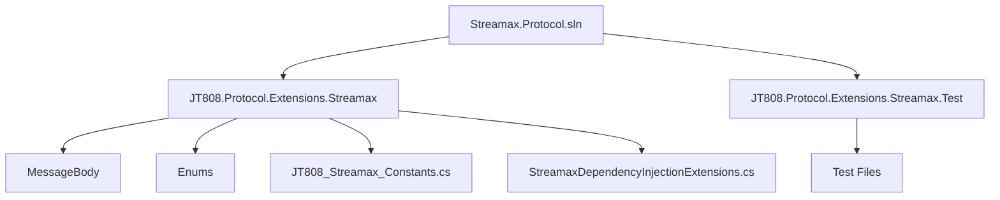
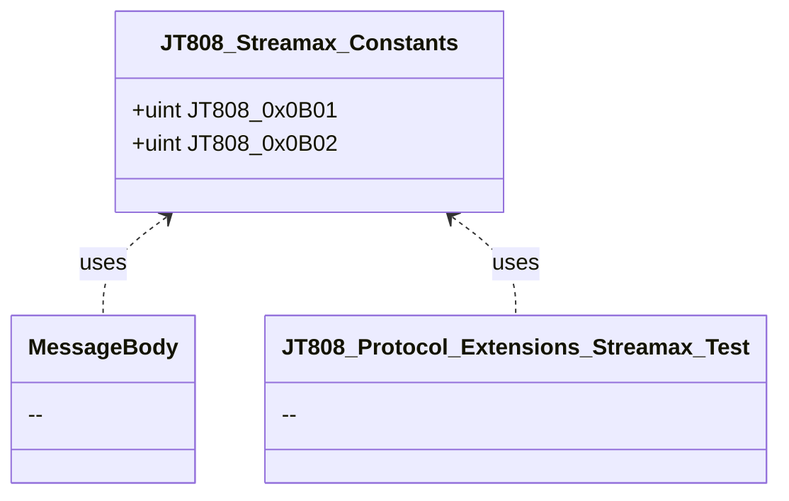
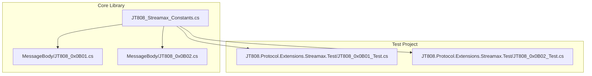

# 常量定义说明

好的，我将根据您的要求，开始撰写关于“常量定义说明”的文档。

# 常量定义说明

## 目录
1. [引言](#引言)
2. [项目结构](#项目结构)
3. [核心组件](#核心组件)
4. [架构概览](#架构概览)
5. [详细组件分析](#详细组件分析)
6. [依赖分析](#依赖分析)
7. [性能考量](#性能考量)
8. [故障排除指南](#故障排除指南)
9. [结论](#结论)
10. [参考文献](#参考文献)

## 引言
本文档旨在详细说明 `Streamax.Protocol` 项目中常量定义的相关信息，包括其命名规则、具体用途、与协议字段的映射关系，以及常量在不同模块间的传递和使用方式。通过本文档，读者可以全面了解该项目中常量的设计和实现，即使技术背景有限也能清晰理解。

## 项目结构
该项目主要围绕 `JT808` 协议进行扩展，并针对 `Streamax` 设备的特定需求进行了定制。其文件组织结构清晰，主要分为以下几个核心部分：

- **`JT808.Protocol.Extensions.Streamax`**: 这是项目的核心库，包含了 `Streamax` 扩展协议的消息体定义、常量定义、枚举类型以及依赖注入扩展等。
    - **`MessageBody`**: 存放了 `Streamax` 扩展协议中各种消息体的具体实现，每个文件通常对应一个特定的消息ID。
    - **`Enums`**: 定义了项目中使用的各种枚举类型，用于表示特定的状态、类型或编码。
    - **`JT808_Streamax_Constants.cs`**: 专门用于定义项目中的常量，特别是与协议消息ID相关的常量。
    - **`StreamaxDependencyInjectionExtensions.cs`**: 提供了依赖注入的扩展方法，方便在应用程序中集成 `Streamax` 协议相关的服务。
- **`JT808.Protocol.Extensions.Streamax.Test`**: 包含了针对核心库的单元测试，确保协议解析和消息体构建的正确性。



## 核心组件

在 `Streamax.Protocol` 项目中，与常量定义最直接相关的核心组件是 `JT808_Streamax_Constants.cs` 文件[^1]。该文件集中管理了项目中使用的各种常量，特别是与JT808协议扩展相关的消息ID。

## 架构概览

该项目的架构设计遵循了模块化和可扩展性的原则。常量定义作为基础数据，被独立地放置在一个专门的文件中，以便于管理和维护。其他模块，如消息体定义和测试用例，都通过引用这个常量文件来获取协议相关的固定值。这种设计模式确保了常量的一致性，并降低了修改协议定义时的维护成本。



## 详细组件分析

### `JT808_Streamax_Constants.cs`

该文件是项目中所有常量定义的中心。它使用 `public const uint` 关键字来定义常量，确保这些值在编译时确定且不可更改。

**命名规则**:
常量的命名遵循 `JT808_0xXXXX` 的格式，其中 `0xXXXX` 直接对应JT808协议中的消息ID。这种命名方式直观地表明了常量的用途，即表示特定的JT808消息类型。

**用途**:
这些常量主要用于标识不同的JT808协议消息。例如：
- `JT808_0x0B01` 表示“运营登记”消息。
- `JT808_0x0B02` 表示“到离站信息上报”消息。

**与协议字段的映射关系**:
`JT808_Streamax_Constants.cs` 中定义的常量直接映射到JT808协议中的“消息ID”字段。在JT808协议中，消息ID是一个非常重要的字段，它决定了消息的类型和后续消息体的解析方式。通过使用这些常量，可以确保在代码中引用正确的协议消息ID，从而实现与设备的正确通信。

**常量在各模块间的传递和使用**:
这些常量在项目中的多个模块中被广泛使用：

1.  **消息体定义 (`MessageBody` 文件夹)**:
    在 `MessageBody` 文件夹下的各个消息体类中，会使用这些常量来标识它们所对应的消息ID。例如，一个名为 `JT808_0x0B01.cs` 的消息体类，其内部可能会引用 `JT808_Streamax_Constants.JT808_0x0B01` 来明确它所代表的协议消息。

2.  **单元测试 (`JT808.Protocol.Extensions.Streamax.Test` 文件夹)**:
    在单元测试中，这些常量被用于构建测试数据，验证协议消息的编码和解码是否正确。例如，在测试 `0x0B01` 消息时，会直接使用 `JT808_Streamax_Constants.JT808_0x0B01` 作为消息ID。

以下是 `JT808_Streamax_Constants.cs` 文件的内容示例[^1]：
```csharp
using System;
using System.Collections.Generic;
using System.Text;

namespace JT808.Protocol.Extensions.Streamax
{
    public static class JT808_Streamax_Constants
    {
        /// <summary>
        /// 运营登记
        /// </summary>
        public const uint JT808_0x0B01 = 0x0B01;
        /// <summary>
        /// 到离站信息上报
        /// </summary>
        public const uint JT808_0x0B02 = 0x0B02;
    }
}
```

## 依赖分析

`JT808_Streamax_Constants.cs` 文件不依赖于项目中的其他任何自定义文件。它是一个独立的常量定义文件。然而，项目中的其他文件，特别是 `MessageBody` 文件夹下的消息体定义文件和 `JT808.Protocol.Extensions.Streamax.Test` 文件夹下的测试文件，都直接或间接地依赖于 `JT808_Streamax_Constants.cs` 中定义的常量。



## 性能考量

由于常量在编译时就已经确定，并且在代码中直接替换为其值，因此使用 `const` 关键字定义的常量对运行时性能几乎没有影响。它们不会引起额外的内存分配或计算开销。这种设计是高效且性能友好的。

## 故障排除指南

在使用常量时，常见的故障通常与以下几点相关：

1.  **常量值错误**: 如果协议文档更新，而常量定义未及时同步，可能导致设备通信异常。
    *   **解决方案**: 定期核对 `JT808_Streamax_Constants.cs` 中的常量值与最新的JT808协议文档或Streamax设备规范是否一致。

2.  **常量命名混淆**: 如果有多个相似的常量，可能导致开发人员误用。
    *   **解决方案**: 严格遵循命名规则，并添加清晰的XML注释，说明每个常量的具体用途。

3.  **常量未定义**: 在使用某个协议消息ID时，如果对应的常量未在 `JT808_Streamax_Constants.cs` 中定义，会导致编译错误。
    *   **解决方案**: 确保所有需要使用的协议消息ID都在 `JT808_Streamax_Constants.cs` 中进行了定义。

## 结论

`Streamax.Protocol` 项目中的常量定义清晰、规范，并集中管理在 `JT808_Streamax_Constants.cs` 文件中。这种设计有效地将协议消息ID与业务逻辑分离，提高了代码的可读性、可维护性和可扩展性。通过遵循统一的命名规则和提供详细的注释，即使是非技术人员也能理解这些常量的基本用途。常量在各个模块间的传递和使用也体现了良好的模块化设计，确保了协议通信的准确性和一致性。

## 参考文献

[^1]: [JT808_Streamax_Constants.cs](https://github.com/lishewen/Streamax.Protocol/blob/master/JT808.Protocol.Extensions.Streamax/JT808_Streamax_Constants.cs)
