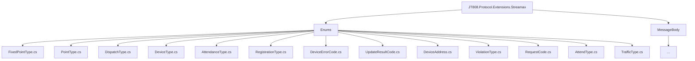
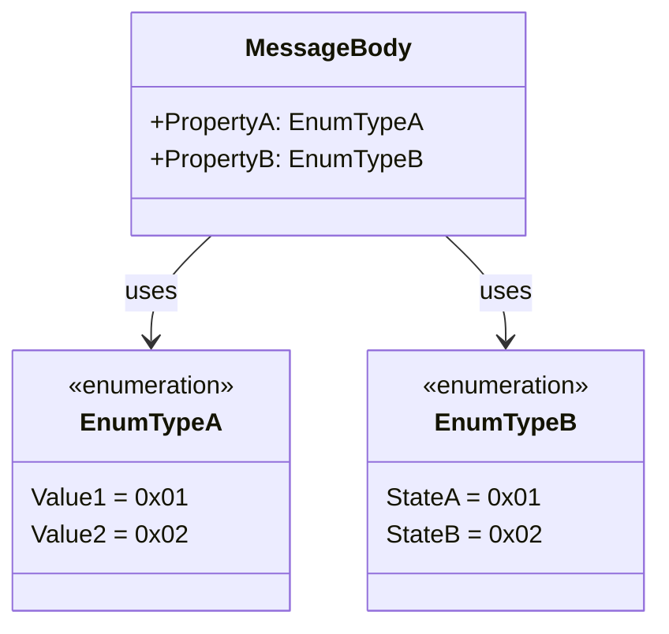
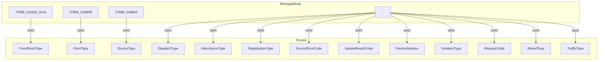

# 枚举类型详解

# 枚举类型详解

## Table of Contents
1. [Introduction](#introduction)
2. [Project Structure](#project-structure)
3. [Core Components](#core-components)
4. [Architecture Overview](#architecture-overview)
5. [Detailed Component Analysis](#detailed-component-analysis)
6. [Dependency Analysis](#dependency-analysis)
7. [Performance Considerations](#performance-considerations)
8. [Troubleshooting Guide](#troubleshooting-guide)
9. [Conclusion](#conclusion)
10. [References](#references)

## Introduction
本文档旨在详细阐述 `Streamax.Protocol.Extensions.Streamax` 项目中定义的枚举类型。这些枚举在协议消息体中扮演着关键角色，用于标准化和规范化各种业务场景下的数据表示。通过深入理解每个枚举的定义、典型取值、业务含义及其在消息体中的应用，开发人员可以更准确地使用和扩展这些枚举，确保系统间通信的正确性和一致性。

## Project Structure
该项目遵循模块化设计，枚举类型集中存放在 `JT808.Protocol.Extensions.Streamax/Enums` 目录下。这种结构使得枚举的查找、管理和维护变得高效。

## Core Components
本节将逐一详解项目中定义的各个枚举类型。

## Architecture Overview
枚举类型作为协议消息体中的数据字段，其架构作用是提供统一的、可解析的业务含义标识。它们通常以字节或字的形式嵌入到消息体中，通过预定义的数值映射到具体的业务状态或类型。

## Detailed Component Analysis

### 1. FixedPointType (定点类型)
*   **定义**: `FixedPointType` 枚举定义了车辆在运营过程中可能遇到的各种固定点类型。[^1]
*   **典型取值**:
    *   `公交首末站` (0x00)
    *   `停车场` (0x01)
    *   `加油站` (0x02)
    *   `维修点` (0x03)
    *   `拐弯点` (0x04)
    *   `安全事故黑点` (0x05)
*   **业务含义**: 用于标识地理位置上的特定兴趣点，例如公交线路的起点终点、车辆停放区域、补给点、维修点等。
*   **在消息体中的应用**: 该枚举通常应用于与地理位置、路线规划或车辆状态上报相关的消息中，例如在设置或上报特定点信息时，会使用此枚举来指明点的具体类型。
*   **选用和扩展**:
    *   **选用**: 开发中应优先使用已定义的枚举值来表示对应的固定点类型，以确保与现有系统的兼容性。
    *   **扩展**: 如果需要引入新的固定点类型，可以在 `FixedPointType` 枚举中添加新的成员，并为其分配一个未被占用的十六进制值。例如，可以添加 `充电站 = 0x06`。

### 2. PointType (点类型)
*   **定义**: `PointType` 枚举定义了与站点相关的事件类型。[^2]
*   **典型取值**:
    *   `到站` (1)
    *   `离站` (2)
    *   `客流` (3)
*   **业务含义**: 描述车辆在站点处的行为或状态，如车辆到达站点、离开站点或站点客流情况。
*   **在消息体中的应用**: 主要用于车辆运营状态上报消息，特别是公交车辆的到离站信息和客流统计。
*   **选用和扩展**:
    *   **选用**: 在处理车辆站点事件时，应使用此枚举来清晰地表达事件的性质。
    *   **扩展**: 若有新的站点相关事件需要上报（如“过站不停”），可在此枚举中增加新成员。

### 3. DispatchType (调度类型)
*   **定义**: `DispatchType` 枚举定义了车辆的调度方式。[^3]
*   **典型取值**:
    *   `全程` (0x01)
    *   `区间` (0x02)
    *   `放站` (0x03)
*   **业务含义**: 指示车辆当前执行的调度任务类型，例如是跑完全程、跑某一段区间，还是在某个站点放客。
*   **在消息体中的应用**: 通常用于调度指令消息或车辆状态上报消息，告知车辆应执行的调度模式或当前正在执行的调度模式。
*   **选用和扩展**:
    *   **选用**: 调度系统在下发调度指令时应使用此枚举。
    *   **扩展**: 如果出现新的调度策略，例如“跨线调度”，可以扩展此枚举。

### 4. DeviceType (设备类型)
*   **定义**: `DeviceType` 枚举定义了车载设备的不同类型。[^4]
*   **典型取值**:
    *   `车载信息终端` (0x01)
    *   `报站显示屏` (0x02)
    *   `路牌` (0x03)
    *   `车辆运行位置显示牌` (0x04)
    *   `电子收费机` (0x05)
    *   `投币机` (0x06)
    *   `媒体播放机` (0x07)
    *   `乘客计数器` (0x08)
    *   `车载优先设备` (0x09)
    *   `发动机仪表` (0x10)
    *   `违章抓拍仪` (0x11)
*   **业务含义**: 用于区分车辆上安装的各种硬件设备，便于系统进行设备管理、状态监控和指令下发。
*   **在消息体中的应用**: 广泛应用于设备注册、设备状态上报、设备配置指令等消息中，通过此枚举来指定消息关联的设备类型。
*   **选用和扩展**:
    *   **选用**: 在需要识别或操作特定车载设备时，必须使用此枚举。
    *   **扩展**: 随着车载设备种类增多，可在此枚举中添加新的设备类型。

### 5. AttendanceType (考勤方式)
*   **定义**: `AttendanceType` 枚举定义了驾驶员或工作人员的考勤方式。[^5]
*   **典型取值**:
    *   `员工卡考勤` (0x01)
    *   `输工号考勤` (0x02)
*   **业务含义**: 描述了考勤操作的具体方式，例如通过刷卡还是手动输入工号进行考勤。
*   **在消息体中的应用**: 通常用于考勤数据上报消息，指明考勤记录是通过何种方式生成的。
*   **选用和扩展**:
    *   **选用**: 在考勤模块开发中，应根据实际考勤机制选择合适的枚举值。
    *   **扩展**: 如果未来引入新的考勤方式（如指纹识别考勤），可在此枚举中新增成员。

### 6. RegistrationType (业务登记类型)
*   **定义**: `RegistrationType` 枚举定义了车辆的业务登记类型。[^6]
*   **典型取值**:
    *   `发车` (0x01)
    *   `进场` (0x02)
*   **业务含义**: 用于记录车辆的关键业务节点，如车辆从场站出发开始运营，或车辆进入场站结束运营。
*   **在消息体中的应用**: 应用于车辆业务状态上报消息，标记车辆当前所处的业务阶段。
*   **选用和扩展**:
    *   **选用**: 在车辆运营管理系统中，用于记录车辆的始发和归场状态。
    *   **扩展**: 若有其他需要登记的业务节点（如“中途休息”），可在此枚举中扩展。

### 7. DeviceErrorCode (设备错误代码)
*   **定义**: `DeviceErrorCode` 枚举定义了车载设备可能出现的错误代码。[^7]
*   **典型取值**:
    *   `卫星定位模块异常` (0x01)
    *   `通信模块异常` (0x02)
    *   `配置文件错误` (0x03)
*   **业务含义**: 用于指示车载设备的故障类型，便于系统进行故障诊断和处理。
*   **在消息体中的应用**: 通常用于设备故障上报消息，向平台报告设备的具体异常情况。
*   **选用和扩展**:
    *   **选用**: 在设备异常处理逻辑中，应使用此枚举来识别错误类型。
    *   **扩展**: 随着设备功能的复杂化，可以添加更细致的错误代码。

### 8. UpdateResultCode (升级结果代码)
*   **定义**: `UpdateResultCode` 枚举定义了设备升级操作的结果。[^8]
*   **典型取值**:
    *   `成功` (0x01)
    *   `连接服务器失败` (0x02)
    *   `验证失败` (0x03)
    *   `下载文件失败` (0x04)
    *   `文件校验错误` (0x05)
    *   `无需升级` (0x06)
*   **业务含义**: 反映了设备固件或软件升级过程的最终状态，无论是成功还是各种失败原因。
*   **在消息体中的应用**: 用于设备升级结果上报消息，告知平台升级任务的执行情况。
*   **选用和扩展**:
    *   **选用**: 在设备远程升级功能中，此枚举是必不可少的结果反馈机制。
    *   **扩展**: 如果有新的升级失败场景（如“存储空间不足”），可以增加新的结果代码。

### 9. DeviceAddress (设备地址)
*   **定义**: `DeviceAddress` 枚举定义了车载信息终端内部或连接的特定设备的地址。[^9]
*   **典型取值**:
    *   `车载信息终端` (0x01)
    *   `报站显示屏前屏` (0x10)
*   **业务含义**: 用于区分车载信息终端本身或其连接的某个特定外设，以便进行精确的指令发送或状态查询。
*   **在消息体中的应用**: 当消息需要针对车载信息终端的某个特定组成部分或外设时，会使用此枚举来指定目标地址。
*   **选用和扩展**:
    *   **选用**: 在与车载信息终端的内部模块或外设交互时使用。
    *   **扩展**: 如果车载信息终端集成了更多可独立寻址的模块或外设，可以添加新的设备地址。

### 10. ViolationType (违章类型)
*   **定义**: `ViolationType` 枚举定义了车辆在运营过程中可能出现的违章或异常行为类型。[^10]
*   **典型取值**:
    *   `超速行车` (0x01)
    *   `低速行车` (0x02)
    *   `滞站` (0x03)
    *   `甩站` (0x04)
    *   `车内温度过高` (0x05)
    *   `车内温度过低` (0x06)
    *   `急刹车` (0x07)
    *   `急加速` (0x08)
    *   `疲劳驾驶` (0x09)
    *   `超载` (0x0A)
    *   `越界行驶` (0x0B)
    *   `报告当前行驶状况` (0x0C)
    *   `超速` (0x0D)
*   **业务含义**: 用于识别和分类车辆的违规操作或异常状态，是安全监控和运营管理的重要依据。
*   **在消息体中的应用**: 广泛应用于报警消息或事件上报消息，指明触发报警的具体违章行为。
*   **选用和扩展**:
    *   **选用**: 智能监控系统在检测到异常行为时，应使用此枚举进行上报。
    *   **扩展**: 随着监控规则的细化，可以增加更具体的违章类型。

### 11. RequestCode (请求代码)
*   **定义**: `RequestCode` 枚举定义了驾驶员或车辆向平台发起的各种请求类型。[^11]
*   **典型取值**:
    *   `请求排班` (0x01)
    *   `请求交班` (0x02)
    *   `请求加油` (0x03)
    *   `请求加气` (0x04)
    *   `请求充电` (0x05)
    *   `请求维修` (0x06)
    *   `请求包车` (0x07)
    *   `请求终止任务` (0x08)
*   **业务含义**: 用于标准化车辆或驾驶员向运营平台发出的服务请求，便于平台进行统一处理和响应。
*   **在消息体中的应用**: 用于车辆或驾驶员主动发起的请求消息，例如请求调度、请求补给等。
*   **选用和扩展**:
    *   **选用**: 在开发车载终端的用户界面或自动请求逻辑时，应使用此枚举。
    *   **扩展**: 如果出现新的服务请求类型，例如“请求救援”，可以扩展此枚举。

### 12. AttendType (考勤类型)
*   **定义**: `AttendType` 枚举定义了考勤事件的具体类型。[^12]
*   **典型取值**:
    *   `上班` (0x01)
    *   `下班` (0x02)
    *   `签到` (0x03)
*   **业务含义**: 区分了考勤记录是表示上班、下班还是单纯的签到行为。
*   **在消息体中的应用**: 用于考勤数据上报消息，精确描述考勤记录的性质。
*   **选用和扩展**:
    *   **选用**: 与 `AttendanceType` 结合使用，共同描述考勤事件的完整信息。
    *   **扩展**: 若有其他考勤状态，如“午休”，可以增加新的考勤类型。

### 13. TrafficType (业务类型)
*   **定义**: `TrafficType` 枚举定义了车辆的业务类型或运行方向。[^13]
*   **典型取值**:
    *   `上行` (0x01)
    *   `下行` (0x02)
    *   `环行` (0x03)
    *   `停主站` (0x04)
    *   `停副站` (0x05)
    *   `出场` (0x80)
    *   `进场` (0x81)
    *   `加油` (0x82)
    *   `加气` (0x83)
    *   `充电` (0x84)
    *   `小修` (0x85)
    *   `大修` (0x86)
    *   `一保` (0x87)
    *   `二保` (0x88)
    *   `三保` (0x89)
    *   `放空` (0x8A)
    *   `停场` (0x8B)
*   **业务含义**: 涵盖了车辆在运营中的多种业务状态和行为，包括线路方向（上行、下行、环行）、站点停靠状态、以及场站内的各种服务活动（加油、维修、保养等）。
*   **在消息体中的应用**: 广泛应用于车辆运营状态上报、业务流程记录等消息中，提供车辆当前业务活动或状态的详细信息。
*   **选用和扩展**:
    *   **选用**: 在车辆运营管理和数据分析中，此枚举是理解车辆行为的关键。
    *   **扩展**: 随着业务场景的增加，可以根据需要添加新的业务类型。

## Dependency Analysis
这些枚举类型是独立的，不直接依赖于其他枚举。它们主要被 `JT808.Protocol.Extensions.Streamax/MessageBody` 目录下的消息体类所引用，作为消息字段的数据类型，从而实现数据的标准化和协议的统一。

## Performance Considerations
枚举类型在协议中通常以字节或短整型表示，占用空间小，解析效率高。其性能影响可以忽略不计。

## Troubleshooting Guide
*   **枚举值冲突**: 在扩展枚举时，务必确保新添加的枚举值与现有值不冲突，特别是当枚举值是作为协议字段传输时。
*   **业务含义不明确**: 如果枚举的业务含义不明确，可能导致开发人员误用。应确保枚举名称和注释清晰地表达其用途。
*   **协议版本兼容性**: 扩展枚举可能影响协议的兼容性。在增加新枚举值时，需要考虑旧版本系统是否能正确处理。通常建议在协议版本升级时引入新的枚举值。

## Conclusion
本文档详细介绍了 `Streamax.Protocol.Extensions.Streamax` 项目中的所有枚举类型。通过对每个枚举的定义、典型取值、业务含义、在消息体中的应用以及如何正确选用和扩展的阐述，旨在帮助开发人员更好地理解和使用这些重要的协议组件。遵循文档中的指导，将有助于确保协议通信的准确性、一致性和可扩展性。

## References
[^1]: [FixedPointType.cs](https://github.com/lishewen/Streamax.Protocol/blob/master/JT808.Protocol.Extensions.Streamax/Enums/FixedPointType.cs)
[^2]: [PointType.cs](https://github.com/lishewen/Streamax.Protocol/blob/master/JT808.Protocol.Extensions.Streamax/Enums/PointType.cs)
[^3]: [DispatchType.cs](https://github.com/lishewen/Streamax.Protocol/blob/master/JT808.Protocol.Extensions.Streamax/Enums/DispatchType.cs)
[^4]: [DeviceType.cs](https://github.com/lishewen/Streamax.Protocol/blob/master/JT808.Protocol.Extensions.Streamax/Enums/DeviceType.cs)
[^5]: [AttendanceType.cs](https://github.com/lishewen/Streamax.Protocol/blob/master/JT808.Protocol.Extensions.Streamax/Enums/AttendanceType.cs)
[^6]: [RegistrationType.cs](https://github.com/lishewen/Streamax.Protocol/blob/master/JT808.Protocol.Extensions.Streamax/Enums/RegistrationType.cs)
[^7]: [DeviceErrorCode.cs](https://github.com/lishewen/Streamax.Protocol/blob/master/JT808.Protocol.Extensions.Streamax/Enums/DeviceErrorCode.cs)
[^8]: [UpdateResultCode.cs](https://github.com/lishewen/Streamax.Protocol/blob/master/JT808.Protocol.Extensions.Streamax/Enums/UpdateResultCode.cs)
[^9]: [DeviceAddress.cs](https://github.com/lishewen/Streamax.Protocol/blob/master/JT808.Protocol.Extensions.Streamax/Enums/DeviceAddress.cs)
[^10]: [ViolationType.cs](https://github.com/lishewen/Streamax.Protocol/blob/master/JT808.Protocol.Extensions.Streamax/Enums/ViolationType.cs)
[^11]: [RequestCode.cs](https://github.com/lishewen/Streamax.Protocol/blob/master/JT808.Protocol.Extensions.Streamax/Enums/RequestCode.cs)
[^12]: [AttendType.cs](https://github.com/lishewen/Streamax.Protocol/blob/master/JT808.Protocol.Extensions.Streamax/Enums/AttendType.cs)
[^13]: [TrafficType.cs](https://github.com/lishewen/Streamax.Protocol/blob/master/JT808.Protocol.Extensions.Streamax/Enums/TrafficType.cs)
