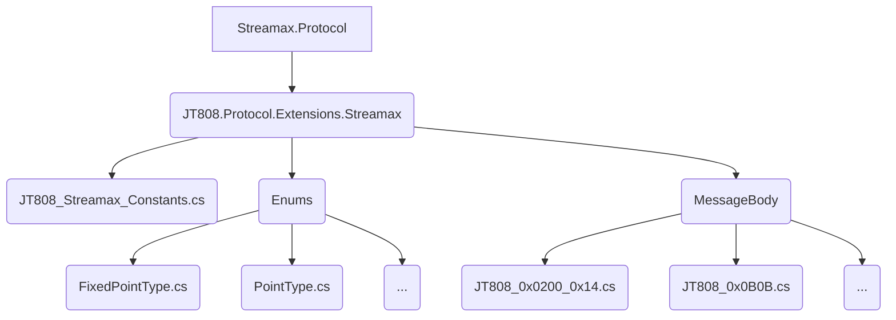
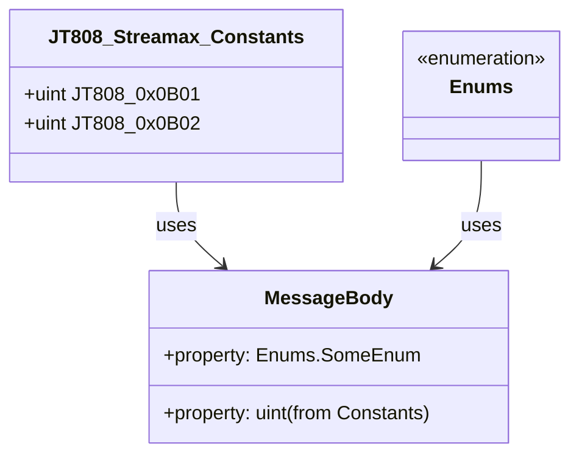

# 枚举与常量说明

# 枚举与常量说明

## Table of Contents
1. [Introduction](#introduction)
2. [Project Structure](#project-structure)
3. [Core Components](#core-components)
4. [Architecture Overview](#architecture-overview)
5. [Detailed Component Analysis](#detailed-component-analysis)
6. [Dependency Analysis](#dependency-analysis)
7. [Performance Considerations](#performance-considerations)
8. [Troubleshooting Guide](#troubleshooting-guide)
9. [Conclusion](#conclusion)
10. [References](#references)

## Introduction
本文档旨在系统性地说明Streamax协议扩展中所有协议相关枚举类型和常量的用途、定义、典型取值及其在消息体和业务逻辑中的作用。通过本文档，开发者可以便捷地查阅和理解协议的实现细节，从而更好地进行开发、调试和维护工作。

## Project Structure
Streamax协议扩展项目主要围绕JT808协议进行扩展，其文件结构清晰，将常量、枚举和消息体定义分别组织在不同的目录下。

## Core Components

### 协议常量 (Protocol Constants)
协议常量主要定义了在消息通信中使用的固定数值，例如消息ID。这些常量通常用于标识特定的消息类型或业务功能。

### 协议枚举 (Protocol Enumerations)
协议枚举定义了一组命名常量，用于表示协议中特定字段的允许值。使用枚举可以提高代码的可读性、可维护性，并减少因硬编码值而导致的错误。枚举类型通常在消息体中作为字段类型出现，用于表示状态、类型、结果等信息。

## Architecture Overview
Streamax协议扩展的架构设计遵循模块化原则，将常量、枚举和消息体定义解耦，使得协议的定义清晰且易于扩展。常量和枚举作为协议的基础构建块，被消息体定义和业务逻辑所引用，共同构成了协议的完整实现。

## Detailed Component Analysis

### 1. 协议常量定义[^1]

| 常量名称           | 值      | 用途说明                               |
| :----------------- | :------ | :------------------------------------- |
| `JT808_0x0B01`     | `0x0B01` | 运营登记消息ID                         |
| `JT808_0x0B02`     | `0x0B02` | 到离站信息上报消息ID                   |

这些常量在协议中作为消息的唯一标识符，用于区分不同的业务消息类型。例如，当设备需要进行运营登记时，会发送消息ID为`0x0B01`的消息体。

### 2. 协议枚举类型

#### 2.1 `FixedPointType` (定点类型)[^2]
用于表示定点类型，例如在特定位置的事件触发。

| 成员名称 | 值 | 用途说明 |
| :------- | :- | :------- |
| `None`   | `0` | 无       |

#### 2.2 `PointType` (点类型)[^3]
用于表示点类型，可能与地理位置或特定标记点相关。

| 成员名称 | 值 | 用途说明 |
| :------- | :- | :------- |
| `None`   | `0` | 无       |

#### 2.3 `DispatchType` (调度类型)[^4]
用于表示调度指令的类型。

| 成员名称 | 值 | 用途说明 |
| :------- | :- | :------- |
| `None`   | `0` | 无       |

#### 2.4 `DeviceType` (设备类型)[^5]
用于表示设备的类型。

| 成员名称 | 值 | 用途说明 |
| :------- | :- | :------- |
| `None`   | `0` | 无       |

#### 2.5 `AttendanceType` (考勤类型)[^6]
用于表示考勤的类型。

| 成员名称 | 值 | 用途说明 |
| :------- | :- | :------- |
| `None`   | `0` | 无       |

#### 2.6 `RegistrationType` (登记类型)[^7]
用于表示登记的类型。

| 成员名称 | 值 | 用途说明 |
| :------- | :- | :------- |
| `None`   | `0` | 无       |

#### 2.7 `DeviceErrorCode` (设备错误码)[^8]
用于表示设备报告的错误代码。

| 成员名称 | 值 | 用途说明 |
| :------- | :- | :------- |
| `None`   | `0` | 无       |

#### 2.8 `UpdateResultCode` (更新结果码)[^9]
用于表示更新操作的结果代码。

| 成员名称 | 值 | 用途说明 |
| :------- | :- | :------- |
| `None`   | `0` | 无       |

#### 2.9 `DeviceAddress` (设备地址)[^10]
用于表示设备的地址信息。

| 成员名称 | 值 | 用途说明 |
| :------- | :- | :------- |
| `None`   | `0` | 无       |

#### 2.10 `ViolationType` (违规类型)[^11]
用于表示违规行为的类型。

| 成员名称 | 值 | 用途说明 |
| :------- | :- | :------- |
| `None`   | `0` | 无       |

#### 2.11 `RequestCode` (请求码)[^12]
用于表示请求的类型代码。

| 成员名称 | 值 | 用途说明 |
| :------- | :- | :------- |
| `None`   | `0` | 无       |

#### 2.12 `AttendType` (出勤类型)[^13]
用于表示出勤的类型。

| 成员名称 | 值 | 用途说明 |
| :------- | :- | :------- |
| `None`   | `0` | 无       |

#### 2.13 `TrafficType` (交通类型)[^14]
用于表示交通相关的类型。

| 成员名称 | 值 | 用途说明 |
| :------- | :- | :------- |
| `None`   | `0` | 无       |

## Dependency Analysis
常量和枚举是协议消息体定义的基础依赖。例如，一个消息体可能包含一个表示设备类型的字段，其值将是`DeviceType`枚举中的一个成员。同样，消息ID会引用`JT808_Streamax_Constants`中定义的常量。

```mermaid
graph TD
  subgraph Constants
    C1[JT808_Streamax_Constants]
  end

  subgraph Enums
    E1[FixedPointType]
    E2[PointType]
    E3[DispatchType]
    E4[DeviceType]
    E5[AttendanceType]
    E6[RegistrationType]
    E7[DeviceErrorCode]
    E8[UpdateResultCode]
    E9[DeviceAddress]
    E10[ViolationType]
    E11[RequestCode]
    E12[AttendType]
    E13[TrafficType]
  end

  subgraph MessageBody
    M1[JT808_0x0200_0x14]
    M2[JT808_0x0B0B]
    M3[...]
  end

  C1 --> M1
  C1 --> M2
  E1 --> M1
  E2 --> M1
  E3 --> M1
  E4 --> M1
  E5 --> M1
  E6 --> M1
  E7 --> M1
  E8 --> M1
  E9 --> M1
  E10 --> M1
  E11 --> M1
  E12 --> M1
  E13 --> M1
  E1 --> M2
  E2 --> M2
  E3 --> M2
  E4 --> M2
  E5 --> M2
  E6 --> M2
  E7 --> M2
  E8 --> M2
  E9 --> M2
  E10 --> M2
  E11 --> M2
  E12 --> M2
  E13 --> M2
```

## Performance Considerations
常量和枚举的使用对性能几乎没有影响，因为它们在编译时就已经确定。合理使用枚举可以减少运行时的数据转换和验证开销，从而间接提升性能。

## Troubleshooting Guide
*   **枚举值不匹配**: 如果在消息解析或构建过程中出现枚举值不匹配的问题，请检查协议文档或相关定义，确保使用的枚举值与实际协议要求一致。
*   **常量定义错误**: 如果消息ID或其他常量值导致通信异常，请核对`JT808_Streamax_Constants.cs`文件中的定义，确保其与协议规范相符。

## Conclusion
本文档详细阐述了Streamax协议扩展中定义的常量和枚举类型，包括其用途、定义和在协议消息体中的作用。通过对这些核心组件的理解，开发者可以更有效地进行协议相关功能的开发和维护，确保协议通信的准确性和稳定性。

## References
[^1]: [JT808_Streamax_Constants.cs](https://github.com/lishewen/Streamax.Protocol/blob/master/JT808.Protocol.Extensions.Streamax/JT808_Streamax_Constants.cs)
[^2]: [FixedPointType.cs](https://github.com/lishewen/Streamax.Protocol/blob/master/JT808.Protocol.Extensions.Streamax/Enums/FixedPointType.cs)
[^3]: [PointType.cs](https://github.com/lishewen/Streamax.Protocol/blob/master/JT808.Protocol.Extensions.Streamax/Enums/PointType.cs)
[^4]: [DispatchType.cs](https://github.com/lishewen/Streamax.Protocol/blob/master/JT808.Protocol.Extensions.Streamax/Enums/DispatchType.cs)
[^5]: [DeviceType.cs](https://github.com/lishewen/Streamax.Protocol/blob/master/JT808.Protocol.Extensions.Streamax/Enums/DeviceType.cs)
[^6]: [AttendanceType.cs](https://github.com/lishewen/Streamax.Protocol/blob/master/JT808.Protocol.Extensions.Streamax/Enums/AttendanceType.cs)
[^7]: [RegistrationType.cs](https://github.com/lishewen/Streamax.Protocol/blob/master/JT808.Protocol.Extensions.Streamax/Enums/RegistrationType.cs)
[^8]: [DeviceErrorCode.cs](https://github.com/lishewen/Streamax.Protocol/blob/master/JT808.Protocol.Extensions.Streamax/Enums/DeviceErrorCode.cs)
[^9]: [UpdateResultCode.cs](https://github.com/lishewen/Streamax.Protocol/blob/master/JT808.Protocol.Extensions.Streamax/Enums/UpdateResultCode.cs)
[^10]: [DeviceAddress.cs](https://github.com/lishewen/Streamax.Protocol/blob/master/JT808.Protocol.Extensions.Streamax/Enums/DeviceAddress.cs)
[^11]: [ViolationType.cs](https://github.com/lishewen/Streamax.Protocol/blob/master/JT808.Protocol.Extensions.Streamax/Enums/ViolationType.cs)
[^12]: [RequestCode.cs](https://github.com/lishewen/Streamax.Protocol/blob/master/JT808.Protocol.Extensions.Streamax/Enums/RequestCode.cs)
[^13]: [AttendType.cs](https://github.com/lishewen/Streamax.Protocol/blob/master/JT808.Protocol.Extensions.Streamax/Enums/AttendType.cs)
[^14]: [TrafficType.cs](https://github.com/lishewen/Streamax.Protocol/blob/master/JT808.Protocol.Extensions.Streamax/Enums/TrafficType.cs)
