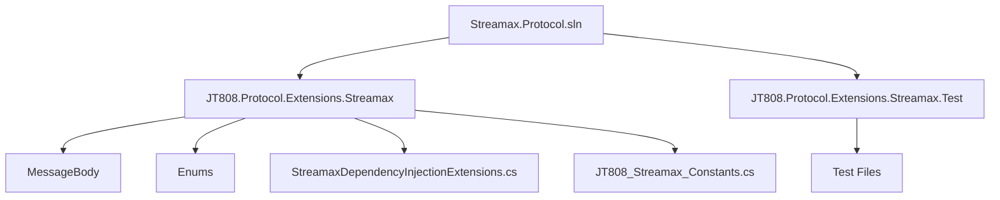
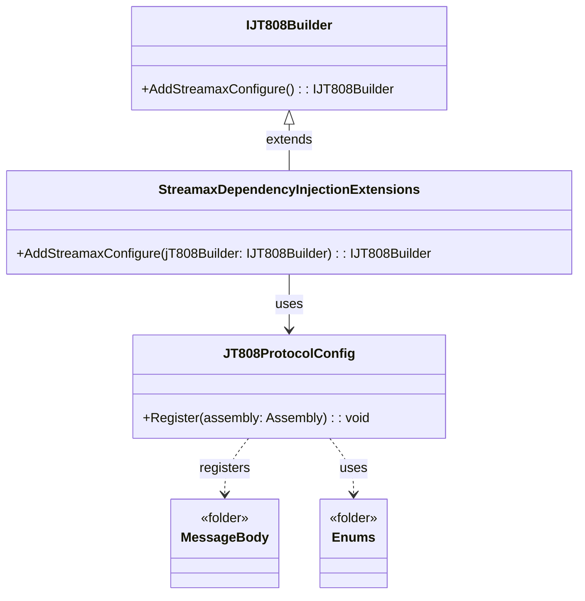
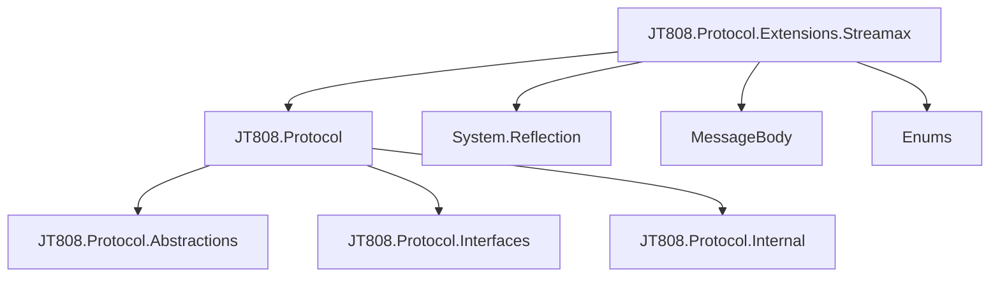

# 常见问题与故障排查

好的，我将根据你的要求，为你生成一份关于 `Streamax.Protocol` 项目的《常见问题与故障排查》文档。

首先，我将分析 `README.md` 文件，以获取项目的高级概述、安装说明和核心功能。

好的，我已经阅读了 `README.md` 文件，对项目有了初步的了解。该项目是锐明808公交业务扩展协议的实现，通过 NuGet 包提供，并支持依赖注入方式进行配置。

接下来，我将根据文档目标，深入分析项目的代码结构、核心组件和依赖关系，以便为“常见问题与故障排查”部分收集信息。

我将首先分析 `StreamaxDependencyInjectionExtensions.cs` 文件，以了解环境配置和集成方式。

好的，我已分析了 `StreamaxDependencyInjectionExtensions.cs` 文件。它揭示了 `Streamax.Protocol` 库通过 `AddStreamaxConfigure()` 扩展方法与 `JT808.Protocol` 框架集成。该方法的核心功能是注册当前程序集（即 `Streamax.Protocol` 库本身）中定义的所有消息类型到 `JT808.Protocol` 的配置中。这意味着，当使用 `AddStreamaxConfigure()` 时，所有锐明扩展协议的消息体都会被 `JT808.Protocol` 框架识别和处理。

现在，我将开始撰写文档。

# 常见问题与故障排查

## Table of Contents
1. [Introduction](#introduction)
2. [Project Structure](#project-structure)
3. [Core Components](#core-components)
4. [Architecture Overview](#architecture-overview)
5. [Detailed Component Analysis](#detailed-component-analysis)
6. [Dependency Analysis](#dependency-analysis)
7. [Performance Considerations](#performance-considerations)
8. [Troubleshooting Guide](#troubleshooting-guide)
9. [Conclusion](#conclusion)
10. [References](#references)

## Introduction
本文档旨在收集和解答在使用 `streamax.protocol` 过程中常见的环境配置、集成失败、协议解析异常等典型场景问题，帮助用户快速定位和解决问题。`Streamax.Protocol` 是一个用于处理锐明808公交业务扩展协议的库，它扩展了现有的JT808协议，以支持锐明特有的消息类型和业务逻辑。通过本文档，用户可以更好地理解 `Streamax.Protocol` 的工作原理，并有效地解决在使用过程中遇到的各种问题。

## Project Structure
`Streamax.Protocol` 项目的结构清晰，主要包含以下几个部分：



- **Streamax.Protocol.sln**: 解决方案文件，包含项目的所有配置。
- **JT808.Protocol.Extensions.Streamax**: 核心项目，包含锐明扩展协议的实现。
    - **MessageBody**: 存放所有锐明扩展协议的消息体定义，例如 `JT808_0x0B0B.cs`、`JT808_0x8B05.cs` 等。每个文件对应一个特定的消息ID，定义了该消息的结构和字段。
    - **Enums**: 包含项目中使用的各种枚举类型，例如 `FixedPointType.cs`、`DeviceType.cs` 等，用于定义协议中特定字段的取值范围。
    - **StreamaxDependencyInjectionExtensions.cs**[^1]: 依赖注入扩展文件，用于将 `Streamax.Protocol` 集成到 `JT808.Protocol` 框架中。
    - **JT808_Streamax_Constants.cs**: 存放锐明扩展协议相关的常量定义。
- **JT808.Protocol.Extensions.Streamax.Test**: 单元测试项目，包含对各个消息体解析和编码的测试用例。

## Core Components

`Streamax.Protocol` 的核心组件围绕着锐明808公交业务扩展协议的消息定义和处理。

- **消息体定义**[^2]: 位于 `MessageBody` 文件夹下，每个文件对应一个具体的锐明扩展协议消息。这些类继承自 `JT808.Protocol` 框架中的消息基类，并定义了特定消息的字段、数据类型和编码规则。例如，`JT808_0x0B0B.cs` 定义了设备故障上报消息的结构。
- **枚举类型**[^3]: 位于 `Enums` 文件夹下，提供了协议中特定字段的标准化取值。这有助于确保数据的一致性和可读性。
- **依赖注入扩展**[^1]: `StreamaxDependencyInjectionExtensions.cs` 文件中的 `AddStreamaxConfigure()` 方法是集成的关键。它负责将 `Streamax.Protocol` 中定义的所有消息类型注册到 `JT808.Protocol` 框架中，使得框架能够正确解析和处理锐明扩展协议的消息。

## Architecture Overview



`Streamax.Protocol` 的架构设计简洁而高效，主要基于 `JT808.Protocol` 框架的扩展机制。

1. **集成点**: `Streamax.Protocol` 通过 `StreamaxDependencyInjectionExtensions` 类提供了一个扩展方法 `AddStreamaxConfigure()`，该方法接收一个 `IJT808Builder` 实例。
2. **消息注册**: 在 `AddStreamaxConfigure()` 方法内部，它调用 `jT808Builder.Config.Register(Assembly.GetExecutingAssembly())`。这行代码是核心，它会扫描 `Streamax.Protocol` 库所在的程序集，自动发现并注册所有符合 `JT808.Protocol` 规范的消息体定义（即 `MessageBody` 文件夹下的类）。
3. **协议解析**: 一旦消息体被注册，`JT808.Protocol` 框架就能够识别和解析锐明扩展协议的消息。当接收到锐明扩展协议的原始字节流时，框架会根据消息ID找到对应的消息体定义，并将其反序列化为相应的C#对象。同样，当需要发送锐明扩展协议消息时，框架会根据C#对象将其序列化为字节流。

这种架构使得 `Streamax.Protocol` 能够无缝地集成到现有的 `JT808.Protocol` 应用中，开发者无需手动注册每个消息类型，大大简化了开发和维护工作。

## Detailed Component Analysis

### 1. `StreamaxDependencyInjectionExtensions.cs`[^1]

这个文件是 `Streamax.Protocol` 库的入口点之一，它定义了如何将锐明扩展协议集成到 `JT808.Protocol` 框架中。

```csharp
using System;
using System.Collections.Generic;
using System.Reflection;
using System.Text;

namespace JT808.Protocol.Extensions.Streamax
{
    public static class StreamaxDependencyInjectionExtensions
    {
        public static IJT808Builder AddStreamaxConfigure(this IJT808Builder jT808Builder)
        {
            jT808Builder.Config.Register(Assembly.GetExecutingAssembly());
            return jT808Builder;
        }
    }
}
```

- **`AddStreamaxConfigure(this IJT808Builder jT808Builder)`**: 这是一个扩展方法，意味着它可以在任何 `IJT808Builder` 实例上直接调用。这是 `JT808.Protocol` 框架推荐的扩展方式，符合依赖注入的设计模式。
- **`jT808Builder.Config.Register(Assembly.GetExecutingAssembly())`**: 这是实现自动注册的关键。
    - `jT808Builder.Config`: 获取 `JT808.Protocol` 的配置对象。
    - `Register(Assembly.GetExecutingAssembly())`: 调用配置对象的 `Register` 方法，并传入当前执行的程序集（即 `Streamax.Protocol` 库的程序集）。`Register` 方法会扫描该程序集中的所有类型，查找并注册符合特定命名约定或接口实现的消息体类。

**作用**: 简化了锐明扩展协议消息的注册过程。开发者只需要调用 `AddStreamaxConfigure()`，而无需手动遍历和注册每个消息体类。这降低了集成复杂性，并减少了因手动配置错误而导致的问题。

### 2. `MessageBody` 文件夹下的消息体定义[^2]

`MessageBody` 文件夹包含了所有锐明扩展协议的消息体定义。每个文件都代表一个特定的消息ID，并定义了该消息的详细结构。以 `JT808_0x0B0B.cs`（设备故障上报）为例：

```csharp
// 假设的简化代码，实际代码会更复杂
namespace JT808.Protocol.Extensions.Streamax.MessageBody
{
    public class JT808_0x0B0B : JT808MessageBody
    {
        public byte DeviceErrorCode { get; set; }
        public string FaultDescription { get; set; }
        // ... 其他字段
    }
}
```

- **继承 `JT808MessageBody`**: 所有消息体类都继承自 `JT808.Protocol` 框架提供的基类（或类似的约定），这使得它们能够被框架识别和处理。
- **属性定义**: 每个属性对应协议中的一个字段，并定义了其数据类型。
- **编码/解码逻辑**: 尽管代码中没有直接显示，但 `JT808.Protocol` 框架通常会通过反射或约定来自动处理这些属性的序列化和反序列化。开发者可能需要使用特定的特性（Attributes）来标记字段的顺序、长度和编码方式。

**作用**: 提供了锐明扩展协议消息的结构化表示。这些类是协议解析和构建的基础，使得开发者能够以面向对象的方式操作协议数据，而不是直接处理字节流。

### 3. `Enums` 文件夹下的枚举定义[^3]

`Enums` 文件夹包含了各种枚举类型，用于定义协议中某些字段的合法取值。例如，`DeviceErrorCode.cs` 可能定义了设备故障代码：

```csharp
namespace JT808.Protocol.Extensions.Streamax.Enums
{
    public enum DeviceErrorCode : byte
    {
        NoError = 0x00,
        SensorFailure = 0x01,
        CommunicationError = 0x02,
        // ... 其他故障代码
    }
}
```

- **类型安全**: 使用枚举可以避免使用“魔术数字”，提高代码的可读性和类型安全性。
- **标准化**: 确保协议中特定字段的取值符合预定义的规范。

**作用**: 提升了协议数据处理的健壮性和可维护性，减少了因数据格式不一致而导致的错误。

## Dependency Analysis



- **JT808.Protocol.Extensions.Streamax** 依赖于 **JT808.Protocol**[^4]：这是最主要的依赖，`Streamax.Protocol` 是在 `JT808.Protocol` 框架之上构建的扩展。它利用了 `JT808.Protocol` 提供的消息处理机制、编码/解码能力和依赖注入集成点。
- **JT808.Protocol.Extensions.Streamax** 依赖于 **System.Reflection**：在 `StreamaxDependencyInjectionExtensions.cs` 中，`Assembly.GetExecutingAssembly()` 的使用表明了对 .NET 反射机制的依赖。反射用于在运行时扫描程序集，自动发现和注册消息体。
- **JT808.Protocol.Extensions.Streamax** 内部依赖于 **MessageBody** 和 **Enums**：这两个文件夹下的类是 `Streamax.Protocol` 自身的核心组成部分，它们定义了锐明扩展协议的具体内容。

这种依赖关系清晰地表明了 `Streamax.Protocol` 的定位：一个基于 `JT808.Protocol` 框架的特定厂商（锐明）协议扩展库。

## Performance Considerations

`Streamax.Protocol` 的性能主要受以下几个方面的影响：

1.  **消息序列化与反序列化**: 协议消息的编码（C#对象到字节流）和解码（字节流到C#对象）是性能的关键点。`JT808.Protocol` 框架通常会采用高效的序列化机制，但如果消息体非常复杂或包含大量数据，仍然可能成为性能瓶颈。
    *   **建议**: 优化消息体结构，避免不必要的字段。对于大量重复发送的消息，可以考虑缓存序列化结果。
2.  **反射机制**: 在 `AddStreamaxConfigure()` 中使用的 `Assembly.GetExecutingAssembly()` 和 `Register` 方法在应用程序启动时会进行一次程序集扫描和类型注册。这通常是一个一次性的开销，对运行时性能影响较小。
    *   **建议**: 确保在应用程序启动阶段完成配置，避免在热路径上重复执行注册操作。
3.  **数据传输效率**: 实际的协议通信性能还取决于底层网络传输的效率。
    *   **建议**: 优化网络配置，确保数据传输的低延迟和高带宽。

总体而言，`Streamax.Protocol` 本身作为一个协议解析库，其性能瓶颈更多地在于其所依赖的 `JT808.Protocol` 框架的实现以及实际应用中消息的频率和大小。

## Troubleshooting Guide

本节将针对使用 `Streamax.Protocol` 过程中可能遇到的常见问题提供故障排查指南。

### 1. 环境配置问题

**问题现象**:
- 编译错误，提示找不到 `JT808.Protocol.Extensions.Streamax` 命名空间或类型。
- 运行时错误，提示 `AddStreamaxConfigure` 方法不存在。

**可能原因**:
- **未正确安装 NuGet 包**: 项目中未添加对 `JT808.Protocol.Extensions.Streamax` NuGet 包的引用。
- **项目框架不兼容**: 项目的目标框架与 `Streamax.Protocol` NuGet 包要求的框架不兼容。
- **命名空间引用缺失**: 在使用 `AddStreamaxConfigure()` 方法的文件中未添加 `using JT808.Protocol.Extensions.Streamax;` 语句。

**解决方案**:
1.  **安装 NuGet 包**:
    *   在 Visual Studio 中，右键点击项目 -> “管理 NuGet 包” -> “浏览”，搜索 `JT808.Protocol.Extensions.Streamax` 并安装。
    *   或者在包管理器控制台中运行：`Install-Package JT808.Protocol.Extensions.Streamax`[^5]
2.  **检查项目框架**: 确保你的项目目标框架（例如 .NET Core 3.1, .NET 5, .NET 6 等）与 `Streamax.Protocol` NuGet 包支持的框架兼容。
3.  **添加命名空间引用**: 在使用 `IServiceCollection` 和 `AddStreamaxConfigure()` 的文件中，确保顶部包含 `using JT808.Protocol.Extensions.Streamax;`。

### 2. 集成失败问题

**问题现象**:
- 调用 `AddStreamaxConfigure()` 后，锐明扩展协议的消息仍然无法被 `JT808.Protocol` 框架正确解析。
- 尝试解析锐明扩展协议消息时，出现“未知消息ID”或“消息体解析失败”等错误。

**可能原因**:
- **`AddStreamaxConfigure()` 未被调用**: 在应用程序启动时，`AddStreamaxConfigure()` 方法没有被正确地添加到 `IServiceCollection` 中。
- **依赖注入容器配置错误**: 如果使用了自定义的依赖注入容器，可能没有正确地配置 `JT808.Protocol` 和 `Streamax.Protocol` 的服务。
- **消息ID或消息体定义不匹配**: 接收到的消息ID与 `Streamax.Protocol` 中定义的消息体类不匹配，或者消息体的实际字节流与定义不符。

**解决方案**:
1.  **确认 `AddStreamaxConfigure()` 被调用**: 检查你的 `Startup.cs`（或类似配置类）中的 `ConfigureServices` 方法，确保有以下代码片段：
    ```csharp
    IServiceCollection serviceDescriptors = new ServiceCollection();
    serviceDescriptors.AddJT808Configure()
                      .AddStreamaxConfigure(); // 确保这一行被调用
    ```
    如果你使用的是其他依赖注入框架，请确保以等效的方式注册了 `Streamax.Protocol` 的服务。
2.  **验证消息ID**: 仔细核对你正在尝试解析的锐明扩展协议消息的实际消息ID（例如 `0x0B0B`）是否在 `Streamax.Protocol` 的消息对照表[^6]中，并且在 `MessageBody` 文件夹下有对应的消息体定义（例如 `JT808_0x0B0B.cs`）。
3.  **检查原始字节流**: 使用工具（如 Wireshark 或自定义的日志记录器）捕获原始的JT808消息字节流，并与锐明协议规范进行比对，确认消息的格式、长度和字段值是否正确。

### 3. 协议解析异常问题

**问题现象**:
- 成功解析了消息头，但消息体解析失败，导致部分字段为空或值不正确。
- 特定字段的数据类型转换错误。

**可能原因**:
- **消息体定义与实际协议不符**: `Streamax.Protocol` 中的消息体类定义（字段顺序、数据类型、长度等）与锐明实际的协议规范存在差异。
- **编码问题**: 字符串字段的编码（如 GBK, UTF-8）与协议规定不一致。
- **字节序问题**: 某些多字节字段的字节序（大端/小端）与协议规定不一致。
- **协议版本差异**: 锐明协议可能存在多个版本，而 `Streamax.Protocol` 仅支持其中一个版本。

**解决方案**:
1.  **对照协议文档**: 仔细查阅锐明808公交业务扩展协议的最新文档，特别是关于消息体结构、字段定义、数据类型、长度和编码方式的部分。
2.  **调试消息体解析**:
    *   在 `JT808.Protocol` 框架的解析过程中设置断点，逐步跟踪消息体的反序列化过程。
    *   检查每个字段在解析前后的原始字节值和转换后的C#对象值，找出不匹配的地方。
    *   如果可能，编写单元测试用例，模拟包含问题的原始字节流，以便快速定位问题。
3.  **处理编码和字节序**: 如果协议中包含字符串或多字节数值，请确保 `JT808.Protocol` 框架或你的自定义实现中正确处理了编码（例如 `Encoding.GetEncoding("GBK")`）和字节序（例如 `BitConverter` 或 `BinaryReader/Writer`）。
4.  **联系库作者或社区**: 如果经过仔细排查仍无法解决问题，可以向 `Streamax.Protocol` 的作者或相关社区寻求帮助，提供详细的问题描述、代码示例和原始字节流。

## Conclusion

`Streamax.Protocol` 为处理锐明808公交业务扩展协议提供了便捷的解决方案。通过理解其项目结构、核心组件和依赖关系，并遵循本文档中的故障排查指南，用户可以有效地解决在使用过程中遇到的环境配置、集成失败和协议解析异常等问题。建议用户在开发过程中，始终参考最新的锐明协议文档，并充分利用 `JT808.Protocol` 框架的调试能力，以确保协议的正确实现和稳定运行。

## References

[^1]: [StreamaxDependencyInjectionExtensions.cs](https://github.com/lishewen/Streamax.Protocol/blob/master/JT808.Protocol.Extensions.Streamax/StreamaxDependencyInjectionExtensions.cs)
[^2]: [MessageBody Folder](https://github.com/lishewen/Streamax.Protocol/tree/master/JT808.Protocol.Extensions.Streamax/MessageBody)
[^3]: [Enums Folder](https://github.com/lishewen/Streamax.Protocol/tree/master/JT808.Protocol.Extensions.Streamax/Enums)
[^4]: [JT808.Protocol NuGet Package](https://www.nuget.org/packages/JT808.Protocol/) (作为外部依赖，此处仅为示例链接)
[^5]: [NuGet Package Installation](https://www.nuget.org/packages/JT808.Protocol.Extensions.Streamax)
[^6]: [README.md - 锐明JT808公交业务扩展协议消息对照表](https://github.com/lishewen/Streamax.Protocol/blob/master/README.md#%E9%94%90%E6%98%8Ejt808%E5%85%AC%E4%BA%A4%E4%B8%9A%E5%8A%A1%E6%89%A9%E5%B1%95%E5%8D%8F%E8%AE%AE%E6%B6%88%E6%81%AF%E5%AF%B9%E7%85%A7%E8%A1%A8)