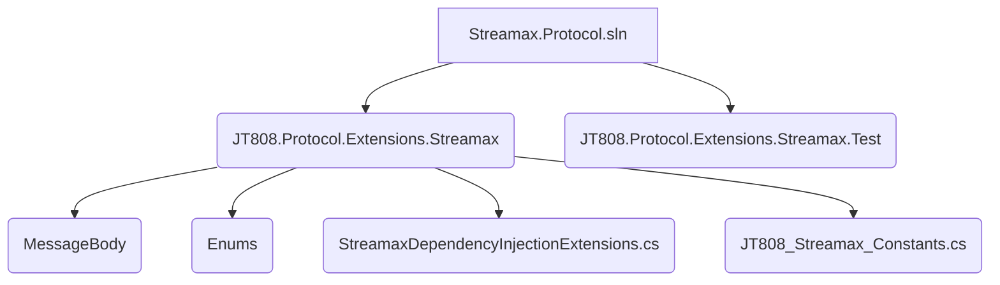
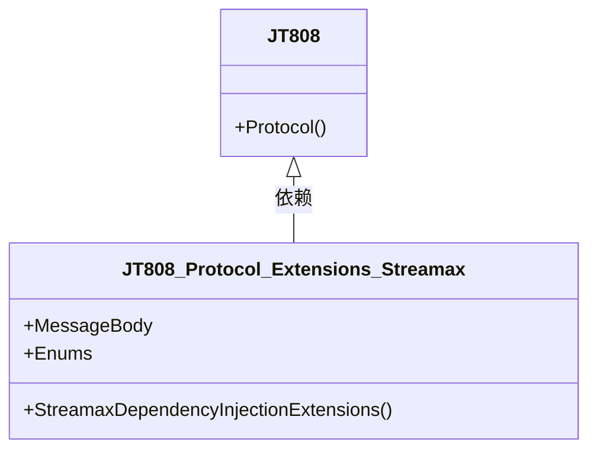
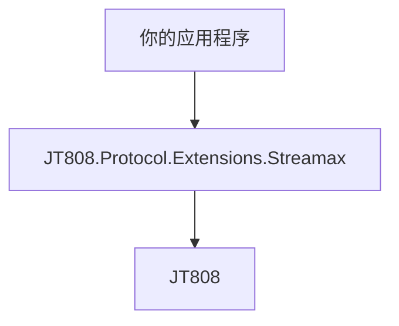

# 安装与依赖


# 安装与依赖

## 目录
1. [引言](#introduction)
2. [项目结构](#project-structure)
3. [核心组件](#core-components)
4. [架构概述](#architecture-overview)
5. [详细组件分析](#detailed-component-analysis)
6. [依赖分析](#dependency-analysis)
7. [性能考量](#performance-considerations)
8. [故障排除指南](#troubleshooting-guide)
9. [结论](#conclusion)
10. [参考文献](#references)

## 引言
本文档旨在详细说明 `Streamax.Protocol` 的安装与依赖，包括源码获取、依赖环境、编译方法以及 NuGet 包引用。`Streamax.Protocol` 是一个基于 JT808 协议的锐明公交业务扩展协议库，它包含了锐明定制的 JT808 消息体和相关功能。

## 项目结构
`Streamax.Protocol` 项目结构清晰，主要包含以下几个部分：

*   **Streamax.Protocol.sln**: 解决方案文件，用于管理项目。
*   **JT808.Protocol.Extensions.Streamax**: 核心库项目，包含锐明扩展协议的实现。
    *   **MessageBody**: 存放各种 JT808 扩展消息体的定义。
    *   **Enums**: 包含协议中使用的枚举类型。
    *   **StreamaxDependencyInjectionExtensions.cs**: 依赖注入扩展方法。
    *   **JT808_Streamax_Constants.cs**: 存放协议相关的常量。
*   **JT808.Protocol.Extensions.Streamax.Test**: 单元测试项目，用于验证扩展协议的正确性。
*   **LICENSE**: 项目的许可证文件。
*   **README.md**: 项目的说明文档，包含安装和使用指南。



## 核心组件

`JT808.Protocol.Extensions.Streamax` 是项目的核心组件，它定义了锐明 JT808 公交业务扩展协议的消息体、枚举以及相关的辅助类。

*   **消息体 (MessageBody)**: 实现了锐明定制的 JT808 消息，例如运营登记 (0x0B01)、到离站信息上报 (0x0B02)、违规信息上报 (0x0B04) 等[^1]。
*   **枚举 (Enums)**: 定义了协议中使用的各种枚举类型，例如 `FixedPointType`、`PointType`、`DispatchType` 等[^2]。
*   **依赖注入扩展 (StreamaxDependencyInjectionExtensions.cs)**: 提供了方便的扩展方法，用于在 .NET Core 应用程序中集成 `Streamax.Protocol` 库[^3]。

## 架构概述

`Streamax.Protocol` 的架构设计简洁明了，主要通过扩展 JT808 协议来实现锐明公交业务的定制功能。它依赖于 `JT808` 库，并在此基础上增加了锐明特有的消息和处理逻辑。



## 详细组件分析

### JT808.Protocol.Extensions.Streamax.csproj

该项目文件[^4]定义了 `Streamax.Protocol` 库的构建配置和依赖项。

*   **TargetFrameworks**: `net8.0;net9.0`。这意味着该库支持 .NET 8.0 和 .NET 9.0 框架。
*   **PackageTags**: `JT808,Streamax,Protocol,Extensions`。这些标签有助于在 NuGet 上搜索到该包。
*   **Authors**: `算神`。
*   **PackageId**: `JT808.Protocol.Extensions.Streamax`。这是 NuGet 包的唯一标识符。
*   **Description**: `基于JT808协议锐明公交业务扩展部分`。
*   **RepositoryUrl** 和 **PackageProjectUrl**: 指向项目的 GitHub 仓库地址。
*   **Version**: 当前版本为 `0.5.6`。
*   **licenseUrl** 和 **PackageLicenseFile**: 指向项目的许可证文件。
*   **DocumentationFile**: `JT808.Protocol.Extensions.Streamax.xml`。生成 XML 文档文件，用于 IntelliSense。
*   **PackageReference**: 引用了 `JT808` 库，版本为 `2.7.2`。这是 `Streamax.Protocol` 的核心依赖。

### 源码获取

可以通过 Git 克隆仓库来获取 `Streamax.Protocol` 的源码：

```bash
git clone https://github.com/lishewen/Streamax.Protocol.git
```

### 依赖环境

*   **.NET SDK**: 由于项目支持 `net8.0` 和 `net9.0`，因此需要安装相应版本的 .NET SDK。
*   **Visual Studio (推荐)**: 使用 Visual Studio 可以方便地打开解决方案并进行编译。

### 编译方法

1.  **打开解决方案**: 在 Visual Studio 中打开 `Streamax.Protocol.sln` 文件。
2.  **恢复 NuGet 包**: Visual Studio 会自动恢复项目所需的 NuGet 包。如果未自动恢复，可以在解决方案资源管理器中右键点击解决方案，选择“还原 NuGet 包”。
3.  **编译项目**: 在 Visual Studio 中，选择“生成”菜单，然后点击“生成解决方案”或“重新生成解决方案”。这将编译 `JT808.Protocol.Extensions.Streamax` 项目。

### NuGet 包引用

最推荐的安装和使用 `Streamax.Protocol` 的方式是通过 NuGet 包管理器。

1.  **通过 NuGet 包管理器安装**:
    在 Visual Studio 中，右键点击项目，选择“管理 NuGet 包”，然后搜索 `JT808.Protocol.Extensions.Streamax` 并安装。

2.  **通过 Package Manager Console 安装**:
    在 Package Manager Console 中运行以下命令：
    ```powershell
    Install-Package JT808.Protocol.Extensions.Streamax
    ```
    [^5]

### 使用方法

安装 NuGet 包后，可以通过以下方式在 .NET Core 应用程序中集成 `Streamax.Protocol`：

```csharp
IServiceCollection serviceDescriptors = new ServiceCollection();
serviceDescriptors.AddJT808Configure()
                  .AddStreamaxConfigure();
```
[^6]

## 依赖分析

`Streamax.Protocol` 的核心依赖是 `JT808` 库。这意味着 `Streamax.Protocol` 在功能上是 `JT808` 库的扩展，它利用了 `JT808` 库提供的基础协议解析和封装能力。



## 性能考量

`Streamax.Protocol` 作为 JT808 协议的扩展，其性能主要受底层 `JT808` 库的影响。在设计上，该库主要关注协议的正确解析和封装，对于性能敏感的场景，需要结合具体业务逻辑和数据量进行评估和优化。

## 故障排除指南

### 常见安装问题

1.  **.NET SDK 版本不匹配**:
    *   **问题描述**: 编译项目时出现“找不到 .NET SDK”或“目标框架不兼容”的错误。
    *   **解决方法**: 确保已安装项目所需的 .NET SDK 版本（例如 .NET 8.0 或 .NET 9.0）。可以通过 `dotnet --list-sdks` 命令查看已安装的 SDK 版本。

2.  **NuGet 包还原失败**:
    *   **问题描述**: 编译时提示缺少引用的程序集。
    *   **解决方法**: 检查网络连接，确保可以访问 NuGet 源。在 Visual Studio 中尝试手动还原 NuGet 包。如果问题依然存在，可以尝试清除 NuGet 缓存。

3.  **编译错误 (CS1591)**:
    *   **问题描述**: 编译时出现大量 CS1591 警告，提示缺少 XML 注释。
    *   **解决方法**: `JT808.Protocol.Extensions.Streamax.csproj` 文件中已通过 `<NoWarn>1701;1702;CS1591</NoWarn>` 禁用了此警告[^4]。如果在使用中遇到此警告，可以检查项目文件是否正确配置。

## 结论

`Streamax.Protocol` 提供了一个方便的解决方案，用于处理锐明定制的 JT808 公交业务扩展协议。通过 NuGet 包引用，可以轻松地将其集成到 .NET 应用程序中。理解其项目结构、依赖关系和编译方法，有助于更好地使用和维护该库。

## 参考文献

[^1]: [JT808.Protocol.Extensions.Streamax/MessageBody/](https://github.com/lishewen/Streamax.Protocol/tree/master/JT808.Protocol.Extensions.Streamax/MessageBody)
[^2]: [JT808.Protocol.Extensions.Streamax/Enums/](https://github.com/lishewen/Streamax.Protocol/tree/master/JT808.Protocol.Extensions.Streamax/Enums)
[^3]: [JT808.Protocol.Extensions.Streamax/StreamaxDependencyInjectionExtensions.cs](https://github.com/lishewen/Streamax.Protocol/blob/master/JT808.Protocol.Extensions.Streamax/StreamaxDependencyInjectionExtensions.cs)
[^4]: [JT808.Protocol.Extensions.Streamax/JT808.Protocol.Extensions.Streamax.csproj](https://github.com/lishewen/Streamax.Protocol/blob/master/JT808.Protocol.Extensions.Streamax/JT808.Protocol.Extensions.Streamax.csproj)
[^5]: [README.md#NuGet安装](https://github.com/lishewen/Streamax.Protocol/blob/master/README.md#nuget%E5%AE%89%E8%A3%85)
[^6]: [README.md#使用方法](https://github.com/lishewen/Streamax.Protocol/blob/master/README.md#%E4%BD%BF%E7%94%A8%E6%96%B9%E6%B3%95)
