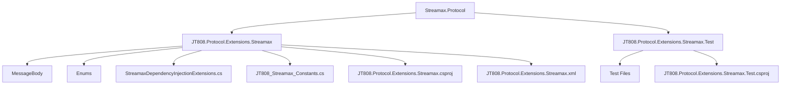
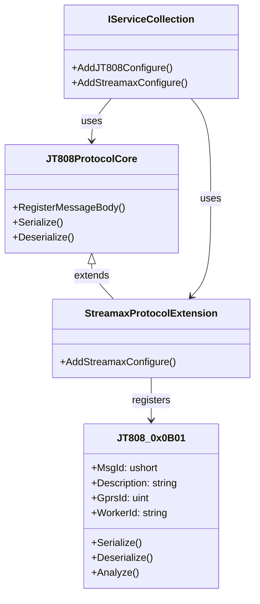
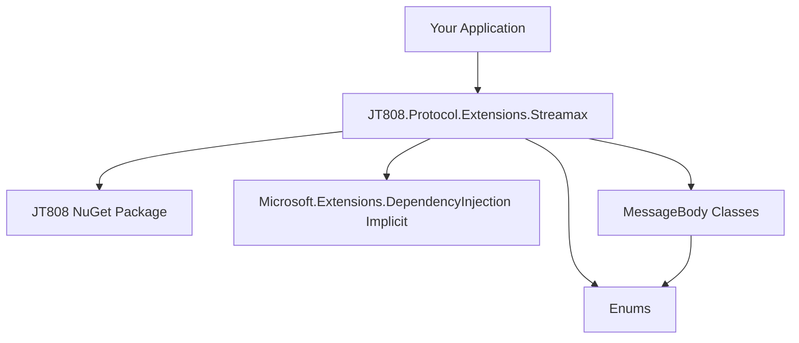

# 快速开始


# 快速开始

## 目录
1. [引言](#引言)
2. [项目结构](#项目结构)
3. [核心组件](#核心组件)
4. [架构概述](#架构概述)
5. [详细组件分析](#详细组件分析)
6. [依赖分析](#依赖分析)
7. [性能考量](#性能考量)
8. [故障排除指南](#故障排除指南)
9. [结论](#结论)
10. [参考](#参考)

## 引言
`Streamax.Protocol` 是一个基于 JT808 协议的扩展库，专门为锐明（Streamax）公交业务提供了额外的协议支持。它旨在帮助开发者轻松地将锐明设备的特定业务逻辑集成到现有的 JT808 协议通信系统中。通过提供预定义的锐明扩展消息体和便捷的依赖注入配置，该项目极大地简化了与锐明设备进行数据交互的复杂性，使得开发者能够快速实现运营登记、到离站信息上报、违规信息上报等多种公交业务功能。

## 项目结构
`Streamax.Protocol` 项目的结构清晰，主要分为两个核心部分：核心库和测试项目。



- **JT808.Protocol.Extensions.Streamax/**[^1]: 这是项目的核心库，包含了所有锐明扩展协议的实现。
    - **MessageBody/**[^2]: 该目录下定义了锐明扩展协议中各种消息体的结构，例如运营登记 (0x0B01)、到离站信息上报 (0x0B02) 等。每个文件对应一个特定的消息ID。
    - **Enums/**[^3]: 包含了协议中使用的各种枚举类型，如固定点类型、设备类型等，用于规范协议中的某些字段值。
    - **StreamaxDependencyInjectionExtensions.cs**[^4]: 提供了便捷的依赖注入扩展方法，使得在 .NET Core 应用程序中集成此库变得非常简单。
    - **JT808_Streamax_Constants.cs**: 定义了锐明扩展协议中可能用到的一些常量。
    - **JT808.Protocol.Extensions.Streamax.csproj**[^5]: 项目文件，定义了项目的元数据、目标框架、依赖项等。
    - **JT808.Protocol.Extensions.Streamax.xml**: 自动生成的文档文件，包含了代码注释。
- **JT808.Protocol.Extensions.Streamax.Test/**[^6]: 包含了一系列单元测试，用于验证核心库中实现的锐明扩展协议消息体的正确性。这些测试用例对于理解消息体的序列化和反序列化过程非常有帮助。

## 核心组件
`Streamax.Protocol` 的核心组件围绕着 JT808 协议的扩展性设计，主要包括：

1.  **扩展消息体 (MessageBody)**: 这是最核心的部分，项目为锐明公交业务定义的各种特定消息，如运营登记 (0x0B01)、到离站信息上报 (0x0B02) 等，都以单独的类形式存在于 `MessageBody` 目录下。每个消息体类都实现了 `JT808Bodies` 接口，并包含了该消息特有的字段和序列化/反序列化逻辑。
2.  **依赖注入扩展 (StreamaxDependencyInjectionExtensions)**: 提供了一个 `AddStreamaxConfigure` 扩展方法，使得开发者可以方便地将锐明扩展协议集成到基于 `Microsoft.Extensions.DependencyInjection` 的应用中。
3.  **枚举定义 (Enums)**: 为了确保协议字段的标准化和可读性，项目中定义了多种枚举类型，用于表示协议中特定字段的含义，例如 `FixedPointType`、`DeviceType` 等。
4.  **JT808 协议依赖**: 整个项目是建立在 `JT808` 协议库之上的，它利用了 `JT808` 库提供的基础框架进行消息的编码、解码和处理。

## 架构概述
`Streamax.Protocol` 的架构设计是基于对现有 JT808 协议的扩展。它作为一个独立的库，通过依赖注入的方式与主 JT808 协议处理流程无缝集成。



**工作流程概述：**

1.  **初始化**: 在应用程序启动时，通过 `IServiceCollection` 注册 `JT808` 核心配置 (`AddJT808Configure()`)。
2.  **扩展注册**: 紧接着，调用 `StreamaxProtocolExtension` 中提供的 `AddStreamaxConfigure()` 方法。这个方法会扫描 `Streamax.Protocol` 库所在的程序集，并将其内部定义的锐明扩展消息体（例如 `JT808_0x0B01` 等）注册到 JT808 协议的核心处理器中。
3.  **消息处理**: 当 JT808 协议栈接收到或需要发送一个锐明扩展消息时，核心处理器会根据消息ID找到对应的已注册消息体类（如 `JT808_0x0B01`）。
4.  **序列化/反序列化**: 找到对应的消息体类后，将利用该类的 `Serialize` 或 `Deserialize` 方法来完成消息数据的编码或解码，从而实现锐明扩展协议数据的正确解析和构建。

这种架构使得 `Streamax.Protocol` 能够作为 JT808 协议的一个插件或模块，在不修改 JT808 核心代码的情况下，为其增加了锐明业务的特定处理能力，保持了良好的模块化和可扩展性。

## 详细组件分析

### 1. `StreamaxDependencyInjectionExtensions.cs`[^4]
这个文件是集成 `Streamax.Protocol` 库到 .NET Core 应用程序的关键。它提供了一个静态扩展方法，简化了依赖注入的配置过程。

```csharp
public static class StreamaxDependencyInjectionExtensions
{
    public static IJT808Builder AddStreamaxConfigure(this IJT808Builder jT808Builder)
    {
        jT808Builder.Config.Register(Assembly.GetExecutingAssembly());
        return jT808Builder;
    }
}
```
-   **`AddStreamaxConfigure` 方法**: 这是一个对 `IJT808Builder` 接口的扩展方法。它的作用是接收一个 `IJT808Builder` 实例，然后通过 `jT808Builder.Config.Register(Assembly.GetExecutingAssembly())` 将当前程序集（即 `JT808.Protocol.Extensions.Streamax`）中定义的所有 JT808 消息体（包括锐明扩展消息）注册到 JT808 协议配置中。这意味着，一旦调用此方法，JT808 协议框架就能识别并处理所有锐明扩展消息。

### 2. `JT808_0x0B01.cs`[^7] (运营登记消息体)
这是 `MessageBody` 目录下的一个典型消息体实现，代表了锐明扩展协议中的“运营登记”消息。

```csharp
namespace JT808.Protocol.Extensions.Streamax.MessageBody
{
    /// <summary>
    /// 运营登记
    /// </summary>
    public class JT808_0x0B01 : JT808MessagePackFormatter<JT808_0x0B01>, JT808Bodies, IJT808Analyze
    {
        public ushort MsgId => 0x0B01;

        public string Description => "运营登记";
        /// <summary>
        /// 线路编号
        /// </summary>
        public uint GprsId { get; set; }
        /// <summary>
        /// 员工编号
        /// </summary>
        public string WorkerId { get; set; }
        /// <summary>
        /// 跳过数据体序列化
        /// </summary>
        public bool SkipSerialization => false;

        public void Analyze(ref JT808MessagePackReader reader, Utf8JsonWriter writer, IJT808Config config)
        {
            // ... (解析逻辑)
        }

        public override JT808_0x0B01 Deserialize(ref JT808MessagePackReader reader, IJT808Config config)
        {
            // ... (反序列化逻辑)
        }

        public override void Serialize(ref JT808MessagePackWriter writer, JT808_0x0B01 value, IJT808Config config)
        {
            writer.WriteUInt32(value.GprsId);
            writer.WriteString(value.WorkerId);
        }
    }
}
```
-   **`MsgId`**: 消息ID，对于运营登记消息，其值为 `0x0B01`。这是协议中唯一标识此消息的ID。
-   **`Description`**: 消息的中文描述，方便理解其用途。
-   **属性 (Properties)**: 定义了消息体包含的业务字段，例如 `GprsId` (线路编号) 和 `WorkerId` (员工编号)。这些属性直接映射到协议数据包中的相应字段。
-   **`Serialize` 方法**: 负责将 `JT808_0x0B01` 类的实例转换为字节流，以便在网络中传输。它按照协议规范的顺序和数据类型写入各个字段。
-   **`Deserialize` 方法**: 负责将接收到的字节流解析回 `JT808_0x0B01` 类的实例。它按照协议规范的顺序和数据类型从字节流中读取各个字段。
-   **`Analyze` 方法**: 用于在调试或日志记录时，将消息体的内容解析并以 JSON 格式输出，方便开发者查看消息的详细结构和值。

### 3. `JT808.Protocol.Extensions.Streamax.csproj`[^5]
这个项目文件定义了 `Streamax.Protocol` 库的构建配置和元数据。

```xml
<Project Sdk="Microsoft.NET.Sdk">
    <PropertyGroup>
        <TargetFrameworks>net8.0;net9.0</TargetFrameworks>
        <Copyright>Copyright 算神工作室 2024.</Copyright>
        <PackageTags>JT808,Streamax,Protocol,Extensions</PackageTags>
        <Authors>算神</Authors>
        <PackageId>JT808.Protocol.Extensions.Streamax</PackageId>
        <Product>JT808.Protocol.Extensions.Streamax</Product>
        <Description>基于JT808协议锐明公交业务扩展部分</Description>
        <PackageReleaseNotes>基于JT808协议锐明公交业务扩展部分</PackageReleaseNotes>
        <RepositoryUrl>https://github.com/lishewen/Streamax.Protocol</RepositoryUrl>
        <PackageProjectUrl>https://github.com/lishewen/Streamax.Protocol</PackageProjectUrl>
        <Version>0.5.6</Version>
        <licenseUrl>https://github.com/lishewen/Streamax.Protocol/blob/master/LICENSE</licenseUrl>
        <license>https://github.com/lishewen/Streamax.Protocol/blob/master/LICENSE</license>
        <DocumentationFile>JT808.Protocol.Extensions.Streamax.xml</DocumentationFile>
        <NoWarn>1701;1702;CS1591</NoWarn>
        <PackageReadmeFile>readme.md</PackageReadmeFile>
        <PackageLicenseFile>LICENSE</PackageLicenseFile>
    </PropertyGroup>

    <ItemGroup>
        <PackageReference Include="JT808" Version="2.7.2" />
        <None Include="..\readme.md" Pack="true" PackagePath="\" />
        <None Include="..\LICENSE" Pack="true" PackagePath="\" />
    </ItemGroup>
</Project>
```
-   **`TargetFrameworks`**: 指定了项目支持的 .NET 版本，目前是 `net8.0` 和 `net9.0`，这意味着它可以在这些 .NET 环境中运行。
-   **`PackageId`**: NuGet 包的唯一标识符，即 `JT808.Protocol.Extensions.Streamax`。
-   **`Description`**: 对 NuGet 包的简短描述，指明它是“基于JT808协议锐明公交业务扩展部分”。
-   **`RepositoryUrl` 和 `PackageProjectUrl`**: 指向项目的 GitHub 仓库地址。
-   **`Version`**: 当前 NuGet 包的版本号。
-   **`PackageReference Include="JT808"`**: 明确指出了项目对 `JT808` 核心库的依赖，版本为 `2.7.2`。这是 `Streamax.Protocol` 能够扩展 JT808 协议的基础。
-   **`None Include="..\readme.md"` 和 `None Include="..\LICENSE"`**: 表示在打包 NuGet 时，会包含项目根目录下的 `readme.md` 和 `LICENSE` 文件。

## 依赖分析
`Streamax.Protocol` 项目的依赖关系相对简单，主要围绕其作为 JT808 协议扩展库的定位。



-   **外部依赖**:
    -   **JT808 (NuGet Package)**[^5]: 这是 `Streamax.Protocol` 最核心的外部依赖。`Streamax.Protocol` 是在 `JT808` 协议框架之上构建的，利用了 `JT808` 库提供的消息解析、序列化和注册机制。没有 `JT808` 库，`Streamax.Protocol` 将无法独立运行。
    -   **Microsoft.Extensions.DependencyInjection (隐式依赖)**: 尽管在 `.csproj` 文件中没有直接列出，但 `StreamaxDependencyInjectionExtensions.cs`[^4] 文件中的 `IServiceCollection` 和 `IJT808Builder` 接口的使用表明了对 .NET Core 依赖注入框架的隐式依赖。这是为了方便在现代 .NET 应用程序中集成和管理服务。

-   **内部依赖**:
    -   **MessageBody Classes**[^2] **-> Enums**[^3]: 锐明扩展协议中的许多消息体类（如 `JT808_0x0B01`）会使用 `Enums` 目录下定义的枚举类型来表示协议中的特定字段值，确保数据的一致性和可读性。
    -   **StreamaxDependencyInjectionExtensions.cs**[^4] **-> MessageBody Classes**: `StreamaxDependencyInjectionExtensions` 通过程序集扫描的方式，将 `MessageBody` 目录下定义的所有消息体类注册到 JT808 协议框架中，使得这些扩展消息能够被正确识别和处理。

## 性能考量
对于协议扩展库而言，性能主要体现在消息的序列化和反序列化效率上。`Streamax.Protocol` 项目基于 `JT808` 协议库，而 `JT808` 库在设计时已经考虑了性能优化。

1.  **MessagePack 序列化**: 从 `JT808_0x0B01.cs`[^7] 文件中可以看出，消息体类继承自 `JT808MessagePackFormatter`。这表明 `JT808` 库及其扩展使用了 MessagePack 格式进行数据序列化和反序列化。MessagePack 是一种高效的二进制序列化格式，相比于文本格式（如 JSON）或一些反射机制较多的序列化方式，通常能提供更快的速度和更小的数据体积，这对于网络通信协议来说至关重要。
2.  **直接字节操作**: 在 `Serialize` 和 `Deserialize` 方法中，通常会直接操作字节流（例如 `writer.WriteUInt32`、`reader.ReadUInt32`），而不是依赖于复杂的对象映射或反射。这种直接的字节操作避免了不必要的开销，有助于提高处理速度。
3.  **依赖注入的开销**: 依赖注入本身会带来微小的启动开销，但在运行时，一旦服务被解析并缓存，其性能影响可以忽略不计。对于一个协议处理库来说，这种开销是完全可以接受的，并且带来的可维护性和可扩展性收益远大于其性能成本。

总的来说，`Streamax.Protocol` 在性能方面是可靠的，得益于其底层 `JT808` 库对高效二进制序列化和直接字节操作的采用。

## 故障排除指南
根据提供的 `README.md` 和项目文件，没有直接的故障排除章节。然而，基于项目的性质和常见的开发实践，以下是一些可能遇到的问题及相应的排查思路：

1.  **消息无法解析或序列化错误**:
    *   **问题描述**: 发送或接收锐明扩展协议消息时，出现解析失败、数据乱码或序列化异常。
    *   **排查思路**:
        *   **注册问题**: 确保已正确调用 `serviceDescriptors.AddJT808Configure().AddStreamaxConfigure();`[^8] 来注册 `Streamax.Protocol` 的扩展。如果未注册，JT808 核心库将无法识别锐明扩展消息体。
        *   **消息ID不匹配**: 检查发送或接收的消息ID是否与 `MessageBody` 目录下定义的 `MsgId` 匹配。例如，运营登记的消息ID必须是 `0x0B01`[^7]。
        *   **协议字段不匹配**: 仔细核对自定义消息体类中的字段类型、顺序和长度是否与锐明设备的实际协议规范完全一致。任何不匹配都可能导致序列化/反序列化错误。
        *   **数据类型转换**: 检查在 `Serialize` 和 `Deserialize` 方法中，数据类型转换是否正确，例如 `uint`、`string` 等。

2.  **依赖注入问题**:
    *   **问题描述**: 在使用 `AddStreamaxConfigure()` 方法时，编译或运行时报错，提示找不到方法或类型。
    *   **排查思路**:
        *   **NuGet 包未安装**: 确认已通过 NuGet 正确安装了 `JT808.Protocol.Extensions.Streamax` 包[^9]。
        *   **命名空间引用**: 确保在代码文件中正确引用了必要的命名空间，例如 `using JT808.Protocol.Extensions.Streamax;`。
        *   **JT808 核心库版本**: 检查 `JT808` 核心库的版本是否与 `Streamax.Protocol` 兼容。通常，`Streamax.Protocol` 会在其 `.csproj` 文件中指定所依赖的 `JT808` 版本[^5]。

3.  **测试用例失败**:
    *   **问题描述**: 运行 `JT808.Protocol.Extensions.Streamax.Test` 项目中的测试时，部分或全部测试失败。
    *   **排查思路**:
        *   **环境问题**: 确保测试环境（如 .NET SDK 版本）与项目要求的 `TargetFrameworks` (`net8.0;net9.0`[^5]) 兼容。
        *   **代码修改**: 如果对核心库进行了修改，请确保修改没有引入新的 bug，并且测试用例仍然有效。

## 结论
`Streamax.Protocol` 项目为基于 JT808 协议的锐明公交业务扩展提供了一个高效、易于集成的解决方案。通过清晰的项目结构、标准化的消息体定义以及便捷的依赖注入机制，它极大地降低了开发者处理锐明特定协议的门槛。该库利用了 MessagePack 进行高效的二进制序列化，确保了良好的运行时性能。对于需要与锐明设备进行数据交互的 JT808 平台开发者而言，`Streamax.Protocol` 是一个值得推荐的工具，能够帮助他们快速构建稳定可靠的通信应用。

## 参考
[^1]: [项目核心库目录](https://github.com/lishewen/Streamax.Protocol/tree/master/JT808.Protocol.Extensions.Streamax)
[^2]: [消息体定义目录](https://github.com/lishewen/Streamax.Protocol/tree/master/JT808.Protocol.Extensions.Streamax/MessageBody)
[^3]: [枚举定义目录](https://github.com/lishewen/Streamax.Protocol/tree/master/JT808.Protocol.Extensions.Streamax/Enums)
[^4]: [依赖注入扩展文件](https://github.com/lishewen/Streamax.Protocol/blob/master/JT808.Protocol.Extensions.Streamax/StreamaxDependencyInjectionExtensions.cs)
[^5]: [项目文件](https://github.com/lishewen/Streamax.Protocol/blob/master/JT808.Protocol.Extensions.Streamax/JT808.Protocol.Extensions.Streamax.csproj)
[^6]: [测试项目目录](https://github.com/lishewen/Streamax.Protocol/tree/master/JT808.Protocol.Extensions.Streamax.Test)
[^7]: [运营登记消息体文件](https://github.com/lishewen/Streamax.Protocol/blob/master/JT808.Protocol.Extensions.Streamax/MessageBody/JT808_0x0B01.cs)
[^8]: [README.md 中的使用方法](https://github.com/lishewen/Streamax.Protocol/blob/master/README.md#%E4%BD%BF%E7%94%A8%E6%96%B9%E6%B3%95)
[^9]: [README.md 中的 NuGet 安装信息](https://github.com/lishewen/Streamax.Protocol/blob/master/README.md#nuget%E5%AE%89%E8%A3%85)
