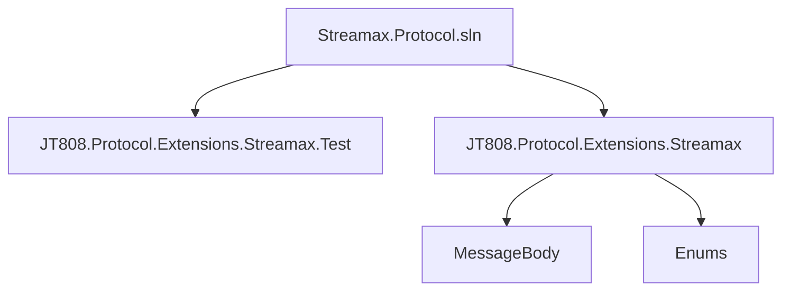
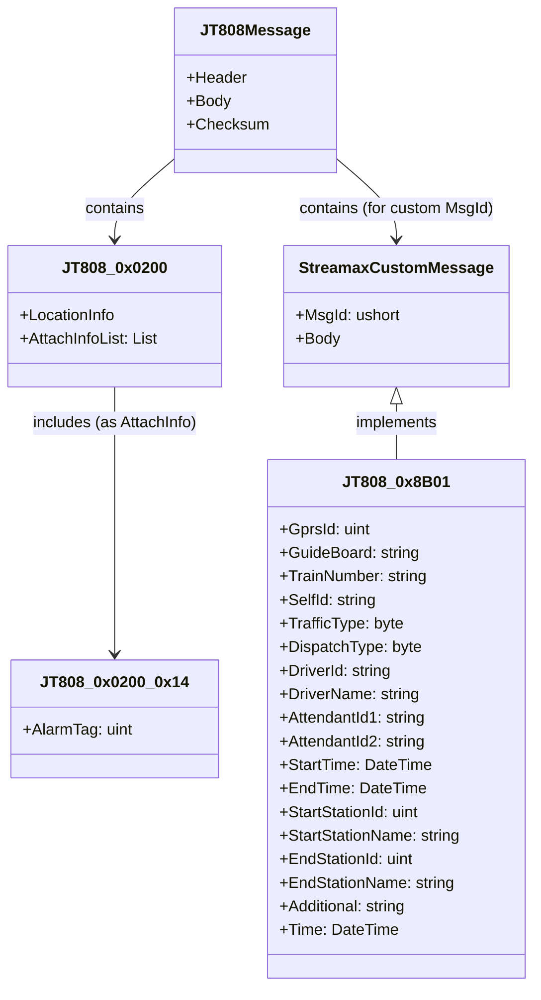
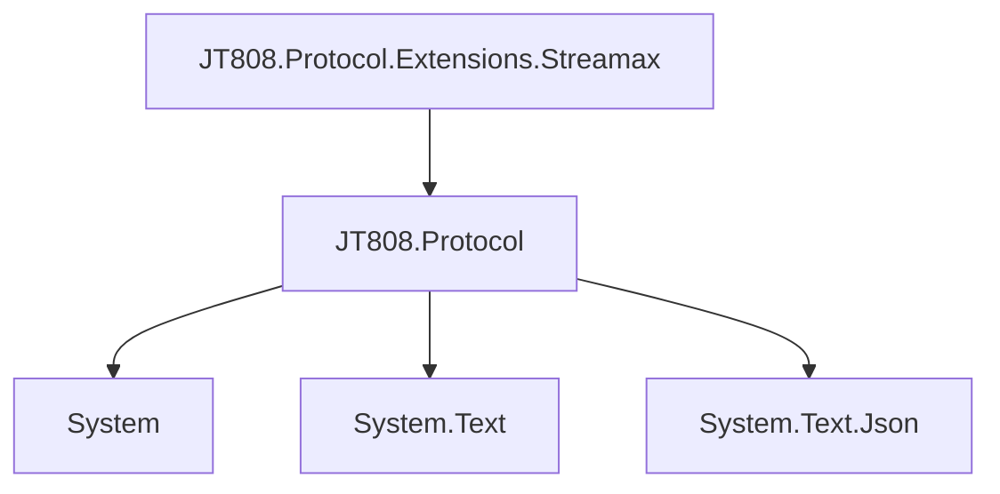

# JT808 协议与 Streamax 扩展概述

好的，我将根据您的要求，分析提供的Git仓库，并撰写一份关于JT808协议与Streamax扩展的文档。

# JT808 协议与 Streamax 扩展概述

## 目录
1. [引言](#引言)
2. [项目结构](#项目结构)
3. [核心组件](#核心组件)
4. [架构概述](#架构概述)
5. [详细组件分析](#详细组件分析)
6. [依赖分析](#依赖分析)
7. [性能考量](#性能考量)
8. [故障排除指南](#故障排除指南)
9. [结论](#结论)
10. [参考文献](#参考文献)

## 引言

本文档旨在详细介绍JT808协议的基本原理、结构、应用场景，以及Streamax协议扩展的目的和主要功能。通过对[Streamax.Protocol](https://github.com/lishewen/Streamax.Protocol)项目的分析，解释JT808协议与Streamax扩展之间的关系，它们在车辆监控行业中的作用，并为后续具体实现章节提供理论基础。

JT808协议是中国交通部制定的一项用于道路运输车辆卫星定位系统的通信协议，广泛应用于车辆位置监控、报警、调度等领域。Streamax作为一家专注于视频监控解决方案的公司，在JT808协议的基础上进行了扩展，以满足其在车辆视频监控和调度方面的特定需求。这些扩展通常包括自定义消息体、新的命令和数据类型，以支持更丰富的视频、音频、图片传输以及更精细的车辆状态和行为监控。

## 项目结构

该项目`Streamax.Protocol`主要围绕JT808协议的Streamax扩展展开，其核心是定义和实现这些扩展消息的结构、序列化和反序列化过程。项目结构清晰，主要分为测试项目和协议实现项目。



- **Streamax.Protocol.sln**: 解决方案文件，包含整个项目。
- **JT808.Protocol.Extensions.Streamax**: 核心项目，包含了Streamax对JT808协议的扩展定义。
    - **MessageBody**: 存放具体的消息体定义，每个文件通常对应一个JT808或Streamax扩展的消息ID。例如，`JT808_0x0200_0x14.cs`定义了JT808协议中0x0200消息的附加信息0x14（视频相关报警）。`JT808_0x8B01.cs`则定义了Streamax扩展的0x8B01消息（发车通知）。
    - **Enums**: 包含各种枚举类型定义，用于表示协议中的状态、类型或代码，如`TrafficType.cs`（业务类型）、`DispatchType.cs`（调度类型）等。
    - **JT808_Streamax_Constants.cs**: 定义了Streamax扩展协议中使用的常量，特别是消息ID。
    - **StreamaxDependencyInjectionExtensions.cs**: 可能包含依赖注入相关的扩展方法，用于在应用程序中集成Streamax协议的解析能力。
    - **JT808.Protocol.Extensions.Streamax.csproj**: 项目文件，定义了项目的编译和依赖关系。
    - **JT808.Protocol.Extensions.Streamax.xml**: XML文档文件，可能包含代码注释生成的文档。
- **JT808.Protocol.Extensions.Streamax.Test**: 测试项目，包含了针对Streamax扩展协议消息的单元测试，用于验证消息的序列化和反序列化逻辑是否正确。

## 核心组件

该项目的核心组件是`JT808.Protocol.Extensions.Streamax`项目，它定义了Streamax扩展协议的消息结构和处理逻辑。

### 消息体定义

在`MessageBody`文件夹下，每个文件代表一个特定的JT808或Streamax扩展消息体。这些类通常实现`IJT808Analyze`接口，并继承自`JT808MessagePackFormatter<T>`，提供消息的序列化 (`Serialize`)、反序列化 (`Deserialize`) 和分析 (`Analyze`) 方法。

例如，`JT808_0x0200_0x14.cs`[^1] 定义了JT808协议中位置信息汇报（0x0200）的附加信息之一：视频相关报警。

```csharp
namespace JT808.Protocol.Extensions.Streamax.MessageBody
{
    /// <summary>
    /// 视频相关报警
    /// </summary>
    public class JT808_0x0200_0x14 : JT808MessagePackFormatter<JT808_0x0200_0x14>, JT808_0x0200_CustomBodyBase, IJT808Analyze
    {
        public byte AttachInfoId { get; set; } = 0x14;
        public byte AttachInfoLength { get; set; } = 4;
        /// <summary>
        /// 视频报警标志位
        /// </summary>
        public uint AlarmTag { get; set; }
        // ... Serialize, Deserialize, Analyze methods ...
    }
}
```

另一个重要的扩展消息是`JT808_0x8B01.cs`[^2]，它定义了“发车通知”消息。

```csharp
namespace JT808.Protocol.Extensions.Streamax.MessageBody
{
    /// <summary>
    /// 发车通知
    /// </summary>
    public class JT808_0x8B01 : JT808MessagePackFormatter<JT808_0x8B01>, JT808Bodies, IJT808Analyze
    {
        public ushort MsgId => 0x8B01;
        public string Description => "发车通知";
        public uint GprsId { get; set; } // 线路编号
        public string GuideBoard { get; set; } // 路牌
        // ... other properties ...
        // ... Serialize, Deserialize, Analyze methods ...
    }
}
```

### 枚举定义

`Enums`文件夹下的文件定义了协议中使用的各种枚举类型，使得协议字段的含义更加清晰和易于理解。例如，`TrafficType.cs`定义了业务类型，`DispatchType.cs`定义了调度类型。

### 常量定义

`JT808_Streamax_Constants.cs`[^3]文件定义了Streamax扩展协议中使用的消息ID常量，例如`JT808_0x0B01`（运营登记）和`JT808_0x0B02`（到离站信息上报）。

```csharp
namespace JT808.Protocol.Extensions.Streamax
{
    public static class JT808_Streamax_Constants
    {
        /// <summary>
        /// 运营登记
        /// </summary>
        public const uint JT808_0x0B01 = 0x0B01;
        /// <summary>
        /// 到离站信息上报
        /// </summary>
        public const uint JT808_0x0B02 = 0x0B02;
    }
}
```

## 架构概述

该项目的架构基于JT808协议的扩展机制。JT808协议允许通过附加信息或自定义消息ID来扩展其功能。Streamax正是利用了这一机制，定义了一系列私有消息ID和附加信息，以传输其特有的数据。



**JT808协议基础**: JT808协议消息通常包含消息头、消息体和校验码。消息头包含消息ID、终端手机号、消息体属性等信息。消息体则承载具体的数据。

**Streamax扩展方式**:
1. **附加信息扩展**: 在JT808协议的现有消息（如0x0200位置信息汇报）中，通过定义新的附加信息ID来携带Streamax特有的数据。例如，0x0200消息的附加信息0x14用于视频相关报警。
2. **自定义消息ID**: Streamax定义了一系列JT808协议标准中未使用的消息ID（如0x8B01、0x0B01等），用于传输其特有的业务数据，如发车通知、运营登记等。

这种扩展方式使得Streamax能够在不修改JT808协议核心结构的前提下，增加其所需的特定功能，从而更好地适应车辆监控行业中对视频、调度等更高级功能的需求。

## 详细组件分析

### JT808_0x0200_0x14 (视频相关报警)

该消息定义了JT808协议中0x0200位置信息汇报的附加信息，用于上报车辆的视频相关报警信息。

- **`AttachInfoId`**: 0x14，标识这是视频相关报警附加信息。
- **`AttachInfoLength`**: 4字节，表示`AlarmTag`的长度。
- **`AlarmTag`**: 4字节无符号整数，通过位操作来表示多种视频报警状态。每个位代表一种报警类型，例如：
    - 位0：视频信号丢失报警
    - 位1：主存储器故障报警
    - 位2：灾备存储单元故障报警
    - 位3：其他视频设备故障报警
    - 位4：客车超载报警
    - 位5：异常驾驶行为报警
    - 位6：特殊报警录像达到存储阈值报警

`Analyze`方法[^1]展示了如何解析`AlarmTag`并将其转换为可读的报警描述，这对于调试和理解协议数据非常有用。

### JT808_0x8B01 (发车通知)

这是一个Streamax自定义的消息，用于向车辆终端发送发车通知。该消息包含了丰富的调度信息。

- **`MsgId`**: 0x8B01，Streamax自定义的发车通知消息ID。
- **`GprsId`**: 线路编号。
- **`GuideBoard`**: 路牌信息。
- **`TrainNumber`**: 车次编号。
- **`SelfId`**: 车辆编号。
- **`TrafficType`**: 业务类型，通过枚举`TrafficType`定义。
- **`DispatchType`**: 调度类型，通过枚举`DispatchType`定义。
- **`DriverId`**: 驾驶员编号。
- **`DriverName`**: 驾驶员姓名。
- **`AttendantId1`, `AttendantId2`**: 乘务员编号。
- **`StartTime`, `EndTime`**: 班次的起始和终止时间。
- **`StartStationId`, `StartStationName`**: 起始站点信息。
- **`EndStationId`, `EndStationName`**: 终止站点信息。
- **`Additional`**: 附加内容。
- **`Time`**: 发送通知的时间。

该消息的序列化和反序列化涉及到多种数据类型，包括无符号整数、BCD编码的时间、以及以空字符结尾的字符串。`Analyze`方法[^2]同样提供了详细的解析过程，有助于理解每个字段的含义和编码方式。

## 依赖分析

该项目主要依赖于JT808协议相关的库，特别是用于消息序列化和反序列化的`JT808.Protocol`。



- **JT808.Protocol**: 提供JT808协议的基础框架，包括消息头、消息体、序列化/反序列化工具等。Streamax的扩展消息体类继承自`JT808MessagePackFormatter`，并使用`JT808MessagePackReader`和`JT808MessagePackWriter`进行数据处理。
- **System**: .NET框架的基础库，提供基本数据类型和操作。
- **System.Text**: 提供文本编码和解码功能。
- **System.Text.Json**: 用于JSON序列化和反序列化，在`Analyze`方法中用于将解析结果输出为JSON格式，便于调试和查看。

这些依赖关系表明，Streamax的扩展是建立在现有JT808协议解析框架之上的，通过利用其提供的工具和接口，实现了自定义消息的解析和封装。

## 性能考量

在车辆监控行业中，协议解析的性能至关重要，因为数据量通常很大且需要实时处理。该项目在性能方面有以下考量：

- **二进制序列化**: JT808协议本身是二进制协议，相比文本协议（如JSON），二进制协议通常具有更小的消息体积和更快的解析速度，这对于带宽有限和计算资源有限的车辆终端环境非常有利。
- **`JT808MessagePackFormatter`**: 使用自定义的`MessagePack`格式化器，可以避免反射等开销较大的操作，直接进行字段的读写，从而提高序列化和反序列化效率。
- **内存使用**: 通过直接操作字节流（`ref JT808MessagePackReader`和`ref JT808MessagePackWriter`），可以减少不必要的内存分配和拷贝，降低垃圾回收的压力。

## 故障排除指南

在处理JT808协议和Streamax扩展时，可能会遇到以下问题：

1. **消息解析失败**:
    - **问题**: 接收到的消息无法正确解析，导致数据错误或程序崩溃。
    - **可能原因**:
        - 消息体长度不匹配：发送方和接收方对消息体长度的理解不一致。
        - 字段类型不匹配：例如，将字符串解析为整数，或将BCD码解析为普通数字。
        - 字节序问题：大小端不一致。
        - 校验码错误：消息在传输过程中损坏。
    - **解决方案**:
        - 仔细核对协议文档，确保消息体结构和字段类型与代码实现一致。
        - 使用`Analyze`方法输出详细的解析过程，逐步排查哪个字段解析出错。
        - 检查网络传输是否稳定，避免数据损坏。
        - 验证校验码计算逻辑。
2. **自定义消息无法识别**:
    - **问题**: 终端发送的Streamax自定义消息，平台无法识别或处理。
    - **可能原因**:
        - 平台未集成Streamax扩展协议的解析逻辑。
        - 消息ID或消息体结构与平台期望的不符。
    - **解决方案**:
        - 确保平台端已引入并正确配置了`JT808.Protocol.Extensions.Streamax`库。
        - 检查终端发送的消息ID是否与`JT808_Streamax_Constants.cs`中定义的常量一致。
        - 对比终端发送的原始消息数据与`MessageBody`中定义的结构，确保字段顺序、类型和长度匹配。
3. **时间解析错误**:
    - **问题**: BCD编码的时间字段解析后时间不正确。
    - **可能原因**: BCD编码解析逻辑错误，或时区问题。
    - **解决方案**: 检查`reader.ReadDateTime_yyMMddHHmmss()`方法的实现，确保其正确处理BCD编码，并考虑时区转换。

## 结论

JT808协议作为车辆监控行业的基础通信协议，通过其灵活的扩展机制，为Streamax等厂商提供了定制化解决方案的能力。Streamax通过定义附加信息和自定义消息ID，成功地将视频监控、调度等业务需求融入到JT808协议体系中。

该项目`Streamax.Protocol`清晰地展示了如何基于JT808协议进行扩展，通过定义消息体类、枚举和常量，实现了对Streamax扩展协议的完整支持。其代码结构良好，测试用例完善，为理解和实现JT808协议的扩展提供了宝贵的参考。

通过对JT808协议和Streamax扩展的深入理解，可以更好地开发和维护车辆监控系统，实现更高效、更智能的车辆管理和调度。

## 参考文献

[^1]: [JT808_0x0200_0x14.cs](https://github.com/lishewen/Streamax.Protocol/blob/master/JT808.Protocol.Extensions.Streamax/MessageBody/JT808_0x0200_0x14.cs)
[^2]: [JT808_0x8B01.cs](https://github.com/lishewen/Streamax.Protocol/blob/master/JT808.Protocol.Extensions.Streamax/MessageBody/JT808_0x8B01.cs)
[^3]: [JT808_Streamax_Constants.cs](https://github.com/lishewen/Streamax.Protocol/blob/master/JT808.Protocol.Extensions.Streamax/JT808_Streamax_Constants.cs)
