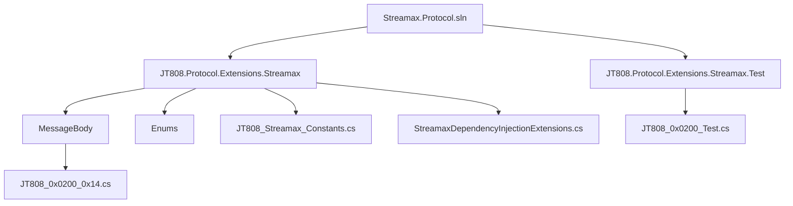
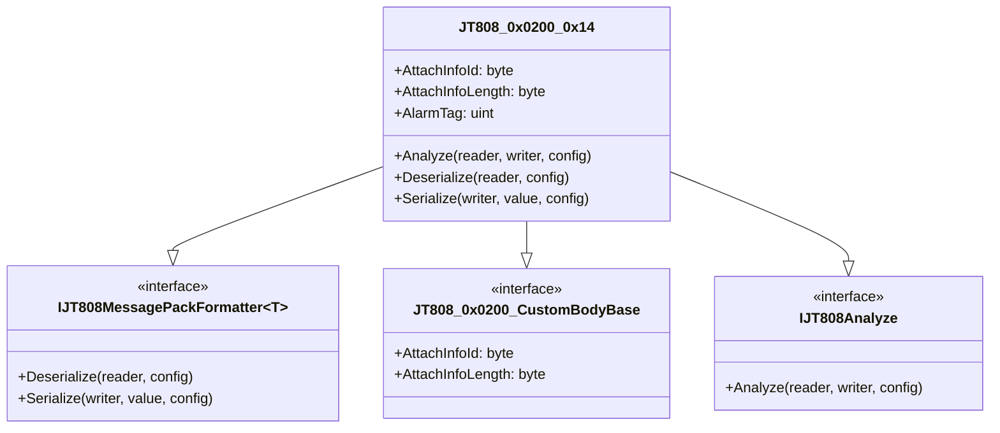
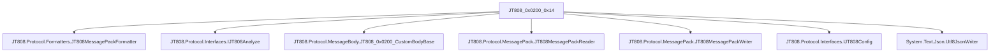

# JT808_0x0200_0x14 消息体

# JT808_0x0200_0x14 消息体

## 目录
1. [引言](#引言)
2. [项目结构](#项目结构)
3. [核心组件](#核心组件)
4. [架构概述](#架构概述)
5. [详细组件分析](#详细组件分析)
6. [依赖分析](#依赖分析)
7. [性能考虑](#性能考虑)
8. [故障排除指南](#故障排除指南)
9. [结论](#结论)
10. [参考文献](#参考文献)

## 引言
本文档旨在详细介绍 `JT808_0x0200_0x14` 消息体的协议定义、字段解析、业务场景，并包含其实现细节、接口参数、返回值说明及常见用法。`JT808_0x0200_0x14` 消息体是 `Streamax.Protocol` 项目中用于处理视频相关报警信息的一个重要组成部分。该项目是基于 JT808 协议的扩展，主要用于车辆监控和管理系统中的数据通信。

## 项目结构
`Streamax.Protocol` 项目的结构清晰，主要分为测试项目 `JT808.Protocol.Extensions.Streamax.Test` 和核心协议扩展项目 `JT808.Protocol.Extensions.Streamax`。

- **JT808.Protocol.Extensions.Streamax.Test**: 包含针对协议扩展的单元测试，确保消息体的解析和序列化符合预期。
- **JT808.Protocol.Extensions.Streamax**: 核心项目，包含了 JT808 协议的 Streamax 扩展。
    - **MessageBody**: 定义了各种 JT808 消息体的具体结构，如 `JT808_0x0200_0x14.cs`。
    - **Enums**: 定义了协议中使用的各种枚举类型。
    - **JT808_Streamax_Constants.cs**: 包含 Streamax 扩展相关的常量定义。
    - **StreamaxDependencyInjectionExtensions.cs**: 用于依赖注入的扩展方法。

## 核心组件
`JT808_0x0200_0x14` 消息体是 `Streamax.Protocol.Extensions.Streamax` 项目中的一个核心组件，它定义了 JT808 协议中位置信息汇报（0x0200）消息的附加信息之一，专门用于传输视频相关的报警信息。

## 架构概述
`Streamax.Protocol` 项目的架构遵循了模块化设计，通过扩展 JT808 协议，实现了对特定业务场景（如视频报警）的支持。`JT808_0x0200_0x14` 作为 `0x0200` 消息的附加信息，体现了协议的可扩展性。

- **`JT808_0x0200_0x14` 类**: 实现了 `IJT808MessagePackFormatter<JT808_0x0200_0x14>`、`JT808_0x0200_CustomBodyBase` 和 `IJT808Analyze` 接口。
    - `IJT808MessagePackFormatter`: 提供了消息体的序列化和反序列化方法。
    - `JT808_0x0200_CustomBodyBase`: 定义了附加信息的基本属性，如 `AttachInfoId` 和 `AttachInfoLength`。
    - `IJT808Analyze`: 提供了消息体的解析方法，用于将二进制数据解析成可读的 JSON 格式。

## 详细组件分析

### JT808_0x0200_0x14 消息体[^1]

该类定义了视频相关报警的附加信息。

- **命名空间**: `JT808.Protocol.Extensions.Streamax.MessageBody`
- **继承**: `JT808MessagePackFormatter<JT808_0x0200_0x14>`, `JT808_0x0200_CustomBodyBase`, `IJT808Analyze`

#### 属性

- **`AttachInfoId`**: `byte` 类型，表示附加信息 ID，固定为 `0x14`。
- **`AttachInfoLength`**: `byte` 类型，表示附加信息长度，固定为 `4` 字节。
- **`AlarmTag`**: `uint` 类型，表示视频报警标志位。这是一个位字段，每个位代表一种特定的视频报警状态。

#### 方法

- **`Analyze(ref JT808MessagePackReader reader, Utf8JsonWriter writer, IJT808Config config)`**:
    - **功能**: 解析二进制数据流中的 `JT808_0x0200_0x14` 消息体，并将其转换为 JSON 格式输出。
    - **参数**:
        - `reader`: `JT808MessagePackReader` 引用，用于从数据流中读取数据。
        - `writer`: `Utf8JsonWriter` 对象，用于写入 JSON 数据。
        - `config`: `IJT808Config` 对象，提供配置信息。
    - **实现细节**:
        1. 读取 `AttachInfoId` 和 `AttachInfoLength`。
        2. 读取 `AlarmTag` (一个 `uint` 值)。
        3. 根据 `AlarmTag` 的每个位，判断具体的报警类型并写入 JSON 数组。
            - `(AlarmTag & 01) > 0`: 视频信号丢失报警
            - `(AlarmTag & 02) > 0`: 主存储器故障报警
            - `(AlarmTag & 04) > 0`: 灾备存储单元故障报警
            - `(AlarmTag & 08) > 0`: 其他视频设备故障报警
            - `(AlarmTag & 16) > 0`: 客车超载报警
            - `(AlarmTag & 32) > 0`: 异常驾驶行为报警
            - `(AlarmTag & 64) > 0`: 特殊报警录像达到存储阈值报警
- **`Deserialize(ref JT808MessagePackReader reader, IJT808Config config)`**:
    - **功能**: 从二进制数据流中反序列化 `JT808_0x0200_0x14` 消息体。
    - **参数**:
        - `reader`: `JT808MessagePackReader` 引用，用于从数据流中读取数据。
        - `config`: `IJT808Config` 对象，提供配置信息。
    - **返回值**: `JT808_0x0200_0x14` 对象。
    - **实现细节**: 依次读取 `AttachInfoId`、`AttachInfoLength` 和 `AlarmTag`，并构建 `JT808_0x0200_0x14` 对象。
- **`Serialize(ref JT808MessagePackWriter writer, JT808_0x0200_0x14 value, IJT808Config config)`**:
    - **功能**: 将 `JT808_0x0200_0x14` 对象序列化为二进制数据流。
    - **参数**:
        - `writer`: `JT808MessagePackWriter` 引用，用于向数据流中写入数据。
        - `value`: `JT808_0x0200_0x14` 对象，待序列化的数据。
        - `config`: `IJT808Config` 对象，提供配置信息。
    - **实现细节**: 依次写入 `AttachInfoId`、`AttachInfoLength` 和 `AlarmTag` 到数据流中。

#### 业务场景

`JT808_0x0200_0x14` 消息体主要应用于车辆监控系统中，当车辆的视频设备发生异常或触发特定视频相关的报警条件时，车载终端会通过 JT808 协议上报位置信息（0x0200），并将视频报警信息作为附加信息（0x14）包含在内。

**常见用法**:

1. **视频信号丢失**: 当车载摄像头视频信号中断时，终端会上报此报警。
2. **存储器故障**: 当车载录像设备的主存储器或灾备存储单元发生故障时，终端会上报此报警。
3. **其他视频设备故障**: 除了摄像头和存储器之外的其他视频相关设备故障时，终端会上报此报警。
4. **客车超载**: 对于客运车辆，当检测到超载时，终端会上报此报警。
5. **异常驾驶行为**: 当系统检测到驾驶员存在异常驾驶行为（如疲劳驾驶、打电话等）时，终端会上报此报警。
6. **特殊报警录像达到存储阈值**: 当特殊报警录像文件达到预设的存储容量阈值时，终端会上报此报警，提醒平台及时处理或下载。

## 依赖分析
`JT808_0x0200_0x14` 类依赖于以下 JT808 协议相关的接口和类：

- **`JT808MessagePackFormatter`**: 提供序列化和反序列化的基础功能。
- **`IJT808Analyze`**: 定义了消息体解析的接口。
- **`JT808_0x0200_CustomBodyBase`**: 定义了 JT808 0x0200 消息附加信息体的通用接口。
- **`JT808MessagePackReader`**: 用于从字节流中读取 JT808 协议数据。
- **`JT808MessagePackWriter`**: 用于将 JT808 协议数据写入字节流。
- **`IJT808Config`**: 提供 JT808 协议相关的配置信息。
- **`Utf8JsonWriter`**: 用于将解析结果输出为 JSON 格式。

## 性能考虑
`JT808_0x0200_0x14` 的序列化和反序列化操作涉及少量字节的读写，因此其性能开销非常小。`Analyze` 方法中对 `AlarmTag` 的位运算也是高效的。整体而言，该消息体的处理对系统性能影响不大。

## 故障排除指南
- **报警信息不准确**:
    - **问题**: 接收到的 `AlarmTag` 值与实际报警情况不符。
    - **可能原因**: 终端上报的数据有误，或者解析 `AlarmTag` 的位运算逻辑有误。
    - **解决方案**: 检查终端的报警逻辑和数据上报，同时仔细核对 `Analyze` 方法中对 `AlarmTag` 的位判断逻辑是否正确。
- **消息体解析失败**:
    - **问题**: `Deserialize` 或 `Analyze` 方法抛出异常，无法正确解析消息体。
    - **可能原因**: 接收到的数据不完整或格式错误，或者 `AttachInfoId` 或 `AttachInfoLength` 不符合预期。
    - **解决方案**: 检查原始数据包的完整性和正确性，确保 `AttachInfoId` 是 `0x14` 且 `AttachInfoLength` 是 `4`。

## 结论
`JT808_0x0200_0x14` 消息体是 JT808 协议在视频监控领域的一个重要扩展，它使得平台能够接收和处理车载终端上报的各种视频相关报警信息。该消息体的设计简洁高效，通过位字段 `AlarmTag` 实现了多种报警状态的紧凑表示，并通过序列化、反序列化和解析方法提供了完整的数据处理能力。

## 参考文献
[^1]: [JT808.Protocol.Extensions.Streamax/MessageBody/JT808_0x0200_0x14.cs](https://github.com/lishewen/Streamax.Protocol/blob/master/JT808.Protocol.Extensions.Streamax/MessageBody/JT808_0x0200_0x14.cs)
