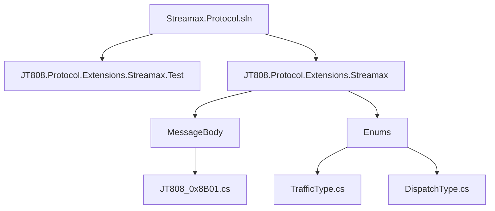
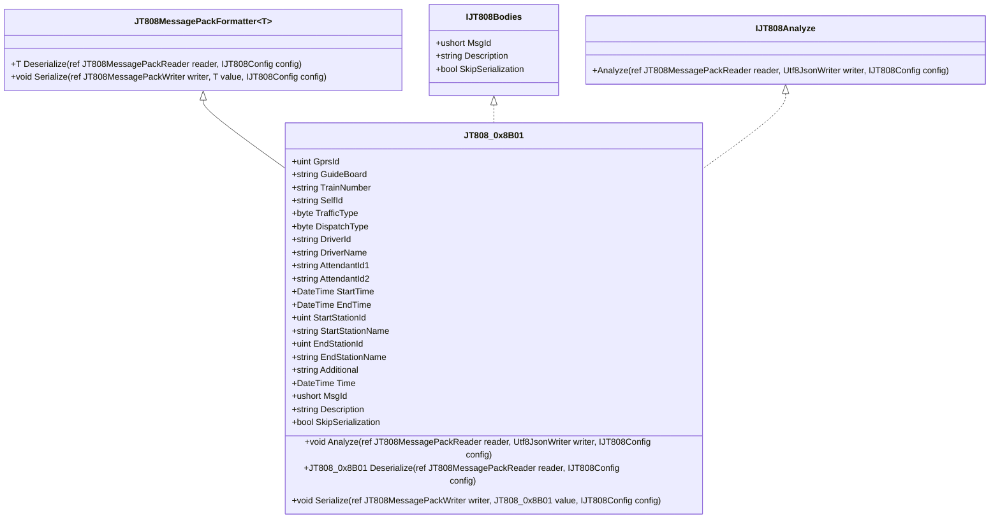
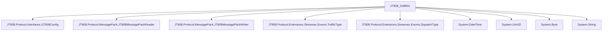

# JT808_0x8B01 消息体

# JT808_0x8B01 消息体

## 目录
1. [引言](#引言)
2. [项目结构](#项目结构)
3. [核心组件](#核心组件)
4. [架构概览](#架构概览)
5. [详细组件分析](#详细组件分析)
6. [依赖分析](#依赖分析)
7. [性能考量](#性能考量)
8. [故障排除指南](#故障排除指南)
9. [结论](#结论)
10. [参考文献](#参考文献)

## 引言
本文档旨在详细介绍 `Streamax.Protocol` 仓库中 JT808 协议扩展部分定义的 `JT808_0x8B01` 消息体。该消息体主要用于“发车通知”业务，包含了线路、车辆、人员、时间、站点等关键信息。我们将深入探讨其协议背景、数据结构、字段含义、使用场景，并分析其序列化/反序列化实现，提供实际代码示例和典型用法，以帮助读者全面理解和应用此消息体。

## 项目结构
`Streamax.Protocol` 仓库主要包含了 JT808 协议的扩展实现，特别是针对 Streamax 设备的特定消息体。项目结构清晰，主要模块如下：

- `JT808.Protocol.Extensions.Streamax.Test`: 包含针对扩展协议消息体的单元测试。
- `JT808.Protocol.Extensions.Streamax`: 核心模块，定义了 Streamax 扩展协议的消息体、枚举和依赖注入等。
    - `MessageBody`: 存放具体的消息体定义，如 `JT808_0x8B01.cs`。
    - `Enums`: 存放协议中使用的枚举定义，如 `TrafficType.cs`、`DispatchType.cs`。



## 核心组件

`JT808_0x8B01` 消息体是 `Streamax.Protocol.Extensions.Streamax` 模块中的一个核心组件，它实现了 `JT808MessagePackFormatter<JT808_0x8B01>` 和 `JT808Bodies`, `IJT808Analyze` 接口，提供了该消息体的序列化、反序列化以及分析功能。

## 架构概览

该项目基于 JT808 协议进行扩展，其核心架构围绕消息体的定义、序列化和反序列化展开。`JT808_0x8B01` 作为其中的一个具体消息体，遵循了统一的接口规范，使得其能够与 JT808 协议框架无缝集成。



## 详细组件分析

### JT808_0x8B01 消息体定义

`JT808_0x8B01` 类[^1]定义了“发车通知”消息体的具体数据结构。

```csharp
public class JT808_0x8B01 : JT808MessagePackFormatter<JT808_0x8B01>, JT808Bodies, IJT808Analyze
{
    public ushort MsgId => 0x8B01;

    public string Description => "发车通知";
    /// <summary>
    /// 线路编号
    /// </summary>
    public uint GprsId { get; set; }
    /// <summary>
    /// 路牌
    /// </summary>
    public string GuideBoard { get; set; }
    // ... 其他字段
}
```

**字段含义**:

| 字段名           | 类型      | 描述                                     | 备注                                     |
| :--------------- | :-------- | :--------------------------------------- | :--------------------------------------- |
| `MsgId`          | `ushort`  | 消息ID，固定为 `0x8B01`                  |                                          |
| `Description`    | `string`  | 消息描述，固定为“发车通知”               |                                          |
| `GprsId`         | `uint`    | 线路编号                                 |                                          |
| `GuideBoard`     | `string`  | 路牌                                     | 以 `\0` 结尾的字符串                     |
| `TrainNumber`    | `string`  | 车次编号                                 | 以 `\0` 结尾的字符串                     |
| `SelfId`         | `string`  | 车辆编号                                 | 以 `\0` 结尾的字符串                     |
| `TrafficType`    | `byte`    | 业务类型                                 | 参见 `TrafficType` 枚举[^2]              |
| `DispatchType`   | `byte`    | 调度类型                                 | 参见 `DispatchType` 枚举[^3]             |
| `DriverId`       | `string`  | 驾驶员编号                               | 以 `\0` 结尾的字符串                     |
| `DriverName`     | `string`  | 驾驶员姓名                               | 以 `\0` 结尾的字符串                     |
| `AttendantId1`   | `string`  | 乘务员1编号                              | 以 `\0` 结尾的字符串                     |
| `AttendantId2`   | `string`  | 乘务员2编号                              | 以 `\0` 结尾的字符串                     |
| `StartTime`      | `DateTime`| 起始时间 (YYMMDDhhmmss)                  | BCD[6] 格式                              |
| `EndTime`        | `DateTime`| 终止时间 (YYMMDDhhmmss)                  | BCD[6] 格式                              |
| `StartStationId` | `uint`    | 起始站点编号                             |                                          |
| `StartStationName`| `string` | 起始场站车站名称                         | 以 `\0` 结尾的字符串                     |
| `EndStationId`   | `uint`    | 终止站点编号                             |                                          |
| `EndStationName` | `string`  | 终止场站车站名称                         | 以 `\0` 结尾的字符串                     |
| `Additional`     | `string`  | 附加内容                                 | 以 `\0` 结尾的字符串                     |
| `Time`           | `DateTime`| 发送通知的时间 (YYMMDDhhmmss)            | BCD[6] 格式                              |
| `SkipSerialization`| `bool`  | 跳过数据体序列化                         | 固定为 `false`                           |

### 序列化 (`Serialize`)

`Serialize` 方法[^1]负责将 `JT808_0x8B01` 对象的各个字段按照 JT808 协议的规定写入到 `JT808MessagePackWriter` 中。

```csharp
public override void Serialize(ref JT808MessagePackWriter writer, JT808_0x8B01 value, IJT808Config config)
{
    writer.WriteUInt32(value.GprsId);
    writer.WriteStringEndChar0(value.GuideBoard);
    writer.WriteStringEndChar0(value.TrainNumber);
    // ... 其他字段的序列化
    writer.WriteDateTime_yyMMddHHmmss(value.Time);
}
```

- **字符串处理**: `WriteStringEndChar0` 方法用于写入以 `\0` 结尾的字符串，符合 JT808 协议中对字符串的常见处理方式。
- **时间处理**: `WriteDateTime_yyMMddHHmmss` 方法用于将 `DateTime` 类型的数据按照 YYMMDDhhmmss 的 BCD 格式写入。

### 反序列化 (`Deserialize`)

`Deserialize` 方法[^1]负责从 `JT808MessagePackReader` 中读取数据，并将其解析为 `JT808_0x8B01` 对象。

```csharp
public override JT808_0x8B01 Deserialize(ref JT808MessagePackReader reader, IJT808Config config)
{
    JT808_0x8B01 value = new();
    value.GprsId = reader.ReadUInt32();
    value.GuideBoard = reader.ReadStringEndChar0();
    value.TrainNumber = reader.ReadStringEndChar0();
    // ... 其他字段的反序列化
    value.Time = reader.ReadDateTime_yyMMddHHmmss();
    return value;
}
```

- **字符串处理**: `ReadStringEndChar0` 方法用于读取以 `\0` 结尾的字符串。
- **时间处理**: `ReadDateTime_yyMMddHHmmss` 方法用于读取 YYMMDDhhmmss 的 BCD 格式数据并转换为 `DateTime` 类型。

### 分析 (`Analyze`)

`Analyze` 方法[^1]提供了对消息体进行分析的功能，通常用于调试和日志记录，将解析后的数据以 JSON 格式输出。

```csharp
public void Analyze(ref JT808MessagePackReader reader, Utf8JsonWriter writer, IJT808Config config)
{
    JT808_0x8B01 value = new();
    value.GprsId = reader.ReadUInt32();
    writer.WriteNumber($"[{value.GprsId.ReadNumber()}]线路编号", value.GprsId);
    value.GuideBoard = reader.ReadStringEndChar0();
    writer.WriteString($"[Length:{value.GuideBoard.Length}]路牌", value.GuideBoard);
    // ... 其他字段的分析
    writer.WriteString($"[{value.Time:yyMMddHHmmss}]发送通知的时间", value.Time.ToString("yyyy-MM-dd HH:mm:ss"));
}
```

该方法在反序列化的同时，将每个字段的名称、值以及一些额外信息（如长度、枚举名称）写入到 `Utf8JsonWriter` 中，方便进行结构化输出。

### 典型用法示例

以下是一个简单的 `JT808_0x8B01` 消息体的创建、序列化和反序列化示例：

```csharp
// 1. 创建 JT808_0x8B01 消息体实例
JT808_0x8B01 message = new JT808_0x8B01
{
    GprsId = 12345,
    GuideBoard = "测试路牌",
    TrainNumber = "T001",
    SelfId = "V001",
    TrafficType = (byte)TrafficType.Normal, // 假设 TrafficType 是一个枚举
    DispatchType = (byte)DispatchType.Manual, // 假设 DispatchType 是一个枚举
    DriverId = "D001",
    DriverName = "张三",
    AttendantId1 = "A001",
    AttendantId2 = "A002",
    StartTime = DateTime.Now.AddHours(-1),
    EndTime = DateTime.Now,
    StartStationId = 1,
    StartStationName = "起始站",
    EndStationId = 10,
    EndStationName = "终点站",
    Additional = "附加信息",
    Time = DateTime.Now
};

// 2. 序列化消息体
// 假设 config 和 writer 已经初始化
JT808MessagePackWriter writer = new JT808MessagePackWriter();
IJT808Config config = new YourJT808ConfigImplementation(); // 需要您自己的配置实现
message.Serialize(ref writer, message, config);
byte[] serializedBytes = writer.FlushAndGet // 获取序列化后的字节数组

// 3. 反序列化消息体
JT808MessagePackReader reader = new JT808MessagePackReader(serializedBytes);
JT808_0x8B01 deserializedMessage = message.Deserialize(ref reader, config);

// 4. 验证反序列化后的数据
Console.WriteLine($"GprsId: {deserializedMessage.GprsId}");
Console.WriteLine($"GuideBoard: {deserializedMessage.GuideBoard}");
// ... 打印其他字段
```

## 依赖分析

`JT808_0x8B01` 类主要依赖于以下几个方面：

- **JT808 协议核心库**: 提供了 `JT808MessagePackReader`、`JT808MessagePackWriter`、`IJT808Config` 等核心接口和类，用于消息的编解码。
- **枚举定义**: 依赖于 `Streamax.Protocol.Extensions.Streamax.Enums` 命名空间下的枚举，如 `TrafficType`[^2] 和 `DispatchType`[^3]，用于表示业务类型和调度类型。
- **C# 内置类型**: 使用 `System.DateTime`、`System.UInt32`、`System.Byte`、`System.String` 等基本数据类型。



## 性能考量

- **字符串处理**: JT808 协议中大量使用以 `\0` 结尾的字符串。在序列化和反序列化过程中，需要注意字符串的长度，避免过长的字符串导致内存占用过大或解析效率低下。
- **BCD 码转换**: 时间字段使用 BCD 码表示，涉及到 `DateTime` 与 BCD 字节数组之间的转换，这部分操作通常是高效的，但仍需注意其实现细节。
- **内存分配**: 在反序列化时，会创建新的 `JT808_0x8B01` 实例，并为字符串等引用类型分配内存。对于高并发场景，应考虑对象池或内存复用等优化策略。

## 故障排除指南

- **数据解析错误**: 如果在反序列化过程中出现数据解析错误，首先检查原始字节流是否符合 JT808_0x8B01 消息体的定义，特别是各个字段的长度和数据类型是否匹配。
- **时间格式问题**: `DateTime` 字段的序列化和反序列化依赖于 YYMMDDhhmmss 的 BCD 格式。如果时间解析不正确，请检查 BCD 转换逻辑是否正确。
- **字符串编码**: 确保字符串的编码方式（通常是 GBK 或 UTF-8）在序列化和反序列化过程中保持一致。

## 结论

`JT808_0x8B01` 消息体作为 JT808 协议在 Streamax 平台上的扩展，为“发车通知”业务提供了标准化的数据结构。通过本文档的详细分析，我们了解了其字段含义、序列化/反序列化机制以及典型用法。理解这些细节对于开发和维护基于 JT808 协议的系统至关重要。

## 参考文献

[^1]: [JT808.Protocol.Extensions.Streamax/MessageBody/JT808_0x8B01.cs](https://github.com/lishewen/Streamax.Protocol/blob/master/JT808.Protocol.Extensions.Streamax/MessageBody/JT808_0x8B01.cs)
[^2]: [JT808.Protocol.Extensions.Streamax/Enums/TrafficType.cs](https://github.com/lishewen/Streamax.Protocol/blob/master/JT808.Protocol.Extensions.Streamax/Enums/TrafficType.cs)
[^3]: [JT808.Protocol.Extensions.Streamax/Enums/DispatchType.cs](https://github.com/lishewen/Streamax.Protocol/blob/master/JT808.Protocol.Extensions.Streamax/Enums/DispatchType.cs)
