# 其他消息体扩展

# 其他消息体扩展

## 目录
1. [引言](#引言)
2. [项目结构](#项目结构)
3. [核心组件](#核心组件)
4. [架构概览](#架构概览)
5. [详细组件分析](#详细组件分析)
6. [依赖分析](#依赖分析)
7. [性能考量](#性能考量)
8. [故障排除指南](#故障排除指南)
9. [结论](#结论)
10. [参考](#参考)

## 引言
本文档旨在为Streamax.Protocol项目中JT808协议的其他消息体扩展提供全面而详细的说明。该项目是基于JT808协议的扩展，主要用于车辆监控和调度系统中的数据通信。本文将深入探讨每个消息体的协议意义、字段描述、典型用法以及它们在整个系统主流程中的作用，旨在帮助读者，包括非技术人员，更好地理解这些消息体的功能和重要性。

## 项目结构
Streamax.Protocol项目的结构清晰，主要围绕JT808协议的消息体扩展进行组织。核心业务逻辑和消息体定义位于`JT808.Protocol.Extensions.Streamax`文件夹下，而测试用例则在`JT808.Protocol.Extensions.Streamax.Test`中。

## 核心组件
本项目中的核心组件是`MessageBody`文件夹下的各个消息体定义文件。每个文件都对应一个特定的JT808协议扩展消息，负责定义该消息的数据结构、序列化和反序列化逻辑。这些消息体通过实现`JT808Bodies`和`IJT808Analyze`接口，与JT808协议框架进行集成。

## 架构概览
该项目的架构基于JT808协议的扩展机制。它通过定义新的消息体类来扩展JT808协议的功能，这些消息体类继承自`JT808MessagePackFormatter`并实现了`JT808Bodies`和`IJT808Analyze`接口。这种设计使得系统能够灵活地处理自定义消息，同时保持与JT808协议的兼容性。

```mermaid
classDiagram
    class JT808MessagePackFormatter~T~ {
        +Deserialize(ref reader, config): T
        +Serialize(ref writer, value, config): void
    }
    class JT808Bodies {
        <<interface>>
        +MsgId: ushort
        +Description: string
        +SkipSerialization: bool
    }
    class IJT808Analyze {
        <<interface>>
        +Analyze(ref reader, writer, config): void
    }

    JT808MessagePackFormatter <|-- JT808_0x0B01
    JT808MessagePackFormatter <|-- JT808_0x0B02
    JT808MessagePackFormatter <|-- JT808_0x0B03
    JT808MessagePackFormatter <|-- JT808_0x0B04
    JT808MessagePackFormatter <|-- JT808_0x0B05
    JT808MessagePackFormatter <|-- JT808_0x0B06
    JT808MessagePackFormatter <|-- JT808_0x0B07
    JT808MessagePackFormatter <|-- JT808_0x0B08
    JT808MessagePackFormatter <|-- JT808_0x0B09
    JT808MessagePackFormatter <|-- JT808_0x0B0A
    JT808MessagePackFormatter <|-- JT808_0x0B0B
    JT808MessagePackFormatter <|-- JT808_0x8B02
    JT808MessagePackFormatter <|-- JT808_0x8B05
    JT808MessagePackFormatter <|-- JT808_0x8B06
    JT808MessagePackFormatter <|-- JT808_0x8B09
    JT808MessagePackFormatter <|-- JT808_0x8B0A
    JT808MessagePackFormatter <|-- JT808_0x0200_0x15
    JT808MessagePackFormatter <|-- JT808_0x0200_0x16
    JT808MessagePackFormatter <|-- JT808_0x0200_0x17
    JT808MessagePackFormatter <|-- JT808_0x0200_0xE4

    JT808_0x0B01 ..|> JT808Bodies
    JT808_0x0B01 ..|> IJT808Analyze
    JT808_0x0B02 ..|> JT808Bodies
    JT808_0x0B02 ..|> IJT808Analyze
    JT808_0x0B03 ..|> JT808Bodies
    JT808_0x0B03 ..|> IJT808Analyze
    JT808_0x0B04 ..|> JT808Bodies
    JT808_0x0B04 ..|> IJT808Analyze
    JT808_0x0B05 ..|> JT808Bodies
    JT808_0x0B05 ..|> IJT808Analyze
    JT808_0x0B06 ..|> JT808Bodies
    JT808_0x0B06 ..|> IJT808Analyze
    JT808_0x0B07 ..|> JT808Bodies
    JT808_0x0B07 ..|> IJT808Analyze
    JT808_0x0B08 ..|> JT808Bodies
    JT808_0x0B08 ..|> IJT808Analyze
    JT808_0x0B09 ..|> JT808Bodies
    JT808_0x0B09 ..|> IJT808Analyze
    JT808_0x0B0A ..|> JT808Bodies
    JT808_0x0B0A ..|> IJT808Analyze
    JT808_0x0B0B ..|> JT808Bodies
    JT808_0x0B0B ..|> IJT808Analyze
    JT808_0x8B02 ..|> JT808Bodies
    JT808_0x8B02 ..|> IJT808Analyze
    JT808_0x8B05 ..|> JT808Bodies
    JT808_0x8B05 ..|> IJT808Analyze
    JT808_0x8B06 ..|> JT808Bodies
    JT808_0x8B06 ..|> IJT808Analyze
    JT808_0x8B09 ..|> JT808Bodies
    JT808_0x8B09 ..|> IJT808Analyze
    JT808_0x8B0A ..|> JT808Bodies
    JT808_0x8B0A ..|> IJT808Analyze
    JT808_0x0200_0x15 ..|> JT808Bodies
    JT808_0x0200_0x15 ..|> IJT808Analyze
    JT808_0x0200_0x16 ..|> JT808Bodies
    JT808_0x0200_0x16 ..|> IJT808Analyze
    JT808_0x0200_0x17 ..|> JT808Bodies
    JT808_0x0200_0x17 ..|> IJT808Analyze
    JT808_0x0200_0xE4 ..|> JT808Bodies
    JT808_0x0200_0xE4 ..|> IJT808Analyze
```

## 详细组件分析

### 1. `JT808_0x0B01`：运营登记[^1]
- **协议意义**：用于设备向平台进行运营登记，包含线路编号和员工编号。
- **字段描述**：
    - `GprsId` (uint): 线路编号。
    - `WorkerId` (string): 员工编号。
- **典型用法**：当车辆或设备开始运营时，向平台发送此消息进行登记。
- **与主流程关系**：运营管理流程的起始点，确保平台能够识别和管理正在运营的设备。

### 2. `JT808_0x0B02`：到离站信息上报[^2]
- **协议意义**：用于上报车辆到达或离开站点的详细信息，包括位置、时间、乘客数量等。
- **字段描述**：
    - `GprsId` (uint): 线路编号。
    - `PointType` (byte): 到离站类型。
    - `TrafficType` (byte): 业务类型。
    - `StationId` (uint): 场站站点编号。
    - `StationNo` (byte): 车站序号。
    - `Tag` (byte): 标志字段，指示触发方式、是否补发、是否定位等。
    - `Latitude` (uint): 纬度，精确到百万分之一度。
    - `Longitude` (uint): 经度，精确到百万分之一度。
    - `Altitude` (short): 高程。
    - `Speed` (ushort): 车速。
    - `Direction` (ushort): 方向。
    - `Time` (DateTime): 时间 (YYMMDDhhmmss)。
    - `PersonCount` (ushort): 当前乘客数。
    - `DoorCount` (byte): 车门数。
    - `PersonList` (List<PersonItem>): 乘客计数项列表，包含每个门的上下客数。
- **典型用法**：车辆在到达或离开预设站点时，自动或手动上报此消息。
- **与主流程关系**：实时监控车辆运营状态和客流量的关键数据，支持调度和运营分析。

### 3. `JT808_0x0B03`：进出定点信息上报[^3]
- **协议意义**：用于上报车辆进出特定定点（如场站、停车场）的信息。
- **字段描述**：
    - `GprsId` (uint): 线路编号。
    - `IOType` (byte): 进出类型 (1:进；2:出)。
    - `TrafficType` (byte): 业务类型。
    - `StationId` (uint): 场站站点编号。
    - `Tag` (byte): 标志字段，与`JT808_0x0B02`类似。
    - `Latitude` (uint): 纬度。
    - `Longitude` (uint): 经度。
    - `Altitude` (ushort): 高程。
    - `Speed` (ushort): 车速。
    - `Direction` (ushort): 方向。
    - `Time` (DateTime): 时间 (YYMMDDhhmmss)。
    - `FixedPointType` (byte): 定点类型。
- **典型用法**：车辆进入或离开重要地理区域时，上报此消息。
- **与主流程关系**：提供车辆在关键地理位置的动态信息，辅助区域管理和安全监控。

### 4. `JT808_0x0B04`：违规信息上报[^4]
- **协议意义**：用于上报车辆在运营过程中发生的违规行为。
- **字段描述**：
    - `GprsId` (uint): 线路编号。
    - `ViolationType` (byte): 违规类型。
    - `ViolationValue` (ushort): 违规值。
    - `ViolationStandard` (ushort): 违规标准。
    - `Latitude` (uint): 纬度。
    - `Longitude` (uint): 经度。
    - `Altitude` (ushort): 高程。
    - `Speed` (ushort): 车速。
    - `Direction` (ushort): 方向。
    - `Time` (DateTime): 时间 (YYMMDDhhmmss)。
    - `Reissue` (byte): 补发标识 (1为补发，0为正常)。
    - `Additional` (string): 附加内容，对违规信息的文本描述。
- **典型用法**：当车辆发生超速、疲劳驾驶等违规行为时，设备自动上报此消息。
- **与主流程关系**：是安全监控和风险管理的重要组成部分，有助于及时发现和处理违规行为。

### 5. `JT808_0x0B05`：考勤[^5]
- **协议意义**：用于设备上报员工的考勤信息。
- **字段描述**：
    - `GprsId` (uint): 线路编号。
    - `WorkerId` (string): 员工编号。
    - `Time` (DateTime): 时间 (YYMMDDhhmmss)。
    - `AttendType` (byte): 考勤类型。
    - `AttendanceType` (byte): 考勤方式。
- **典型用法**：员工通过设备进行上下班打卡时，设备上报此消息。
- **与主流程关系**：支持员工考勤管理，为运营数据分析提供基础。

### 6. `JT808_0x0B06`：校时请求[^6]
- **协议意义**：用于设备向平台请求校时。
- **字段描述**：
    - `Time` (DateTime): 设备当前时间 (YYMMDDhhmmss)。
- **典型用法**：设备在启动或周期性地向平台发送校时请求，以确保时间同步。
- **与主流程关系**：确保系统中所有设备的时间一致性，对数据记录和事件排序至关重要。

### 7. `JT808_0x0B07`：行车计划请求[^7]
- **协议意义**：用于设备向平台请求行车计划。
- **字段描述**：
    - `WorkDate` (DateTime): 营运日期 (YY-MM-DD)。
    - `WorkerId` (string): 员工编号。
- **典型用法**：设备在开始运营前或需要更新计划时，向平台请求当天的行车计划。
- **与主流程关系**：调度管理的重要环节，确保车辆按照预定计划运行。

### 8. `JT808_0x0B08`：业务登记[^8]
- **协议意义**：用于设备向平台进行业务登记，包含线路编号、员工编号、业务登记类型和时间。
- **字段描述**：
    - `GprsId` (uint): 线路编号。
    - `WorkerId` (string): 员工编号。
    - `RegistrationType` (byte): 业务登记类型。
    - `Time` (DateTime): 时间 (YYMMDDhhmmss)。
- **典型用法**：设备在执行特定业务操作时，向平台进行登记。
- **与主流程关系**：记录和管理业务操作，支持业务流程的追溯和审计。

### 9. `JT808_0x0B09`：业务请求[^9]
- **协议意义**：用于设备向平台发起业务请求。
- **字段描述**：
    - `GprsId` (uint): 线路编号。
    - `WorkerId` (string): 员工编号。
    - `RequestCode` (byte): 业务请求代码。
    - `Time` (DateTime): 时间 (YYMMDDhhmmss)。
- **典型用法**：设备需要平台协助处理特定业务时，发送此请求。
- **与主流程关系**：设备与平台进行交互的关键机制，支持远程协助和业务协同。

### 10. `JT808_0x0B0A`：升级结果上报[^10]
- **协议意义**：用于设备向平台报告升级操作的结果。
- **字段描述**：
    - `GprsId` (uint): 线路编号。
    - `UpdateResultCode` (byte): 升级结果代码。
    - `Time` (DateTime): 时间 (YYMMDDhhmmss)。
    - `UpdateFile` (string): 升级文件名称。
- **典型用法**：设备完成固件或软件升级后，向平台报告升级成功或失败。
- **与主流程关系**：远程设备管理和维护的重要环节，确保设备软件版本的一致性和稳定性。

### 11. `JT808_0x0B0B`：设备故障上报[^11]
- **协议意义**：用于设备向平台报告自身发生的故障信息。
- **字段描述**：
    - `DeviceType` (byte): 设备类型。
    - `DeviceAddress` (byte): 设备地址。
    - `DeviceVersion` (string): 设备版本。
    - `DeviceErrorCode` (byte): 故障编码。
    - `Time` (DateTime): 时间 (YYMMDDhhmmss)。
- **典型用法**：当设备检测到自身故障时，立即向平台发送此消息。
- **与主流程关系**：设备健康监控和故障预警的关键，有助于及时发现和处理设备问题。

### 12. `JT808_0x8B02`：业务变更指令[^12]
- **协议意义**：用于平台向设备下发业务变更指令。
- **字段描述**：
    - `GprsId` (uint): 线路编号。
    - `TrafficType` (byte): 业务类型。
    - `Additional` (string): 附加内容，最长1024字节，对违规信息的文本描述。
- **典型用法**：平台根据运营需求，向车辆下发线路变更、业务类型调整等指令。
- **与主流程关系**：调度和运营管理的核心指令，实现对车辆业务的动态调整。

### 13. `JT808_0x8B05`：考勤应答[^13]
- **协议意义**：用于平台对设备上报的考勤请求进行应答。
- **字段描述**：
    - `Response` (byte): 业务请求结果 (1:同意，0:不同意)。
    - `Time` (DateTime): 应答时间 (YYMMDDhhmmss)。
    - `Additional` (string): 附加内容，可为司机姓名或IC卡号。
- **典型用法**：平台收到考勤消息后，根据业务逻辑进行处理并返回应答。
- **与主流程关系**：考勤流程的反馈机制，确保考勤信息的有效性。

### 14. `JT808_0x8B06`：校时应答[^14]
- **协议意义**：用于平台对设备发起的校时请求进行应答。
- **字段描述**：
    - `Time` (DateTime): 平台当前时间 (YYMMDDhhmmss)。
- **典型用法**：平台收到校时请求后，返回标准时间给设备。
- **与主流程关系**：确保系统中所有设备的时间一致性，对数据记录和事件排序至关重要。

### 15. `JT808_0x8B09`：业务请求应答[^15]
- **协议意义**：用于平台对设备发起的业务请求进行应答。
- **字段描述**：
    - `Serial` (ushort): 流水号。
    - `Response` (byte): 业务请求结果 (1:同意，0:不同意)。
    - `Time` (DateTime): 应答时间 (YYMMDDhhmmss)。
    - `GprsId` (uint): 线路编号。
    - `GuideBoard` (string): 路牌。
    - `TrainNumber` (string): 车次编号。
    - `SelfId` (string): 车辆编号。
    - `TrafficType` (byte): 业务类型。
    - `DispatchType` (byte): 调度类型。
    - `DriverId` (string): 驾驶员编号。
    - `DriverName` (string): 驾驶员姓名。
    - `AttendantId1` (string): 乘务员1编号。
    - `AttendantId2` (string): 乘务员2编号。
    - `StartTime` (DateTime): 起始时间 (YYMMDDhhmmss)。
    - `EndTime` (DateTime): 终止时间 (YYMMDDhhmmss)。
    - `StartStationId` (uint): 起始站点编号。
    - `StartStationName` (string): 起始场站车站名称。
    - `EndStationId` (uint): 终止站点编号。
    - `EndStationName` (string): 终止场站车站名称。
    - `Additional` (string): 附加内容。
- **典型用法**：平台根据设备请求的业务类型，返回相应的业务处理结果和相关信息。
- **与主流程关系**：实现平台与设备之间的业务交互和协同，支持复杂的业务流程。

### 16. `JT808_0x8B0A`：升级通知[^16]
- **协议意义**：用于平台向设备发送升级通知，包含升级服务器的IP地址、端口、用户名和密码。
- **字段描述**：
    - `IPAddress` (string): IP地址。
    - `Port` (ushort): 端口号。
    - `UserName` (string): 用户名。
    - `Password` (string): 密码。
- **典型用法**：平台需要对设备进行远程升级时，发送此通知。
- **与主流程关系**：远程设备管理和维护的重要环节，触发设备的升级流程。

### 17. `JT808_0x0200_0x15`：异常驾驶行为报警详细描述[^17]
- **协议意义**：作为`JT808_0x0200`（位置信息汇报）消息的附加信息，用于描述异常驾驶行为。
- **字段描述**：
    - `AttachInfoId` (byte): 附加信息Id，固定为0x15。
    - `AttachInfoLength` (byte): 附加信息长度，固定为2。
    - `ExceptionType` (byte): 异常驾驶行为类型，按位设置（疲劳、打电话、抽烟）。
    - `Fatigue` (byte): 疲劳程度 (0-100)。
- **典型用法**：当车辆在行驶过程中检测到异常驾驶行为时，在位置信息汇报中附加此信息。
- **与主流程关系**：扩展了位置信息汇报的含义，提供了更详细的驾驶行为监控数据。

### 18. `JT808_0x0200_0x16`：线路编码[^18]
- **协议意义**：作为`JT808_0x0200`（位置信息汇报）消息的附加信息，用于标识当前车辆所运行的线路编号。
- **字段描述**：
    - `AttachInfoId` (byte): 附加信息Id，固定为0x16。
    - `AttachInfoLength` (byte): 附加信息长度，固定为4。
    - `GprsId` (uint): 线路编号。
- **典型用法**：在位置信息汇报中，附加当前车辆的线路编号，以便平台进行线路识别和管理。
- **与主流程关系**：为位置信息增加了线路属性，方便平台进行更精细的车辆管理和调度。

### 19. `JT808_0x0200_0x17`：业务类型[^19]
- **协议意义**：作为`JT808_0x0200`（位置信息汇报）消息的附加信息，用于标识当前车辆的业务类型。
- **字段描述**：
    - `AttachInfoId` (byte): 附加信息Id，固定为0x17。
    - `AttachInfoLength` (byte): 附加信息长度，固定为1。
    - `TrafficType` (byte): 业务类型。
- **典型用法**：在位置信息汇报中，附加当前车辆的业务类型，以便平台进行业务区分和统计。
- **与主流程关系**：为位置信息增加了业务属性，有助于平台进行多业务场景的管理和分析。

### 20. `JT808_0x0200_0xE4`：限速值[^20]
- **协议意义**：作为`JT808_0x0200`（位置信息汇报）消息的附加信息，用于指示当前路段的限速值。
- **字段描述**：
    - `AttachInfoId` (byte): 附加信息Id，固定为0xE4。
    - `AttachInfoLength` (byte): 附加信息长度，固定为2。
    - `SpeedLimit` (ushort): 限速值。
- **典型用法**：在位置信息汇报中，附加当前路段的限速值，以便平台进行超速判断和报警。
- **与主流程关系**：为位置信息增加了限速属性，支持更精确的超速监控和安全管理。

## 依赖分析
这些消息体类主要依赖于`JT808.Protocol`库提供的基础接口和类，如`JT808MessagePackFormatter`、`JT808Bodies`和`IJT808Analyze`。同时，它们也依赖于`JT808.Protocol.Extensions.Streamax.Enums`中定义的枚举类型，用于表示各种状态和类型。

## 性能考量
在性能方面，这些消息体的序列化和反序列化操作是核心。`JT808MessagePackFormatter`的设计旨在提供高效的二进制数据处理能力，以减少网络传输的开销和提高处理速度。对于包含字符串字段的消息体，如`JT808_0x0B04`中的`Additional`字段，其长度会影响序列化和反序列化的性能。在实际应用中，应尽量控制可变长度字段的大小，以优化性能。

## 故障排除指南
- **消息解析失败**：
    - 检查消息体的字段定义是否与协议规范一致，特别是数据类型和长度。
    - 确保序列化和反序列化过程中，字节序（大小端）处理正确。
    - 检查`Analyze`方法中的`reader`操作是否正确读取了所有字段，避免数据错位。
- **数据不一致**：
    - 确认发送方和接收方使用的消息体版本是否一致。
    - 检查字符串编码方式是否统一（例如UTF-8）。
    - 对于时间字段，确保时间格式（YYMMDDhhmmss）的解析和格式化正确。
- **枚举值问题**：
    - 确保枚举类型在发送方和接收方之间保持一致，避免因枚举值变化导致解析错误。

## 结论
Streamax.Protocol项目中的JT808协议扩展消息体，为车辆监控和调度系统提供了丰富的数据交互能力。通过对每个消息体的详细分析，我们可以看到它们在运营登记、到离站上报、违规监控、考勤管理、设备校时、行车计划请求、业务登记、业务请求、升级通知和设备故障上报等方面发挥着关键作用。这些消息体的精心设计和实现，确保了系统能够高效、准确地进行数据通信，从而支持车辆运营的各项管理功能。

## 参考
[^1]: [JT808_0x0B01.cs](https://github.com/lishewen/Streamax.Protocol/blob/master/JT808.Protocol.Extensions.Streamax/MessageBody/JT808_0x0B01.cs)
[^2]: [JT808_0x0B02.cs](https://github.com/lishewen/Streamax.Protocol/blob/master/JT808.Protocol.Extensions.Streamax/MessageBody/JT808_0x0B02.cs)
[^3]: [JT808_0x0B03.cs](https://github.com/lishewen/Streamax.Protocol/blob/master/JT808.Protocol.Extensions.Streamax/MessageBody/JT808_0x0B03.cs)
[^4]: [JT808_0x0B04.cs](https://github.com/lishewen/Streamax.Protocol/blob/master/JT808.Protocol.Extensions.Streamax/MessageBody/JT808_0x0B04.cs)
[^5]: [JT808_0x0B05.cs](https://github.com/lishewen/Streamax.Protocol/blob/master/JT808.Protocol.Extensions.Streamax/MessageBody/JT808_0x0B05.cs)
[^6]: [JT808_0x0B06.cs](https://github.com/lishewen/Streamax.Protocol/blob/master/JT808.Protocol.Extensions.Streamax/MessageBody/JT808_0x0B06.cs)
[^7]: [JT808_0x0B07.cs](https://github.com/lishewen/Streamax.Protocol/blob/master/JT808.Protocol.Extensions.Streamax/MessageBody/JT808_0x0B07.cs)
[^8]: [JT808_0x0B08.cs](https://github.com/lishewen/Streamax.Protocol/blob/master/JT808.Protocol.Extensions.Streamax/MessageBody/JT808_0x0B08.cs)
[^9]: [JT808_0x0B09.cs](https://github.com/lishewen/Streamax.Protocol/blob/master/JT808.Protocol.Extensions.Streamax/MessageBody/JT808_0x0B09.cs)
[^10]: [JT808_0x0B0A.cs](https://github.com/lishewen/Streamax.Protocol/blob/master/JT808.Protocol.Extensions.Streamax/MessageBody/JT808_0x0B0A.cs)
[^11]: [JT808_0x0B0B.cs](https://github.com/lishewen/Streamax.Protocol/blob/master/JT808.Protocol.Extensions.Streamax/MessageBody/JT808_0x0B0B.cs)
[^12]: [JT808_0x8B02.cs](https://github.com/lishewen/Streamax.Protocol/blob/master/JT808.Protocol.Extensions.Streamax/MessageBody/JT808_0x8B02.cs)
[^13]: [JT808_0x8B05.cs](https://github.com/lishewen/Streamax.Protocol/blob/master/JT808.Protocol.Extensions.Streamax/MessageBody/JT808_0x8B05.cs)
[^14]: [JT808_0x8B06.cs](https://github.com/lishewen/Streamax.Protocol/blob/master/JT808.Protocol.Extensions.Streamax/MessageBody/JT808_0x8B06.cs)
[^15]: [JT808_0x8B09.cs](https://github.com/lishewen/Streamax.Protocol/blob/master/JT808.Protocol.Extensions.Streamax/MessageBody/JT808_0x8B09.cs)
[^16]: [JT808_0x8B0A.cs](https://github.com/lishewen/Streamax.Protocol/blob/master/JT808.Protocol.Extensions.Streamax/MessageBody/JT808_0x8B0A.cs)
[^17]: [JT808_0x0200_0x15.cs](https://github.com/lishewen/Streamax.Protocol/blob/master/JT808.Protocol.Extensions.Streamax/MessageBody/JT808_0x0200_0x15.cs)
[^18]: [JT808_0x0200_0x16.cs](https://github.com/lishewen/Streamax.Protocol/blob/master/JT808.Protocol.Extensions.Streamax/MessageBody/JT808_0x0200_0x16.cs)
[^19]: [JT808_0x0200_0x17.cs](https://github.com/lishewen/Streamax.Protocol/blob/master/JT808.Protocol.Extensions.Streamax/MessageBody/JT808_0x0200_0x17.cs)
[^20]: [JT808_0x0200_0xE4.cs](https://github.com/lishewen/Streamax.Protocol/blob/master/JT808.Protocol.Extensions.Streamax/MessageBody/JT808_0x0200_0xE4.cs)