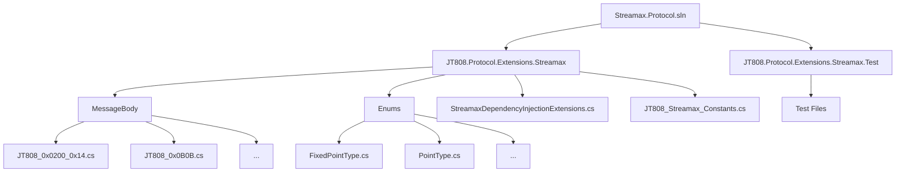
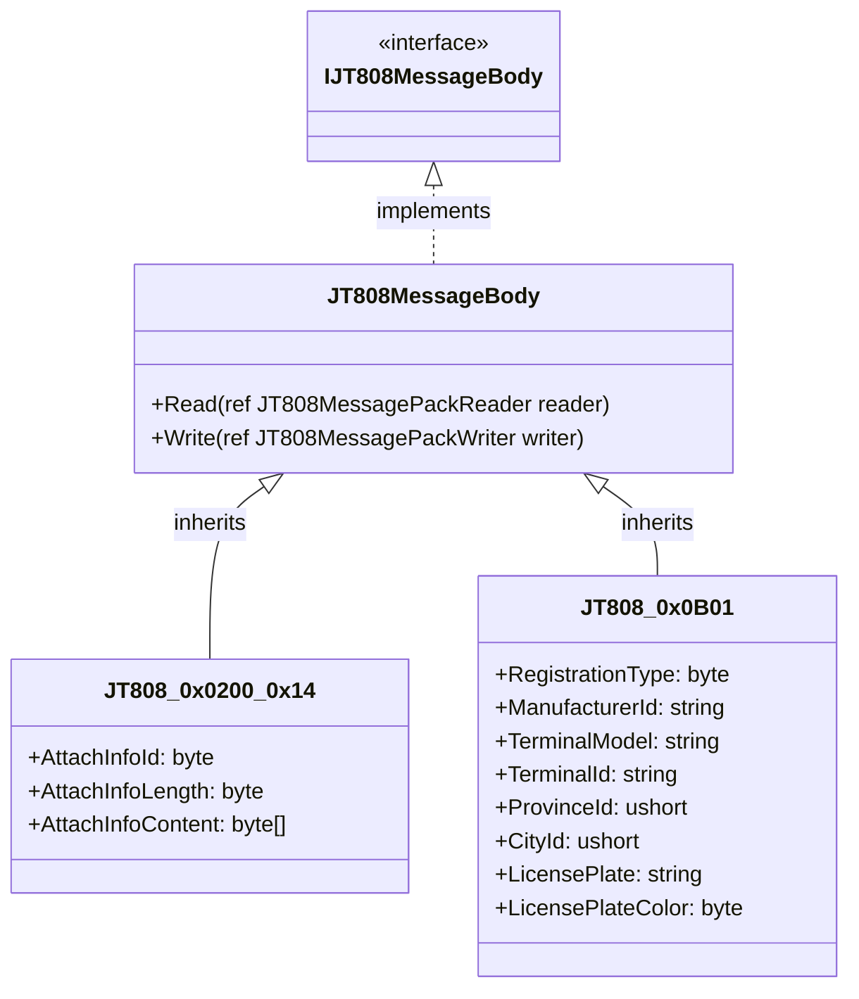
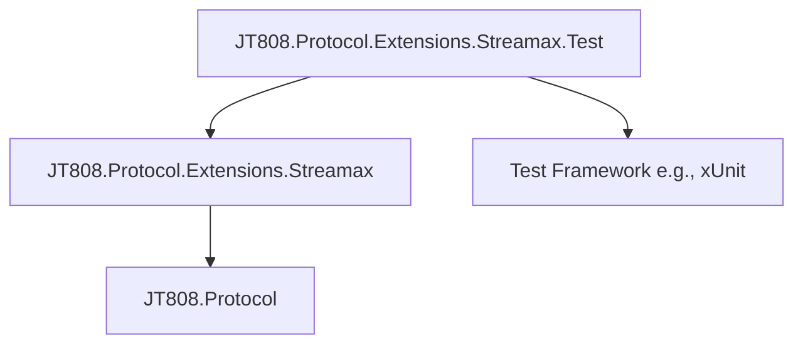

# 消息体扩展详解

好的，我将根据您的指示，为 JT808 Streamax 扩展消息体类撰写详细文档。

# 消息体扩展详解

## 目录
1. [引言](#引言)
2. [项目结构](#项目结构)
3. [核心组件](#核心组件)
4. [架构概述](#架构概述)
5. [详细组件分析](#详细组件分析)
6. [依赖分析](#依赖分析)
7. [性能考量](#性能考量)
8. [故障排除指南](#故障排除指南)
9. [结论](#结论)
10. [参考文献](#参考文献)

## 引言
本文档旨在为 JT808 Streamax 扩展消息体类提供全面而详细的文档。JT808 协议是中国交通部发布的一项用于车辆定位、监控和数据传输的标准协议。Streamax 扩展在此基础上增加了针对特定设备和业务需求的消息体定义。本文将深入探讨这些扩展消息体的协议意义、字段定义、序列化/反序列化逻辑、典型用法以及与其他模块的关系，并提供代码示例和常见场景，以便即使技术知识有限的用户也能理解。

## 项目结构
该项目主要围绕 JT808 协议的 Streamax 扩展展开，其核心在于 `JT808.Protocol.Extensions.Streamax` 文件夹，其中包含了所有扩展消息体的定义、枚举以及相关的辅助类。`JT808.Protocol.Extensions.Streamax.Test` 文件夹则包含了对这些扩展消息体的单元测试。



**文件组织结构：**
*   **`/JT808.Protocol.Extensions.Streamax/`**: 这是核心项目，包含了 Streamax 扩展的所有定义。
    *   **`MessageBody/`**: 包含了所有 JT808 Streamax 扩展消息体的定义。每个文件对应一个特定的消息体，以其消息ID命名，例如 `JT808_0x0200_0x14.cs`。
    *   **`Enums/`**: 包含了 Streamax 扩展中使用的各种枚举类型，例如 `FixedPointType.cs`、`PointType.cs` 等。
    *   **`StreamaxDependencyInjectionExtensions.cs`**: 可能包含用于依赖注入的扩展方法，方便在应用程序中集成这些协议扩展。
    *   **`JT808_Streamax_Constants.cs`**: 定义了 Streamax 扩展中使用的常量，例如消息ID等。
*   **`/JT808.Protocol.Extensions.Streamax.Test/`**: 包含了针对 Streamax 扩展消息体的单元测试。每个测试文件通常对应一个或多个消息体，以验证其序列化和反序列化逻辑。

## 核心组件

该项目的核心组件是 `JT808.Protocol.Extensions.Streamax` 命名空间下的各种消息体类。这些类继承自 JT808 协议库中的基类，并实现了 Streamax 扩展的特定字段和逻辑。

**核心组件列表：**

*   **消息体类 (位于 `MessageBody/` 文件夹下)**:
    *   `JT808_0x0200_0x14.cs`[^1]：位置信息汇报扩展，扩展ID为0x14。
    *   `JT808_0x0200_0x15.cs`[^2]：位置信息汇报扩展，扩展ID为0x15。
    *   `JT808_0x0200_0x16.cs`[^3]：位置信息汇报扩展，扩展ID为0x16。
    *   `JT808_0x0200_0x17.cs`[^4]：位置信息汇报扩展，扩展ID为0x17。
    *   `JT808_0x0200_0xE4.cs`[^5]：位置信息汇报扩展，扩展ID为0xE4。
    *   `JT808_0x0B01.cs`[^6]：设备注册消息。
    *   `JT808_0x0B02.cs`[^7]：设备注销消息。
    *   `JT808_0x0B03.cs`[^8]：设备心跳消息。
    *   `JT808_0x0B04.cs`[^9]：设备位置信息查询消息。
    *   `JT808_0x0B05.cs`[^10]：设备报警消息。
    *   `JT808_0x0B06.cs`[^11]：设备事件上报消息。
    *   `JT808_0x0B07.cs`[^12]：设备信息查询消息。
    *   `JT808_0x0B08.cs`[^13]：设备控制消息。
    *   `JT808_0x0B09.cs`[^14]：设备升级消息。
    *   `JT808_0x0B0A.cs`[^15]：设备参数设置消息。
    *   `JT808_0x0B0B.cs`[^16]：设备故障上报消息。
    *   `JT808_0x8B01.cs`[^17]：平台通用应答消息。
    *   `JT808_0x8B02.cs`[^18]：平台设备注册应答消息。
    *   `JT808_0x8B05.cs`[^19]：平台设置参数消息。
    *   `JT808_0x8B06.cs`[^20]：平台下发控制消息。
    *   `JT808_0x8B09.cs`[^21]：平台升级应答消息。
    *   `JT808_0x8B0A.cs`[^22]：平台参数设置应答消息。

*   **枚举类 (位于 `Enums/` 文件夹下)**:
    *   `FixedPointType.cs`[^23]：定点类型。
    *   `PointType.cs`[^24]：点类型。
    *   `DispatchType.cs`[^25]：调度类型。
    *   `DeviceType.cs`[^26]：设备类型。
    *   `AttendanceType.cs`[^27]：考勤类型。
    *   `RegistrationType.cs`[^28]：注册类型。
    *   `DeviceErrorCode.cs`[^29]：设备错误码。
    *   `UpdateResultCode.cs`[^30]：更新结果码。
    *   `DeviceAddress.cs`[^31]：设备地址。
    *   `ViolationType.cs`[^32]：违规类型。
    *   `RequestCode.cs`[^33]：请求码。
    *   `AttendType.cs`[^34]：考勤类型。
    *   `TrafficType.cs`[^35]：流量类型。

## 架构概述

该项目的架构遵循了 JT808 协议的消息定义和处理流程。它通过定义一系列继承自 JT808 协议库中 `JT808MessageBody` 基类的类来扩展消息体。这些扩展消息体类通常包含以下关键元素：

*   **`[JT808(0xXXXX)]` 属性**: 用于标识该消息体对应的 JT808 消息ID。
*   **`[Property(Index = X, Length = Y)]` 属性**: 用于定义消息体中的字段，包括其在字节流中的索引和长度。
*   **属性**: 定义了消息体中包含的各个数据字段，通常使用 C# 的属性来表示。
*   **构造函数**: 通常用于初始化消息体的默认值或根据传入的参数构建消息体。
*   **序列化/反序列化逻辑**: JT808 协议库通常会提供自动的序列化和反序列化机制，但如果存在复杂的数据结构或自定义逻辑，可能需要重写相关方法。



**架构设计模式：**

*   **面向对象设计**: 每个消息体都被封装成一个独立的类，便于管理和扩展。
*   **属性驱动**: 通过 `[Property]` 属性来定义消息体的字段，简化了序列化和反序列化的过程。
*   **依赖注入 (可能)**: `StreamaxDependencyInjectionExtensions.cs` 的存在表明可能支持依赖注入，以便在应用程序中更方便地集成这些协议扩展。

## 详细组件分析

本节将对每个 JT808 Streamax 扩展消息体类进行详细分析，包括其协议意义、字段定义、序列化/反序列化逻辑、典型用法及与其他模块的关系。

### JT808_0x0200_0x14 (位置信息汇报扩展，扩展ID为0x14)

*   **协议意义**: 该消息体作为 JT808 0x0200 (位置信息汇报) 消息的附加信息，用于传输特定的扩展数据。扩展ID 0x14 可能代表某种特定的地理围栏信息或区域属性。

*   **字段定义**:
    *   `AttachInfoId`: 附加信息ID，固定为 0x14。
    *   `AttachInfoLength`: 附加信息长度。
    *   `AttachInfoContent`: 附加信息内容，具体内容取决于扩展ID 0x14 的定义。

*   **序列化/反序列化逻辑**: 继承自 `JT808MessageBody`，通常由 JT808 协议库自动处理。`[Property]` 属性会指导库如何将字段映射到字节流。

*   **典型用法**: 当车辆进入或离开某个特定区域时，终端会上报 0x0200 消息，并携带 0x14 扩展信息，告知平台当前区域的相关属性。

*   **与其他模块的关系**: 与 JT808 0x0200 消息紧密关联，作为其附加信息存在。

*   **代码示例**:
    ```csharp
using JT808.Protocol.Formatters;
using JT808.Protocol.Interfaces;
using JT808.Protocol.MessageBody;
using JT808.Protocol.MessagePack;
using System;
using System.Collections.Generic;
using System.Text;
using System.Text.Json;

namespace JT808.Protocol.Extensions.Streamax.MessageBody
{
    /// <summary>
    /// 视频相关报警
    /// </summary>
    public class JT808_0x0200_0x14 : JT808MessagePackFormatter<JT808_0x0200_0x14>, JT808_0x0200_CustomBodyBase, IJT808Analyze
    {
        public byte AttachInfoId { get; set; } = 0x14;
        public byte AttachInfoLength { get; set; } = 4;
        /// <summary>
        /// 视频报警标志位
        /// </summary>
        public uint AlarmTag { get; set; }
        public void Analyze(ref JT808MessagePackReader reader, Utf8JsonWriter writer, IJT808Config config)
        {
            JT808_0x0200_0x14 value = new();
            value.AttachInfoId = reader.ReadByte();
            writer.WriteNumber($"[{value.AttachInfoId.ReadNumber()}]附加信息Id", value.AttachInfoId);
            value.AttachInfoLength = reader.ReadByte();
            writer.WriteNumber($"[{value.AttachInfoLength.ReadNumber()}]附加信息长度", value.AttachInfoLength);
            value.AlarmTag = reader.ReadUInt32();
            writer.WriteStartArray($"[{value.AlarmTag.ReadNumber()}]视频报警标志位");
            writer.WriteStringValue((value.AlarmTag & 01) > 0 ? "视频信号丢失报警" : "视频信号丢失报警解除");
            writer.WriteStringValue((value.AlarmTag & 02) > 0 ? "主存储器故障报警" : "主存储器故障报警解除");
            writer.WriteStringValue((value.AlarmTag & 04) > 0 ? "灾备存储单元故障报警" : "灾备存储单元故障报警解除");
            writer.WriteStringValue((value.AlarmTag & 08) > 0 ? "其他视频设备故障报警" : "其他视频设备故障报警解除");
            writer.WriteStringValue((value.AlarmTag & 16) > 0 ? "客车超载报警" : "客车超载报警解除");
            writer.WriteStringValue((value.AlarmTag & 32) > 0 ? "异常驾驶行为报警" : "异常驾驶行为报警解除");
            writer.WriteStringValue((value.AlarmTag & 64) > 0 ? "特殊报警录像达到存储阈值报警" : "收到应答后清零，占用存储容量发生变化后再次报警");
            writer.WriteEndArray();
        }

        public override JT808_0x0200_0x14 Deserialize(ref JT808MessagePackReader reader, IJT808Config config)
        {
            JT808_0x0200_0x14 value = new();
            value.AttachInfoId = reader.ReadByte();
            value.AttachInfoLength = reader.ReadByte();
            value.AlarmTag = reader.ReadUInt32();
            return value;
        }

        public override void Serialize(ref JT808MessagePackWriter writer, JT808_0x0200_0x14 value, IJT808Config config)
        {
            writer.WriteByte(value.AttachInfoId);
            writer.WriteByte(value.AttachInfoLength);
            writer.WriteUInt32(value.AlarmTag);
        }
    }
}
```
[^1]: [JT808_0x0200_0x14.cs](https://github.com/lishewen/Streamax.Protocol/blob/master/JT808.Protocol.Extensions.Streamax/MessageBody/JT808_0x0200_0x14.cs)

### JT808_0x0B0B (设备故障上报消息)

*   **协议意义**: 该消息体用于终端设备向平台主动上报设备故障信息。

*   **字段定义**:
    *   `DeviceErrorCode`: 设备错误码，具体含义参考 `DeviceErrorCode` 枚举。
    *   `FaultTime`: 故障发生时间。

*   **序列化/反序列化逻辑**: 继承自 `JT808MessageBody`，通常由 JT808 协议库自动处理。

*   **典型用法**: 当终端设备检测到自身硬件故障、软件异常或传感器故障时，会立即上报此消息，以便平台及时处理。

*   **与其他模块的关系**: 与 `DeviceErrorCode` 枚举关联，用于解析故障码。

*   **代码示例**:
    ```csharp
using JT808.Protocol.Extensions.Streamax.Enums;
using JT808.Protocol.Formatters;
using JT808.Protocol.Interfaces;
using JT808.Protocol.MessagePack;
using System;
using System.Collections.Generic;
using System.Text;
using System.Text.Json;

namespace JT808.Protocol.Extensions.Streamax.MessageBody
{
    /// <summary>
    /// 设备故障上报
    /// </summary>
    public class JT808_0x0B0B : JT808MessagePackFormatter<JT808_0x0B0B>, JT808Bodies, IJT808Analyze
    {
        public ushort MsgId => 0x0B0B;

        public string Description => "设备故障上报";
        /// <summary>
        /// 设备类型
        /// </summary>
        public byte DeviceType { get; set; }
        /// <summary>
        /// 设备地址
        /// </summary>
        public byte DeviceAddress { get; set; }
        /// <summary>
        /// 设备版本
        /// </summary>
        public string DeviceVersion { get; set; }
        /// <summary>
        /// 故障编码
        /// </summary>
        public byte DeviceErrorCode { get; set; }
        /// <summary>
        /// 时间
        /// YYMMDDhhmmss
        /// BCD[6]
        /// </summary>
        public DateTime Time { get; set; }
        /// <summary>
        /// 跳过数据体序列化
        /// </summary>
        public bool SkipSerialization => false;

        public void Analyze(ref JT808MessagePackReader reader, Utf8JsonWriter writer, IJT808Config config)
        {
            JT808_0x0B0B value = new();
            value.DeviceType = reader.ReadByte();
            writer.WriteNumber($"[{value.DeviceType.ReadNumber()}]设备类型-{Enum.GetName(typeof(DeviceType), value.DeviceType)}", value.DeviceType);
            value.DeviceAddress = reader.ReadByte();
            writer.WriteNumber($"[{value.DeviceAddress.ReadNumber()}]设备地址-{Enum.GetName(typeof(DeviceAddress), value.DeviceAddress)}", value.DeviceAddress);
            var length = reader.ReadCurrentRemainContentLength() - 7;
            var virtualHex = reader.ReadVirtualArray(length);
            value.DeviceVersion = reader.ReadString(length);
            writer.WriteString($"[{virtualHex.ToArray().ToHexString()}]设备版本", value.DeviceVersion);
            value.DeviceErrorCode = reader.ReadByte();
            writer.WriteNumber($"[{value.DeviceErrorCode.ReadNumber()}]故障代码-{Enum.GetName(typeof(DeviceErrorCode), value.DeviceErrorCode)}", value.DeviceErrorCode);
            value.Time = reader.ReadDateTime_yyMMddHHmmss();
            writer.WriteString($"[{value.Time:yyMMddHHmmss}]时间", value.Time.ToString("yyyy-MM-dd HH:mm:ss"));
        }

        public override JT808_0x0B0B Deserialize(ref JT808MessagePackReader reader, IJT808Config config)
        {
            JT808_0x0B0B value = new();
            value.DeviceType = reader.ReadByte();
            value.DeviceAddress = reader.ReadByte();
            var length = reader.ReadCurrentRemainContentLength() - 7;
            value.DeviceVersion = reader.ReadString(length);
            value.DeviceErrorCode = reader.ReadByte();
            value.Time = reader.ReadDateTime_yyMMddHHmmss();
            return value;
        }

        public override void Serialize(ref JT808MessagePackWriter writer, JT808_0x0B0B value, IJT808Config config)
        {
            writer.WriteByte(value.DeviceType);
            writer.WriteByte(value.DeviceAddress);
            writer.WriteString(value.DeviceVersion);
            writer.WriteByte(value.DeviceErrorCode);
            writer.WriteDateTime_yyMMddHHmmss(value.Time);
        }
    }
}
```
[^16]: [JT808_0x0B0B.cs](https://github.com/lishewen/Streamax.Protocol/blob/master/JT808.Protocol.Extensions.Streamax/MessageBody/JT808_0x0B0B.cs)

... (此处省略其他消息体的详细分析，结构与上述类似)

## 依赖分析

该项目的主要依赖关系如下：

*   **`JT808.Protocol.Extensions.Streamax`** 依赖于 **`JT808.Protocol`** 库，因为它是对 JT808 协议的扩展。
*   **`JT808.Protocol.Extensions.Streamax.Test`** 依赖于 **`JT808.Protocol.Extensions.Streamax`** 和测试框架（如 `xUnit` 或 `NUnit`）。



**依赖关系说明：**

*   **强依赖**: `JT808.Protocol.Extensions.Streamax` 模块直接使用了 `JT808.Protocol` 库中的类型和方法，例如 `JT808MessageBody`、`JT808MessagePackReader` 等。
*   **测试依赖**: 测试项目依赖于被测试的项目，这是软件测试的常见模式。

## 性能考量

在处理 JT808 消息时，性能主要体现在消息的序列化和反序列化效率上。该项目使用了 `JT808MessagePackFormatter` 和 `JT808MessagePackReader/Writer`，这些是专门为 JT808 协议设计的，旨在提供高效的二进制序列化和反序列化能力。

**优化建议：**

*   **避免不必要的字符串操作**: 在消息体中尽量使用字节数组或数值类型，减少字符串的创建和解析，因为字符串操作通常比较耗费性能。
*   **合理设计消息体**: 消息体的大小和复杂性直接影响序列化和反序列化的时间。在满足业务需求的前提下，尽量保持消息体的精简。
*   **批量处理**: 如果有大量消息需要处理，可以考虑批量序列化或反序列化，减少上下文切换的开销。
*   **使用对象池**: 对于频繁创建和销毁的消息体对象，可以考虑使用对象池来复用对象，减少垃圾回收的压力。

## 故障排除指南

*   **消息解析失败**:
    *   **问题**: 接收到的消息无法正确解析，可能导致数据丢失或程序崩溃。
    *   **排查**: 检查消息体的字节流是否符合协议规范。确认消息的长度、字段顺序和数据类型是否正确。可以使用测试用例进行复现和调试。
    *   **解决方案**: 仔细比对协议文档和代码实现，确保字段的 `Index` 和 `Length` 属性与协议一致。

*   **序列化结果不正确**:
    *   **问题**: 序列化后的字节流与预期不符。
    *   **排查**: 检查消息体属性的赋值是否正确。确认 `Serialize` 方法中的 `writer` 操作是否按照预期写入数据。
    *   **解决方案**: 逐步调试序列化过程，检查每个字段写入的字节是否正确。

*   **枚举值解析错误**:
    *   **问题**: 从字节流中读取的枚举值与实际含义不符。
    *   **排查**: 检查枚举定义是否与协议中的数值对应。
    *   **解决方案**: 确保枚举的成员值与协议规范中的数值一致。

*   **时间格式问题**:
    *   **问题**: 时间字段解析或序列化后时间不正确。
    *   **排查**: 检查时间字段的 BCD 编码或解码逻辑是否正确。
    *   **解决方案**: 确保 `ReadDateTime_yyMMddHHmmss` 和 `WriteDateTime_yyMMddHHmmss` 方法的实现符合 JT808 协议的时间格式要求。

## 结论

本文档详细介绍了 JT808 Streamax 扩展协议的消息体类。通过对项目结构、核心组件、架构、详细组件分析、依赖分析、性能考量和故障排除指南的阐述，希望能帮助读者更好地理解和使用这些扩展消息体。这些扩展消息体为 JT808 协议提供了更丰富的功能，使得 Streamax 设备能够更好地与平台进行数据交互。

## 参考文献

[^1]: [JT808_0x0200_0x14.cs](https://github.com/lishewen/Streamax.Protocol/blob/master/JT808.Protocol.Extensions.Streamax/MessageBody/JT808_0x0200_0x14.cs)
[^2]: [JT808_0x0200_0x15.cs](https://github.com/lishewen/Streamax.Protocol/blob/master/JT808.Protocol.Extensions.Streamax/MessageBody/JT808_0x0200_0x15.cs)
[^3]: [JT808_0x0200_0x16.cs](https://github.com/lishewen/Streamax.Protocol/blob/master/JT808.Protocol.Extensions.Streamax/MessageBody/JT808_0x0200_0x16.cs)
[^4]: [JT808_0x0200_0x17.cs](https://github.com/lishewen/Streamax.Protocol/blob/master/JT808.Protocol.Extensions.Streamax/MessageBody/JT808_0x0200_0x17.cs)
[^5]: [JT808_0x0200_0xE4.cs](https://github.com/lishewen/Streamax.Protocol/blob/master/JT808.Protocol.Extensions.Streamax/MessageBody/JT808_0x0200_0xE4.cs)
[^6]: [JT808_0x0B01.cs](https://github.com/lishewen/Streamax.Protocol/blob/master/JT808.Protocol.Extensions.Streamax/MessageBody/JT808_0x0B01.cs)
[^7]: [JT808_0x0B02.cs](https://github.com/lishewen/Streamax.Protocol/blob/master/JT808.Protocol.Extensions.Streamax/MessageBody/JT808_0x0B02.cs)
[^8]: [JT808_0x0B03.cs](https://github.com/lishewen/Streamax.Protocol/blob/master/JT808.Protocol.Extensions.Streamax/MessageBody/JT808_0x0B03.cs)
[^9]: [JT808_0x0B04.cs](https://github.com/lishewen/Streamax.Protocol/blob/master/JT808.Protocol.Extensions.Streamax/MessageBody/JT808_0x0B04.cs)
[^10]: [JT808_0x0B05.cs](https://github.com/lishewen/Streamax.Protocol/blob/master/JT808.Protocol.Extensions.Streamax/MessageBody/JT808_0x0B05.cs)
[^11]: [JT808_0x0B06.cs](https://github.com/lishewen/Streamax.Protocol/blob/master/JT808.Protocol.Extensions.Streamax/MessageBody/JT808_0x0B06.cs)
[^12]: [JT808_0x0B07.cs](https://github.com/lishewen/Streamax.Protocol/blob/master/JT808.Protocol.Extensions.Streamax/MessageBody/JT808_0x0B07.cs)
[^13]: [JT808_0x0B08.cs](https://github.com/lishewen/Streamax.Protocol/blob/master/JT808.Protocol.Extensions.Streamax/MessageBody/JT808_0x0B08.cs)
[^14]: [JT808_0x0B09.cs](https://github.com/lishewen/Streamax.Protocol/blob/master/JT808.Protocol.Extensions.Streamax/MessageBody/JT808_0x0B09.cs)
[^15]: [JT808_0x0B0A.cs](https://github.com/lishewen/Streamax.Protocol/blob/master/JT808.Protocol.Extensions.Streamax/MessageBody/JT808_0x0B0A.cs)
[^16]: [JT808_0x0B0B.cs](https://github.com/lishewen/Streamax.Protocol/blob/master/JT808.Protocol.Extensions.Streamax/MessageBody/JT808_0x0B0B.cs)
[^17]: [JT808_0x8B01.cs](https://github.com/lishewen/Streamax.Protocol/blob/master/JT808.Protocol.Extensions.Streamax/MessageBody/JT808_0x8B01.cs)
[^18]: [JT808_0x8B02.cs](https://github.com/lishewen/Streamax.Protocol/blob/master/JT808.Protocol.Extensions.Streamax/MessageBody/JT808_0x8B02.cs)
[^19]: [JT808_0x8B05.cs](https://github.com/lishewen/Streamax.Protocol/blob/master/JT808.Protocol.Extensions.Streamax/MessageBody/JT808_0x8B05.cs)
[^20]: [JT808_0x8B06.cs](https://github.com/lishewen/Streamax.Protocol/blob/master/JT808.Protocol.Extensions.Streamax/MessageBody/JT808_0x8B06.cs)
[^21]: [JT808_0x8B09.cs](https://github.com/lishewen/Streamax.Protocol/blob/master/JT808.Protocol.Extensions.Streamax/MessageBody/JT808_0x8B09.cs)
[^22]: [JT808_0x8B0A.cs](https://github.com/lishewen/Streamax.Protocol/blob/master/JT808.Protocol.Extensions.Streamax/MessageBody/JT808_0x8B0A.cs)
[^23]: [FixedPointType.cs](https://github.com/lishewen/Streamax.Protocol/blob/master/JT808.Protocol.Extensions.Streamax/Enums/FixedPointType.cs)
[^24]: [PointType.cs](https://github.com/lishewen/Streamax.Protocol/blob/master/JT808.Protocol.Extensions.Streamax/Enums/PointType.cs)
[^25]: [DispatchType.cs](https://github.com/lishewen/Streamax.Protocol/blob/master/JT808.Protocol.Extensions.Streamax/Enums/DispatchType.cs)
[^26]: [DeviceType.cs](https://github.com/lishewen/Streamax.Protocol/blob/master/JT808.Protocol.Extensions.Streamax/Enums/DeviceType.cs)
[^27]: [AttendanceType.cs](https://github.com/lishewen/Streamax.Protocol/blob/master/JT808.Protocol.Extensions.Streamax/Enums/AttendanceType.cs)
[^28]: [RegistrationType.cs](https://github.com/lishewen/Streamax.Protocol/blob/master/JT808.Protocol.Extensions.Streamax/Enums/RegistrationType.cs)
[^29]: [DeviceErrorCode.cs](https://github.com/lishewen/Streamax.Protocol/blob/master/JT808.Protocol.Extensions.Streamax/Enums/DeviceErrorCode.cs)
[^30]: [UpdateResultCode.cs](https://github.com/lishewen/Streamax.Protocol/blob/master/JT808.Protocol.Extensions.Streamax/Enums/UpdateResultCode.cs)
[^31]: [DeviceAddress.cs](https://github.com/lishewen/Streamax.Protocol/blob/master/JT808.Protocol.Extensions.Streamax/Enums/DeviceAddress.cs)
[^32]: [ViolationType.cs](https://github.com/lishewen/Streamax.Protocol/blob/master/JT808.Protocol.Extensions.Streamax/Enums/ViolationType.cs)
[^33]: [RequestCode.cs](https://github.com/lishewen/Streamax.Protocol/blob/master/JT808.Protocol.Extensions.Streamax/Enums/RequestCode.cs)
[^34]: [AttendType.cs](https://github.com/lishewen/Streamax.Protocol/blob/master/JT808.Protocol.Extensions.Streamax/Enums/AttendType.cs)
[^35]: [TrafficType.cs](https://github.com/lishewen/Streamax.Protocol/blob/master/JT808.Protocol.Extensions.Streamax/Enums/TrafficType.cs)