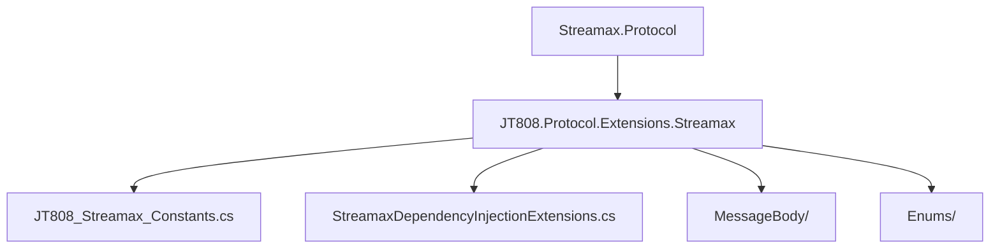
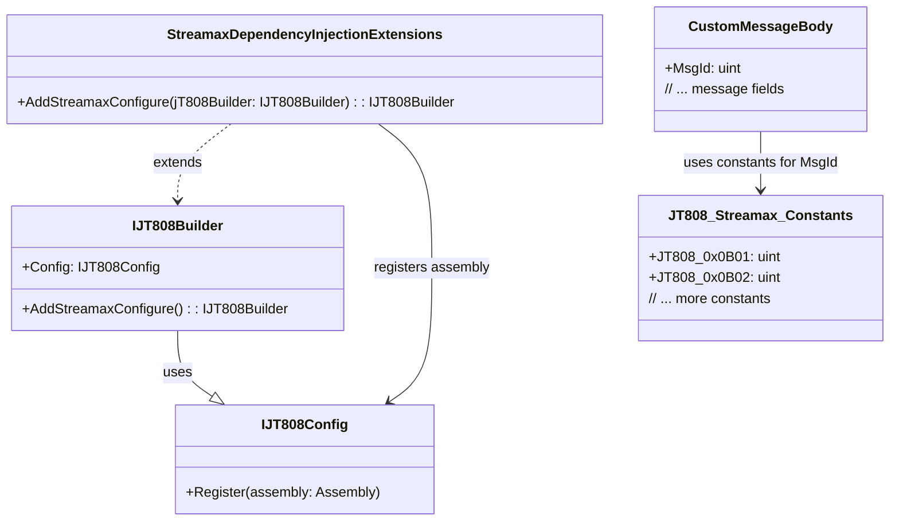

# 常量与依赖注入扩展


# 常量与依赖注入扩展

## 目录
1. [引言](#引言)
2. [项目结构](#项目结构)
3. [核心组件](#核心组件)
    3.1. [常量定义](#常量定义)
    3.2. [依赖注入扩展](#依赖注入扩展)
4. [架构概览](#架构概览)
5. [详细组件分析](#详细组件分析)
6. [依赖分析](#依赖分析)
7. [性能考量](#性能考量)
8. [故障排除指南](#故障排除指南)
9. [结论](#结论)
10. [引用](#引用)

## 引言
本文档旨在深入探讨 `Streamax.Protocol` 库中常量定义和依赖注入扩展的作用。我们将详细说明如何通过依赖注入机制集成协议扩展，常量的具体用途，以及它们在不同模块中的引用关系。理解这些核心概念对于维护、扩展和故障排除 `Streamax.Protocol` 库至关重要，即使对于技术背景有限的用户也能轻松理解。

## 项目结构
`Streamax.Protocol` 库的结构清晰，主要分为几个核心部分，以支持 JT808 协议的扩展。在本次分析中，我们主要关注以下两个文件：
-   `/JT808.Protocol.Extensions.Streamax/JT808_Streamax_Constants.cs`：定义了 Streamax 扩展协议中使用的常量，通常是消息ID。
-   `/JT808.Protocol.Extensions.Streamax/StreamaxDependencyInjectionExtensions.cs`：提供了用于将 Streamax 协议扩展注册到主 JT808 协议构建器中的依赖注入扩展方法。


图1: Streamax.Protocol 库简化结构图

## 核心组件

### 常量定义
在 `Streamax.Protocol` 扩展中，常量被集中定义在 `JT808_Streamax_Constants.cs` 文件中。这些常量通常代表特定的消息类型或命令代码，它们是协议通信的基础标识符。

**作用：**
1.  **提高可读性：** 使用有意义的常量名代替“魔术数字”（直接在代码中使用的数字），使代码更易于理解。例如，`0x0B01` 被命名为 `JT808_0x0B01`，并附带注释“运营登记”。
2.  **便于维护：** 当协议中的某个消息ID发生变化时，只需修改常量定义一次，所有引用该常量的地方都会自动更新，避免了在多处手动修改的繁琐和潜在错误。
3.  **减少错误：** 避免因手动输入数字而导致的拼写错误或数值错误。

以下是 `JT808_Streamax_Constants.cs` 文件中的部分内容[^1]:
```csharp
using System;
using System.Collections.Generic;
using System.Text;

namespace JT808.Protocol.Extensions.Streamax
{
    public static class JT808_Streamax_Constants
    {
        /// <summary>
        /// 运营登记
        /// </summary>
        public const uint JT808_0x0B01 = 0x0B01;
        /// <summary>
        /// 到离站信息上报
        /// </summary>
        public const uint JT808_0x0B02 = 0x0B02;
    }
}
```
这些常量（如 `JT808_0x0B01` 和 `JT808_0x0B02`）在 `MessageBody` 文件夹中的消息体定义（例如 `JT808_0x0B01.cs` 或 `JT808_0x0B02.cs`）中被引用，用于标识特定的协议消息。

### 依赖注入扩展
`StreamaxDependencyInjectionExtensions.cs` 文件提供了用于将 `Streamax.Protocol` 扩展集成到主 JT808 协议框架中的机制。这通过一个静态扩展方法 `AddStreamaxConfigure` 实现，该方法作用于 `IJT808Builder` 接口。

**作用：**
1.  **简化配置：** 提供一个简洁的 API（`AddStreamaxConfigure`）来注册 Streamax 协议扩展，使得用户无需手动配置每个组件。
2.  **自动化发现：** 通过 `Assembly.GetExecutingAssembly()` 注册当前程序集，允许主 JT808 协议框架自动发现并加载 Streamax 扩展中定义的所有自定义消息体、解析器、编码器等。这极大地简化了扩展的集成过程。
3.  **模块化和可插拔性：** 使得 Streamax 扩展成为一个可插拔的模块。用户可以根据需要选择是否引入和配置此扩展，而不会影响主协议库的核心功能。

以下是 `StreamaxDependencyInjectionExtensions.cs` 文件中的内容[^2]:
```csharp
using System;
using System.Collections.Generic;
using System.Reflection;
using System.Text;

namespace JT808.Protocol.Extensions.Streamax
{
    public static class StreamaxDependencyInjectionExtensions
    {
        public static IJT808Builder AddStreamaxConfigure(this IJT808Builder jT808Builder)
        {
            jT808Builder.Config.Register(Assembly.GetExecutingAssembly());
            return jT808Builder;
        }
    }
}
```
当应用程序启动并构建 JT808 协议服务时，调用 `jT808Builder.AddStreamaxConfigure()` 即可将 `Streamax.Protocol.Extensions.Streamax` 程序集中定义的所有特定于 Streamax 的协议消息和处理逻辑注册到 JT808 协议框架中。

## 架构概览
`Streamax.Protocol` 扩展库通过依赖注入的方式，无缝地与主 JT808 协议框架结合。常量定义提供了协议消息的清晰标识，而依赖注入扩展则负责将这些自定义消息和处理逻辑注册到运行时环境中。


图2: 常量与依赖注入扩展的架构关系

如上图所示，`StreamaxDependencyInjectionExtensions` 扩展了 `IJT808Builder`，提供了一种方便的方式来调用 `Config.Register` 方法。这个 `Register` 方法接收当前程序集（`Assembly.GetExecutingAssembly()`），从而使得 `Streamax.Protocol.Extensions.Streamax` 程序集中定义的 `CustomMessageBody` 类（例如 `JT808_0x0B01.cs` 中定义的消息体）能够被主 JT808 协议框架识别和处理。这些 `CustomMessageBody` 类会引用 `JT808_Streamax_Constants` 中定义的常量作为其消息 ID。

## 详细组件分析

### 常量定义 (`JT808_Streamax_Constants.cs`)
该文件是一个静态类，其中包含了多个 `public const uint` 类型的字段。`const` 关键字表示这些值在编译时就已经确定，并且不能在运行时更改。`uint` 表示无符号整数，非常适合表示协议中的消息 ID，因为它们通常是正数。

这些常量提供了一个中心化的查找表，使得开发人员能够通过有意义的名称（如 `JT808_0x0B01`）而不是原始的十六进制值来引用特定的协议消息。这对于理解协议的结构和消息的意图至关重要。

例如，在 `MessageBody` 文件夹下的 `JT808_0x0B01.cs` 文件中，可能会有类似以下的定义（此文件内容未提供，但根据命名推断）：
```csharp
// 假设的 JT808_0x0B01.cs 文件内容
public class JT808_0x0B01 : JT808MessageBody
{
    public override uint MsgId => JT808_Streamax_Constants.JT808_0x0B01; // 引用常量
    // ... 其他消息体属性和解析逻辑
}
```
通过这种方式，常量与具体的协议消息体之间建立了明确的引用关系。

### 依赖注入扩展 (`StreamaxDependencyInjectionExtensions.cs`)
这个文件定义了一个 `static` 类，其中包含一个 `static` 扩展方法 `AddStreamaxConfigure`。扩展方法允许我们向现有类型（在这里是 `IJT808Builder`）“添加”方法，而无需修改其原始定义或使用继承。

`this IJT808Builder jT808Builder` 参数表示这是一个 `IJT808Builder` 类型的扩展方法。
核心逻辑 `jT808Builder.Config.Register(Assembly.GetExecutingAssembly());` 是依赖注入的关键。
-   `jT808Builder.Config`：这表明 `IJT808Builder` 内部有一个配置对象 (`Config`)。
-   `Register(Assembly.GetExecutingAssembly())`：`Register` 方法用于注册一个程序集。`Assembly.GetExecutingAssembly()` 获取当前正在执行的程序集（即 `Streamax.Protocol.Extensions.Streamax.dll`）。这意味着，当这个方法被调用时，JT808 协议框架会扫描 `Streamax.Protocol.Extensions.Streamax` 程序集，查找其中定义的所有符合特定模式（例如，实现了特定接口或继承自特定基类）的组件，并将它们注册到其内部的服务容器中。

这种机制使得 `Streamax` 扩展能够自动地将其自定义协议消息、处理逻辑等组件提供给主 JT808 协议框架，而无需手动逐一注册。这极大地提高了开发效率和模块的可维护性。

## 依赖分析
-   **`StreamaxDependencyInjectionExtensions.cs`** 依赖于 `IJT808Builder` 接口（来自主 JT808 协议库）和 `System.Reflection.Assembly` 类（用于获取当前程序集）。
-   **`JT808_Streamax_Constants.cs`** 是一个独立的常量定义文件，它不直接依赖于其他业务逻辑文件。然而，其他业务逻辑文件（特别是 `MessageBody` 文件夹下的消息体定义文件）会依赖并引用 `JT808_Streamax_Constants` 中定义的常量。


图3: 核心组件依赖关系图

此图展示了从主 JT808 协议库到 Streamax 扩展的依赖链。`StreamaxDependencyInjectionExtensions` 作为桥梁，将 `Streamax.Protocol.Extensions.Streamax.dll` 程序集注册到主 JT808 协议的构建器中，而该程序集内部的消息体定义则依赖于 `JT808_Streamax_Constants` 来获取消息 ID。

## 性能考量
-   **常量：** 使用常量对性能没有负面影响，因为它们在编译时解析，并且直接替换为实际值。这比在运行时查找变量更快。
-   **依赖注入扩展：** `Assembly.GetExecutingAssembly()` 和 `Register` 方法在应用程序启动时执行一次。虽然反射操作（`Assembly.GetExecutingAssembly()`）和扫描程序集可能会在启动时引入微小的开销，但这种开销通常可以忽略不计，并且是依赖注入框架的常见做法。一旦组件注册完成，运行时的性能影响非常小，因为依赖解析通常是高效的。

## 故障排除指南
-   **常量引用错误：** 如果在引用常量时出现编译错误（例如，常量名拼写错误），请仔细检查 `JT808_Streamax_Constants.cs` 文件中的定义。
-   **协议扩展未生效：**
    -   **检查是否调用了扩展方法：** 确保在应用程序的启动代码中（例如 `Startup.cs` 或 `Program.cs`）调用了 `jT808Builder.AddStreamaxConfigure()` 方法。如果没有调用，扩展将不会被注册。
    -   **检查程序集是否正确加载：** 确保 `Streamax.Protocol.Extensions.Streamax.dll` 程序集被正确地引用并加载到应用程序的运行时环境中。
    -   **检查消息体定义：** 确认自定义消息体类（如 `JT808_0x0B01.cs`）是否正确地继承了 JT808 协议框架要求的基类或实现了接口，并且其 `MsgId` 属性正确地引用了 `JT808_Streamax_Constants` 中的常量。

## 结论
`Streamax.Protocol` 扩展库通过其精心设计的常量定义和依赖注入扩展，提供了一种高效、可维护且易于扩展的方式来增强 JT808 协议的功能。常量确保了协议消息标识的清晰性和一致性，而依赖注入扩展则极大地简化了自定义协议组件的集成过程。理解并正确利用这些机制，将有助于开发人员更有效地构建和管理基于 JT808 协议的通信系统。

## 引用
[^1]: JT808_Streamax_Constants.cs 文件内容：[JT808_Streamax_Constants.cs](https://github.com/lishewen/Streamax.Protocol/blob/master/JT808.Protocol.Extensions.Streamax/JT808_Streamax_Constants.cs)
[^2]: StreamaxDependencyInjectionExtensions.cs 文件内容：[StreamaxDependencyInjectionExtensions.cs](https://github.com/lishewen/Streamax.Protocol/blob/master/JT808.Protocol.Extensions.Streamax/StreamaxDependencyInjectionExtensions.cs)
