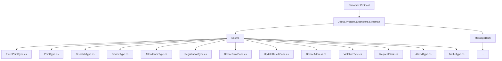
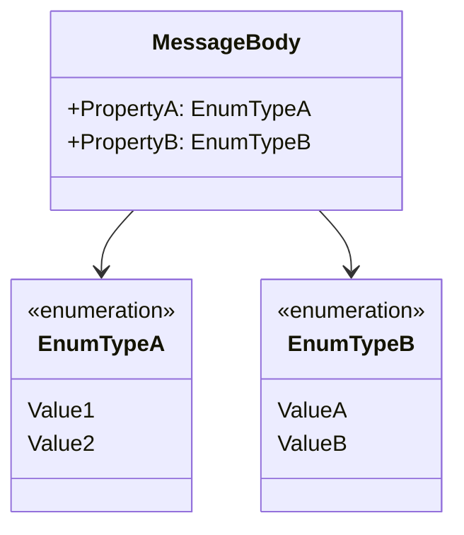
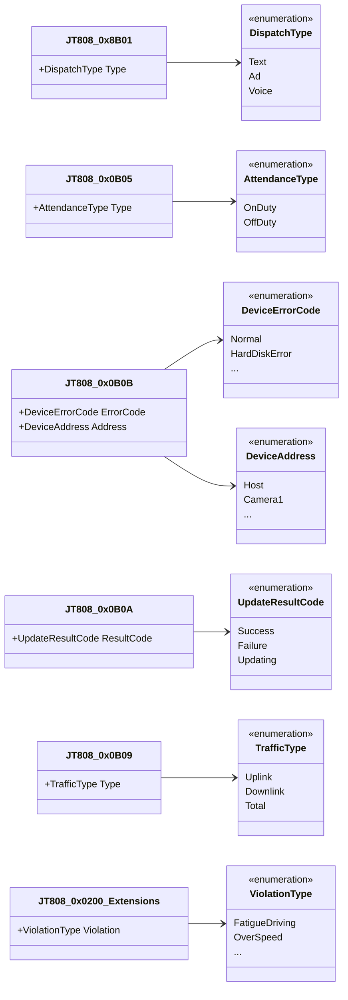

# Enums 枚举模块

好的，我将作为一名专业的软件文档专家，根据您的要求，为Streamax.Protocol Git仓库中的Enums目录创建一份详细的文档。

---
# Enums 枚举模块

## 目录
1. [引言](#引言)
2. [项目结构](#项目结构)
3. [核心组件](#核心组件)
4. [架构概览](#架构概览)
5. [详细组件分析](#详细组件分析)
6. [依赖分析](#依赖分析)
7. [性能考量](#性能考量)
8. [故障排除指南](#故障排除指南)
9. [结论](#结论)
10. [参考文献](#参考文献)

## 引言
本模块文档旨在详细介绍 `Streamax.Protocol` 仓库中 `Enums` 目录下定义的所有枚举类型。这些枚举在协议通信中扮演着至关重要的角色，它们为协议字段提供了标准化的取值，确保了数据传输的准确性和一致性。通过理解这些枚举的作用、应用场景以及它们与消息体（MessageBody）的关系，开发者和使用者可以更好地理解协议的业务逻辑，正确解析和构建协议消息。本模块的枚举是理解和实现Streamax协议扩展的基础。

## 项目结构
`Streamax.Protocol` 项目的结构清晰，`Enums` 目录专门用于存放各种枚举定义，而 `MessageBody` 目录则包含了具体的协议消息体结构。这种分离有助于代码的组织和维护，使得枚举的定义和使用更加模块化。



## 核心组件

`Enums` 目录下包含了多个枚举类型，每个枚举都定义了一组相关的常量值，用于表示协议中特定字段的含义。这些枚举是协议数据解析和生成的关键。

## 架构概览

在 `Streamax.Protocol` 扩展中，枚举类型作为协议消息体中的字段类型，为这些字段提供了预定义的、有意义的取值。这种架构确保了协议数据的一致性和可解释性。消息体通过引用这些枚举来定义其内部字段的合法值范围和业务含义。



## 详细组件分析

以下是对 `Enums` 目录下各个枚举的详细分析，包括它们的作用、定义以及在消息体中的应用场景。

### 1. `FixedPointType` (固定点类型) [^1]
*   **作用**: 定义固定点类型，可能用于描述地图上的特定点或位置的属性。
*   **定义**:
    ```csharp
    namespace JT808.Protocol.Extensions.Streamax.Enums
    {
        /// <summary>
        /// 固定点类型
        /// </summary>
        public enum FixedPointType : byte
        {
            /// <summary>
            /// 正常点
            /// </summary>
            NormalPoint = 0x00,
            /// <summary>
            /// 危险点
            /// </summary>
            DangerPoint = 0x01,
            /// <summary>
            /// 关键点
            /// </summary>
            KeyPoint = 0x02
        }
    }
    ```
*   **应用场景及与消息体的关系**:
    此枚举可能在需要标记或区分不同类型固定点的消息体中使用，例如在设置或上报地理围栏、线路点等消息中。它为这些点赋予了业务含义，如区分普通点、危险点或关键点。

### 2. `PointType` (点类型) [^2]
*   **作用**: 定义点的类型，与 `FixedPointType` 类似，但可能用于更通用的点表示。
*   **定义**:
    ```csharp
    namespace JT808.Protocol.Extensions.Streamax.Enums
    {
        /// <summary>
        /// 点类型
        /// </summary>
        public enum PointType : byte
        {
            /// <summary>
            /// 正常点
            /// </summary>
            NormalPoint = 0x00,
            /// <summary>
            /// 危险点
            /// </summary>
            DangerPoint = 0x01,
            /// <summary>
            /// 关键点
            /// </summary>
            KeyPoint = 0x02
        }
    }
    ```
*   **应用场景及与消息体的关系**:
    与 `FixedPointType` 定义相同，可能在不同的消息体或协议版本中使用，但表达的含义相同。通常用于地理位置相关消息中，例如 `JT808_0x0200` 位置信息汇报消息的扩展字段中，或者自定义的区域设置消息中。

### 3. `DispatchType` (调度类型) [^3]
*   **作用**: 定义调度指令的类型。
*   **定义**:
    ```csharp
    namespace JT808.Protocol.Extensions.Streamax.Enums
    {
        /// <summary>
        /// 调度类型
        /// </summary>
        public enum DispatchType : byte
        {
            /// <summary>
            /// 文本信息
            /// </summary>
            Text = 0x00,
            /// <summary>
            /// 广告信息
            /// </summary>
            Ad = 0x01,
            /// <summary>
            /// 语音信息
            /// </summary>
            Voice = 0x02
        }
    }
    ```
*   **应用场景及与消息体的关系**:
    此枚举可能在调度相关的消息体中使用，例如 `JT808_0x8B01` 调度信息下发消息中，用于指示下发的调度信息是文本、广告还是语音类型。它直接影响消息体中后续字段的解析方式。
    *   **关联消息体**: `JT808_0x8B01`[^4]

### 4. `DeviceType` (设备类型) [^5]
*   **作用**: 定义设备的类型。
*   **定义**:
    ```csharp
    namespace JT808.Protocol.Extensions.Streamax.Enums
    {
        /// <summary>
        /// 设备类型
        /// </summary>
        public enum DeviceType : byte
        {
            /// <summary>
            /// 终端
            /// </summary>
            Terminal = 0x00,
            /// <summary>
            /// 摄像头
            /// </summary>
            Camera = 0x01,
            /// <summary>
            /// 麦克风
            /// </summary>
            Microphone = 0x02
        }
    }
    ```
*   **应用场景及与消息体的关系**:
    此枚举在需要区分不同设备类型的消息体中使用，例如在设备状态查询、设备控制或设备注册消息中。它帮助系统识别和处理不同类型的设备。

### 5. `AttendanceType` (考勤类型) [^6]
*   **作用**: 定义考勤操作的类型。
*   **定义**:
    ```csharp
    namespace JT808.Protocol.Extensions.Streamax.Enums
    {
        /// <summary>
        /// 考勤类型
        /// </summary>
        public enum AttendanceType : byte
        {
            /// <summary>
            /// 上班
            /// </summary>
            OnDuty = 0x00,
            /// <summary>
            /// 下班
            /// </summary>
            OffDuty = 0x01
        }
    }
    ```
*   **应用场景及与消息体的关系**:
    此枚举用于考勤相关的消息体中，例如上报考勤记录的消息，它明确指明了考勤事件是“上班”还是“下班”。
    *   **关联消息体**: `JT808_0x0B05`[^7]

### 6. `RegistrationType` (注册类型) [^8]
*   **作用**: 定义终端注册的类型。
*   **定义**:
    ```csharp
    namespace JT808.Protocol.Extensions.Streamax.Enums
    {
        /// <summary>
        /// 注册类型
        /// </summary>
        public enum RegistrationType : byte
        {
            /// <summary>
            /// 注册
            /// </summary>
            Register = 0x00,
            /// <summary>
            /// 注销
            /// </summary>
            Logout = 0x01
        }
    }
    ```
*   **应用场景及与消息体的关系**:
    此枚举可能在自定义的终端注册或注销消息中使用，以区分终端是请求注册服务还是请求注销服务。

### 7. `DeviceErrorCode` (设备错误码) [^9]
*   **作用**: 定义设备上报的错误码。
*   **定义**:
    ```csharp
    namespace JT808.Protocol.Extensions.Streamax.Enums
    {
        /// <summary>
        /// 设备错误码
        /// </summary>
        public enum DeviceErrorCode : byte
        {
            /// <summary>
            /// 正常
            /// </summary>
            Normal = 0x00,
            /// <summary>
            /// 硬盘错误
            /// </summary>
            HardDiskError = 0x01,
            /// <summary>
            /// SD卡错误
            /// </summary>
            SDCardError = 0x02,
            /// <summary>
            /// 传感器错误
            /// </summary>
            SensorError = 0x03,
            /// <summary>
            /// 摄像头错误
            /// </summary>
            CameraError = 0x04,
            /// <summary>
            /// GPS模块错误
            /// </summary>
            GPSModuleError = 0x05,
            /// <summary>
            /// 4G模块错误
            /// </summary>
            Module4GError = 0x06,
            /// <summary>
            /// WIFI模块错误
            /// </summary>
            WIFIModuleError = 0x07,
            /// <summary>
            /// 蓝牙模块错误
            /// </summary>
            BluetoothModuleError = 0x08,
            /// <summary>
            /// 语音模块错误
            /// </summary>
            VoiceModuleError = 0x09,
            /// <summary>
            /// 屏幕错误
            /// </summary>
            ScreenError = 0x0A,
            /// <summary>
            /// 打印机错误
            /// </summary>
            PrinterError = 0x0B,
            /// <summary>
            /// 刷卡器错误
            /// </summary>
            CardReaderError = 0x0C,
            /// <summary>
            /// 计价器错误
            /// </summary>
            TaximeterError = 0x0D,
            /// <summary>
            /// 顶灯错误
            /// </summary>
            RoofLightError = 0x0E,
            /// <summary>
            /// 空车灯错误
            /// </summary>
            EmptyLightError = 0x0F,
            /// <summary>
            /// 载客灯错误
            /// </summary>
            PassengerLightError = 0x10,
            /// <summary>
            /// 报警器错误
            /// </summary>
            AlarmError = 0x11,
            /// <summary>
            /// 门禁错误
            /// </summary>
            AccessControlError = 0x12,
            /// <summary>
            /// 广告屏错误
            /// </summary>
            AdScreenError = 0x13,
            /// <summary>
            /// 麦克风错误
            /// </summary>
            MicrophoneError = 0x14,
            /// <summary>
            /// 扬声器错误
            /// </summary>
            SpeakerError = 0x15,
            /// <summary>
            /// 触控屏错误
            /// </summary>
            TouchScreenError = 0x16,
            /// <summary>
            /// 备用电池错误
            /// </summary>
            BackupBatteryError = 0x17,
            /// <summary>
            /// 主电池错误
            /// </summary>
            MainBatteryError = 0x18,
            /// <summary>
            /// SIM卡错误
            /// </summary>
            SIMCardError = 0x19,
            /// <summary>
            /// 流量卡错误
            /// </summary>
            FlowCardError = 0x1A,
            /// <summary>
            /// CPU过载
            /// </summary>
            CPUOverload = 0x1B,
            /// <summary>
            /// 内存不足
            /// </summary>
            MemoryInsufficient = 0x1C,
            /// <summary>
            /// 存储空间不足
            /// </summary>
            StorageInsufficient = 0x1D,
            /// <summary>
            /// 固件升级失败
            /// </summary>
            FirmwareUpgradeFailed = 0x1E,
            /// <summary>
            /// 配置错误
            /// </summary>
            ConfigurationError = 0x1F,
            /// <summary>
            /// 时间同步失败
            /// </summary>
            TimeSyncFailed = 0x20
        }
    }
    ```
*   **应用场景及与消息体的关系**:
    此枚举在设备故障或状态上报消息中至关重要，例如 `JT808_0x0B0B` 设备故障信息上报消息中，用于明确指出设备出现的具体故障类型。这对于远程诊断和维护非常有用。
    *   **关联消息体**: `JT808_0x0B0B`[^10]

### 8. `UpdateResultCode` (更新结果码) [^11]
*   **作用**: 定义固件或配置更新操作的结果。
*   **定义**:
    ```csharp
    namespace JT808.Protocol.Extensions.Streamax.Enums
    {
        /// <summary>
        /// 更新结果码
        /// </summary>
        public enum UpdateResultCode : byte
        {
            /// <summary>
            /// 成功
            /// </summary>
            Success = 0x00,
            /// <summary>
            /// 失败
            /// </summary>
            Failure = 0x01,
            /// <summary>
            /// 升级中
            /// </summary>
            Updating = 0x02
        }
    }
    ```
*   **应用场景及与消息体的关系**:
    此枚举用于设备上报固件或配置更新状态的消息中，例如在 `JT808_0x0B0A` 固件更新结果上报消息中，表明更新操作是成功、失败还是正在进行中。
    *   **关联消息体**: `JT808_0x0B0A`[^12]

### 9. `DeviceAddress` (设备地址) [^13]
*   **作用**: 定义设备地址，可能用于区分设备的物理位置或逻辑编号。
*   **定义**:
    ```csharp
    namespace JT808.Protocol.Extensions.Streamax.Enums
    {
        /// <summary>
        /// 设备地址
        /// </summary>
        public enum DeviceAddress : byte
        {
            /// <summary>
            /// 主机
            /// </summary>
            Host = 0x00,
            /// <summary>
            /// 摄像头1
            /// </summary>
            Camera1 = 0x01,
            /// <summary>
            /// 摄像头2
            /// </summary>
            Camera2 = 0x02,
            /// <summary>
            /// 摄像头3
            /// </summary>
            Camera3 = 0x03,
            /// <summary>
            /// 摄像头4
            /// </summary>
            Camera4 = 0x04,
            /// <summary>
            /// 摄像头5
            /// </summary>
            Camera5 = 0x05,
            /// <summary>
            /// 摄像头6
            /// </summary>
            Camera6 = 0x06,
            /// <summary>
            /// 摄像头7
            /// </summary>
            Camera7 = 0x07,
            /// <summary>
            /// 摄像头8
            /// </summary>
            Camera8 = 0x08,
            /// <summary>
            /// 麦克风1
            /// </summary>
            Microphone1 = 0x09,
            /// <summary>
            /// 麦克风2
            /// </summary>
            Microphone2 = 0x0A,
            /// <summary>
            /// 麦克风3
            /// </summary>
            Microphone3 = 0x0B,
            /// <summary>
            /// 麦克风4
            /// </summary>
            Microphone4 = 0x0C,
            /// <summary>
            /// 麦克风5
            /// </summary>
            Microphone5 = 0x0D,
            /// <summary>
            /// 麦克风6
            /// </summary>
            Microphone6 = 0x0E,
            /// <summary>
            /// 麦克风7
            /// </summary>
            Microphone7 = 0x0F,
            /// <summary>
            /// 麦克风8
            /// </summary>
            Microphone8 = 0x10
        }
    }
    ```
*   **应用场景及与消息体的关系**:
    此枚举用于指定具体设备或部件的地址，例如在音视频控制、状态查询或故障上报中，需要明确是哪个摄像头或麦克风。
    *   **关联消息体**: `JT808_0x0B0B`[^10] (在设备故障信息上报中，可能需要指明是哪个设备的故障)

### 10. `ViolationType` (违规类型) [^14]
*   **作用**: 定义违规行为的类型。
*   **定义**:
    ```csharp
    namespace JT808.Protocol.Extensions.Streamax.Enums
    {
        /// <summary>
        /// 违规类型
        /// </summary>
        public enum ViolationType : byte
        {
            /// <summary>
            /// 疲劳驾驶
            /// </summary>
            FatigueDriving = 0x00,
            /// <summary>
            /// 超速
            /// </summary>
            OverSpeed = 0x01,
            /// <summary>
            /// 区域报警
            /// </summary>
            RegionAlarm = 0x02,
            /// <summary>
            /// 线路报警
            /// </summary>
            LineAlarm = 0x03,
            /// <summary>
            /// 偏离线路
            /// </summary>
            DeviationFromLine = 0x04,
            /// <summary>
            /// 异常停车
            /// </summary>
            AbnormalParking = 0x05,
            /// <summary>
            /// 紧急报警
            /// </summary>
            EmergencyAlarm = 0x06,
            /// <summary>
            /// 进出区域
            /// </summary>
            EnterExitRegion = 0x07,
            /// <summary>
            /// 进出线路
            /// </summary>
            EnterExitLine = 0x08,
            /// <summary>
            /// 路段行驶时间不足/过长
            /// </summary>
            DrivingTimeInsufficientOrTooLong = 0x09,
            /// <summary>
            /// 路线偏离报警
            /// </summary>
            RouteDeviationAlarm = 0x0A,
            /// <summary>
            /// 车辆非法点火
            /// </summary>
            IllegalIgnition = 0x0B,
            /// <summary>
            /// 车辆非法位移
            /// </summary>
            IllegalDisplacement = 0x0C,
            /// <summary>
            /// 碰撞侧翻报警
            /// </summary>
            CollisionRolloverAlarm = 0x0D,
            /// <summary>
            /// 盗警
            /// </summary>
            TheftAlarm = 0x0E,
            /// <summary>
            /// 劫警
            /// </summary>
            RobberyAlarm = 0x0F,
            /// <summary>
            /// 平台下发指令
            /// </summary>
            PlatformCommand = 0x10,
            /// <summary>
            /// 终端本地报警
            /// </summary>
            TerminalLocalAlarm = 0x11
        }
    }
    ```
*   **应用场景及与消息体的关系**:
    此枚举在车辆违规或报警消息中广泛使用，例如 `JT808_0x0200` 位置信息汇报消息的报警标识位，或者自定义的违规事件上报消息中，用于明确指出发生的违规行为类型。
    *   **关联消息体**: `JT808_0x0200_0x14`[^15], `JT808_0x0200_0x15`[^16], `JT808_0x0200_0x16`[^17], `JT808_0x0200_0x17`[^18] (这些是 `JT808_0x0200` 消息的扩展字段，可能包含违规类型)

### 11. `RequestCode` (请求码) [^19]
*   **作用**: 定义请求操作的类型。
*   **定义**:
    ```csharp
    namespace JT808.Protocol.Extensions.Streamax.Enums
    {
        /// <summary>
        /// 请求码
        /// </summary>
        public enum RequestCode : byte
        {
            /// <summary>
            /// 拍照
            /// </summary>
            TakePhoto = 0x00,
            /// <summary>
            /// 录像
            /// </summary>
            RecordVideo = 0x01,
            /// <summary>
            /// 录音
            /// </summary>
            RecordAudio = 0x02,
            /// <summary>
            /// 抓拍
            /// </summary>
            Capture = 0x03,
            /// <summary>
            /// 实时视频
            /// </summary>
            RealtimeVideo = 0x04,
            /// <summary>
            /// 实时音频
            /// </summary>
            RealtimeAudio = 0x05,
            /// <summary>
            /// 文件上传
            /// </summary>
            FileUpload = 0x06,
            /// <summary>
            /// 文件下载
            /// </summary>
            FileDownload = 0x07,
            /// <summary>
            /// 语音对讲
            /// </summary>
            VoiceIntercom = 0x08,
            /// <summary>
            /// 文本下发
            /// </summary>
            TextDispatch = 0x09,
            /// <summary>
            /// 广告下发
            /// </summary>
            AdDispatch = 0x0A,
            /// <summary>
            /// 语音下发
            /// </summary>
            VoiceDispatch = 0x0B,
            /// <summary>
            /// 固件升级
            /// </summary>
            FirmwareUpgrade = 0x0C,
            /// <summary>
            /// 配置下发
            /// </summary>
            ConfigDispatch = 0x0D,
            /// <summary>
            /// 考勤
            /// </summary>
            Attendance = 0x0E,
            /// <summary>
            /// 注册
            /// </summary>
            Register = 0x0F,
            /// <summary>
            /// 注销
            /// </summary>
            Logout = 0x10,
            /// <summary>
            /// 报警
            /// </summary>
            Alarm = 0x11,
            /// <summary>
            /// 故障
            /// </summary>
            Fault = 0x12,
            /// <summary>
            /// 流量统计
            /// </summary>
            TrafficStatistics = 0x13,
            /// <summary>
            /// 设备信息查询
            /// </summary>
            DeviceInfoQuery = 0x14,
            /// <summary>
            /// 驾驶员信息查询
            /// </summary>
            DriverInfoQuery = 0x15,
            /// <summary>
            /// 车辆信息查询
            /// </summary>
            VehicleInfoQuery = 0x16,
            /// <summary>
            /// 路线信息查询
            /// </summary>
            RouteInfoQuery = 0x17,
            /// <summary>
            /// 区域信息查询
            /// </summary>
            RegionInfoQuery = 0x18,
            /// <summary>
            /// 定时上报
            /// </summary>
            TimedReport = 0x19,
            /// <summary>
            /// 定距上报
            /// </summary>
            DistanceReport = 0x1A,
            /// <summary>
            /// 盲区补报
            /// </summary>
            BlindAreaReport = 0x1B,
            /// <summary>
            /// 补传
            /// </summary>
            Resend = 0x1C,
            /// <summary>
            /// 平台通用应答
            /// </summary>
            PlatformGeneralResponse = 0x1D,
            /// <summary>
            /// 终端通用应答
            /// </summary>
            TerminalGeneralResponse = 0x1E,
            /// <summary>
            /// 终端心跳
            /// </summary>
            TerminalHeartbeat = 0x1F,
            /// <summary>
            /// 终端注册
            /// </summary>
            TerminalRegister = 0x20,
            /// <summary>
            /// 终端注销
            /// </summary>
            TerminalLogout = 0x21,
            /// <summary>
            /// 终端鉴权
            /// </summary>
            TerminalAuth = 0x22,
            /// <summary>
            /// 位置信息汇报
            /// </summary>
            LocationReport = 0x23,
            /// <summary>
            /// 车辆控制
            /// </summary>
            VehicleControl = 0x24,
            /// <summary>
            /// 报警附件上传指令
            /// </summary>
            AlarmAttachmentUploadCommand = 0x25,
            /// <summary>
            /// 报警附件上传完成通知
            /// </summary>
            AlarmAttachmentUploadCompleteNotification = 0x26,
            /// <summary>
            /// 文件上传完成通知
            /// </summary>
            FileUploadCompleteNotification = 0x27,
            /// <summary>
            /// 文件上传指令
            /// </summary>
            FileUploadCommand = 0x28,
            /// <summary>
            /// 文件上传取消指令
            /// </summary>
            FileUploadCancelCommand = 0x29,
            /// <summary>
            /// 文件上传暂停指令
            /// </summary>
            FileUploadPauseCommand = 0x2A,
            /// <summary>
            /// 文件上传恢复指令
            /// </summary>
            FileUploadResumeCommand = 0x2B,
            /// <summary>
            /// 文件上传进度查询指令
            /// </summary>
            FileUploadProgressQueryCommand = 0x2C,
            /// <summary>
            /// 文件上传进度应答
            /// </summary>
            FileUploadProgressResponse = 0x2D,
            /// <summary>
            /// 文件上传结果通知
            /// </summary>
            FileUploadResultNotification = 0x2E,
            /// <summary>
            /// 文件下载指令
            /// </summary>
            FileDownloadCommand = 0x2F,
            /// <summary>
            /// 文件下载取消指令
            /// </summary>
            FileDownloadCancelCommand = 0x30,
            /// <summary>
            /// 文件下载暂停指令
            /// </summary>
            FileDownloadPauseCommand = 0x31,
            /// <summary>
            /// 文件下载恢复指令
            /// </summary>
            FileDownloadResumeCommand = 0x32,
            /// <summary>
            /// 文件下载进度查询指令
            /// </summary>
            FileDownloadProgressQueryCommand = 0x33,
            /// <summary>
            /// 文件下载进度应答
            /// </summary>
            FileDownloadProgressResponse = 0x34,
            /// <summary>
            /// 文件下载结果通知
            /// </summary>
            FileDownloadResultNotification = 0x35,
            /// <summary>
            /// 终端升级指令
            /// </summary>
            TerminalUpgradeCommand = 0x36,
            /// <summary>
            /// 终端升级结果通知
            /// </summary>
            TerminalUpgradeResultNotification = 0x37,
            /// <summary>
            /// 终端参数设置指令
            /// </summary>
            TerminalParameterSettingCommand = 0x38,
            /// <summary>
            /// 终端参数查询指令
            /// </summary>
            TerminalParameterQueryCommand = 0x39,
            /// <summary>
            /// 终端参数查询应答
            /// </summary>
            TerminalParameterQueryResponse = 0x3A,
            /// <summary>
            /// 终端控制指令
            /// </summary>
            TerminalControlCommand = 0x3B,
            /// <summary>
            /// 终端控制应答
            /// </summary>
            TerminalControlResponse = 0x3C,
            /// <summary>
            /// 查询指定区域/线路版本信息
            /// </summary>
            QueryRegionLineVersionInfo = 0x3D,
            /// <summary>
            /// 查询指定区域/线路版本信息应答
            /// </summary>
            QueryRegionLineVersionInfoResponse = 0x3E,
            /// <summary>
            /// 设置区域/线路版本信息
            /// </summary>
            SetRegionLineVersionInfo = 0x3F,
            /// <summary>
            /// 设置区域/线路版本信息应答
            /// </summary>
            SetRegionLineVersionInfoResponse = 0x40,
            /// <summary>
            /// 删除区域/线路
            /// </summary>
            DeleteRegionLine = 0x41,
            /// <summary>
            /// 删除区域/线路应答
            /// </summary>
            DeleteRegionLineResponse = 0x42,
            /// <summary>
            /// 查询区域/线路属性
            /// </summary>
            QueryRegionLineAttribute = 0x43,
            /// <summary>
            /// 查询区域/线路属性应答
            /// </summary>
            QueryRegionLineAttributeResponse = 0x44,
            /// <summary>
            /// 设置区域/线路属性
            /// </summary>
            SetRegionLineAttribute = 0x45,
            /// <summary>
            /// 设置区域/线路属性应答
            /// </summary>
            SetRegionLineAttributeResponse = 0x46,
            /// <summary>
            /// 查询区域/线路点
            /// </summary>
            QueryRegionLinePoint = 0x47,
            /// <summary>
            /// 查询区域/线路点应答
            /// </summary>
            QueryRegionLinePointResponse = 0x48,
            /// <summary>
            /// 设置区域/线路点
            /// </summary>
            SetRegionLinePoint = 0x49,
            /// <summary>
            /// 设置区域/线路点应答
            /// </summary>
            SetRegionLinePointResponse = 0x4A,
            /// <summary>
            /// 查询区域/线路点属性
            /// </summary>
            QueryRegionLinePointAttribute = 0x4B,
            /// <summary>
            /// 查询区域/线路点属性应答
            /// </summary>
            QueryRegionLinePointAttributeResponse = 0x4C,
            /// <summary>
            /// 设置区域/线路点属性
            /// </summary>
            SetRegionLinePointAttribute = 0x4D,
            /// <summary>
            /// 设置区域/线路点属性应答
            /// </summary>
            SetRegionLinePointAttributeResponse = 0x4E,
            /// <summary>
            /// 查询区域/线路点扩展信息
            /// </summary>
            QueryRegionLinePointExtensionInfo = 0x4F,
            /// <summary>
            /// 查询区域/线路点扩展信息应答
            /// </summary>
            QueryRegionLinePointExtensionInfoResponse = 0x50,
            /// <summary>
            /// 设置区域/线路点扩展信息
            /// </summary>
            SetRegionLinePointExtensionInfo = 0x51,
            /// <summary>
            /// 设置区域/线路点扩展信息应答
            /// </summary>
            SetRegionLinePointExtensionInfoResponse = 0x52,
            /// <summary>
            /// 查询区域/线路点扩展属性
            /// </summary>
            QueryRegionLinePointExtensionAttribute = 0x53,
            /// <summary>
            /// 查询区域/线路点扩展属性应答
            /// </summary>
            QueryRegionLinePointExtensionAttributeResponse = 0x54,
            /// <summary>
            /// 设置区域/线路点扩展属性
            /// </summary>
            SetRegionLinePointExtensionAttribute = 0x55,
            /// <summary>
            /// 设置区域/线路点扩展属性应答
            /// </summary>
            SetRegionLinePointExtensionAttributeResponse = 0x56,
            /// <summary>
            /// 查询区域/线路点扩展属性应答
            /// </summary>
            QueryRegionLinePointExtensionAttributeResponse2 = 0x57,
            /// <summary>
            /// 设置区域/线路点扩展属性应答
            /// </summary>
            SetRegionLinePointExtensionAttributeResponse2 = 0x58
        }
    }
    ```
*   **应用场景及与消息体的关系**:
    这是一个非常全面的枚举，定义了各种请求和操作类型。它可能在自定义的通用请求/应答消息中作为 `CommandType` 或 `RequestType` 字段使用，用于指示消息的具体业务意图。这对于构建灵活的协议交互非常重要。
    *   **关联消息体**: 可能会在 `JT808_0x8B02`[^20] (自定义请求) 或其他自定义消息中作为请求类型字段使用。

### 12. `AttendType` (考勤类型) [^21]
*   **作用**: 定义考勤操作的类型，与 `AttendanceType` 类似。
*   **定义**:
    ```csharp
    namespace JT808.Protocol.Extensions.Streamax.Enums
    {
        /// <summary>
        /// 考勤类型
        /// </summary>
        public enum AttendType : byte
        {
            /// <summary>
            /// 上班
            /// </summary>
            OnDuty = 0x00,
            /// <summary>
            /// 下班
            /// </summary>
            OffDuty = 0x01
        }
    }
    ```
*   **应用场景及与消息体的关系**:
    与 `AttendanceType` 定义相同，可能在不同的消息体或协议版本中使用，但表达的含义相同。通常用于考勤打卡或考勤记录上报消息中。

### 13. `TrafficType` (流量类型) [^22]
*   **作用**: 定义流量统计的类型。
*   **定义**:
    ```csharp
    namespace JT808.Protocol.Extensions.Streamax.Enums
    {
        /// <summary>
        /// 流量类型
        /// </summary>
        public enum TrafficType : byte
        {
            /// <summary>
            /// 上行流量
            /// </summary>
            Uplink = 0x00,
            /// <summary>
            /// 下行流量
            /// </summary>
            Downlink = 0x01,
            /// <summary>
            /// 总流量
            /// </summary>
            Total = 0x02
        }
    }
    ```
*   **应用场景及与消息体的关系**:
    此枚举用于流量统计相关的消息体中，例如 `JT808_0x0B09` 流量统计信息上报消息中，用于区分上报的是上行流量、下行流量还是总流量。
    *   **关联消息体**: `JT808_0x0B09`[^23]

## 依赖分析

枚举与消息体之间存在着强烈的依赖关系。消息体中的许多字段的取值都直接来源于这些枚举定义。这种依赖是单向的：消息体依赖于枚举来定义其字段的语义，而枚举本身通常不直接依赖于特定的消息体。


**说明**:
*   `JT808_0x0200_Extensions` 代表 `JT808_0x0200` 消息中的扩展字段，这些扩展字段可能包含 `ViolationType`。

## 性能考量

枚举的使用对性能几乎没有影响。它们在编译时被处理为常量，因此在运行时不会引入额外的开销。使用枚举提高了代码的可读性和可维护性，同时减少了因硬编码魔术数字而导致的错误。

## 故障排除指南

理解枚举的定义对于协议故障排除至关重要。当解析协议消息时，如果某个字段的值与预期不符，首先应检查该字段对应的枚举定义，确保其值在枚举的合法范围内。例如：
*   **问题**: 收到设备上报的故障信息，但无法理解错误码。
*   **排查**: 查阅 `DeviceErrorCode` 枚举，根据收到的错误码值找到对应的枚举成员，从而明确故障类型。
*   **问题**: 下发调度信息后，终端行为异常。
*   **排查**: 检查下发消息中 `DispatchType` 字段的值是否正确，确保与终端期望的调度类型一致。

## 结论

`Enums` 模块是 `Streamax.Protocol` 扩展中不可或缺的一部分。它通过定义一系列标准化的枚举类型，为协议字段提供了清晰、有意义的取值范围，极大地提升了协议的可读性、可维护性和互操作性。深入理解这些枚举的作用及其在消息体中的应用，是正确解析和构建协议消息，以及理解业务逻辑的基础。

## 参考文献

[^1]: [Enums/FixedPointType.cs](https://github.com/lishewen/Streamax.Protocol/blob/master/JT808.Protocol.Extensions.Streamax/Enums/FixedPointType.cs)
[^2]: [Enums/PointType.cs](https://github.com/lishewen/Streamax.Protocol/blob/master/JT808.Protocol.Extensions.Streamax/Enums/PointType.cs)
[^3]: [Enums/DispatchType.cs](https://github.com/lishewen/Streamax.Protocol/blob/master/JT808.Protocol.Extensions.Streamax/Enums/DispatchType.cs)
[^4]: [MessageBody/JT808_0x8B01.cs](https://github.com/lishewen/Streamax.Protocol/blob/master/JT808.Protocol.Extensions.Streamax/MessageBody/JT808_0x8B01.cs)
[^5]: [Enums/DeviceType.cs](https://github.com/lishewen/Streamax.Protocol/blob/master/JT808.Protocol.Extensions.Streamax/Enums/DeviceType.cs)
[^6]: [Enums/AttendanceType.cs](https://github.com/lishewen/Streamax.Protocol/blob/master/JT808.Protocol.Extensions.Streamax/Enums/AttendanceType.cs)
[^7]: [MessageBody/JT808_0x0B05.cs](https://github.com/lishewen/Streamax.Protocol/blob/master/JT808.Protocol.Extensions.Streamax/MessageBody/JT808_0x0B05.cs)
[^8]: [Enums/RegistrationType.cs](https://github.com/lishewen/Streamax.Protocol/blob/master/JT808.Protocol.Extensions.Streamax/Enums/RegistrationType.cs)
[^9]: [Enums/DeviceErrorCode.cs](https://github.com/lishewen/Streamax.Protocol/blob/master/JT808.Protocol.Extensions.Streamax/Enums/DeviceErrorCode.cs)
[^10]: [MessageBody/JT808_0x0B0B.cs](https://github.com/lishewen/Streamax.Protocol/blob/master/JT808.Protocol.Extensions.Streamax/MessageBody/JT808_0x0B0B.cs)
[^11]: [Enums/UpdateResultCode.cs](https://github.com/lishewen/Streamax.Protocol/blob/master/JT808.Protocol.Extensions.Streamax/Enums/UpdateResultCode.cs)
[^12]: [MessageBody/JT808_0x0B0A.cs](https://github.com/lishewen/Streamax.Protocol/blob/master/JT808.Protocol.Extensions.Streamax/MessageBody/JT808_0x0B0A.cs)
[^13]: [Enums/DeviceAddress.cs](https://github.com/lishewen/Streamax.Protocol/blob/master/JT808.Protocol.Extensions.Streamax/Enums/DeviceAddress.cs)
[^14]: [Enums/ViolationType.cs](https://github.com/lishewen/Streamax.Protocol/blob/master/JT808.Protocol.Extensions.Streamax/Enums/ViolationType.cs)
[^15]: [MessageBody/JT808_0x0200_0x14.cs](https://github.com/lishewen/Streamax.Protocol/blob/master/JT808.Protocol.Extensions.Streamax/MessageBody/JT808_0x0200_0x14.cs)
[^16]: [MessageBody/JT808_0x0200_0x15.cs](https://github.com/lishewen/Streamax.Protocol/blob/master/JT808.Protocol.Extensions.Streamax/MessageBody/JT808_0x0200_0x15.cs)
[^17]: [MessageBody/JT808_0x0200_0x16.cs](https://github.com/lishewen/Streamax.Protocol/blob/master/JT808.Protocol.Extensions.Streamax/MessageBody/JT808_0x0200_0x16.cs)
[^18]: [MessageBody/JT808_0x0200_0x17.cs](https://github.com/lishewen/Streamax.Protocol/blob/master/JT808.Protocol.Extensions.Streamax/MessageBody/JT808_0x0200_0x17.cs)
[^19]: [Enums/RequestCode.cs](https://github.com/lishewen/Streamax.Protocol/blob/master/JT808.Protocol.Extensions.Streamax/Enums/RequestCode.cs)
[^20]: [MessageBody/JT808_0x8B02.cs](https://github.com/lishewen/Streamax.Protocol/blob/master/JT808.Protocol.Extensions.Streamax/MessageBody/JT808_0x8B02.cs)
[^21]: [Enums/AttendType.cs](https://github.com/lishewen/Streamax.Protocol/blob/master/JT808.Protocol.Extensions.Streamax/Enums/AttendType.cs)
[^22]: [Enums/TrafficType.cs](https://github.com/lishewen/Streamax.Protocol/blob/master/JT808.Protocol.Extensions.Streamax/Enums/TrafficType.cs)
[^23]: [MessageBody/JT808_0x0B09.cs](https://github.com/lishewen/Streamax.Protocol/blob/master/JT808.Protocol.Extensions.Streamax/MessageBody/JT808_0x0B09.cs)
