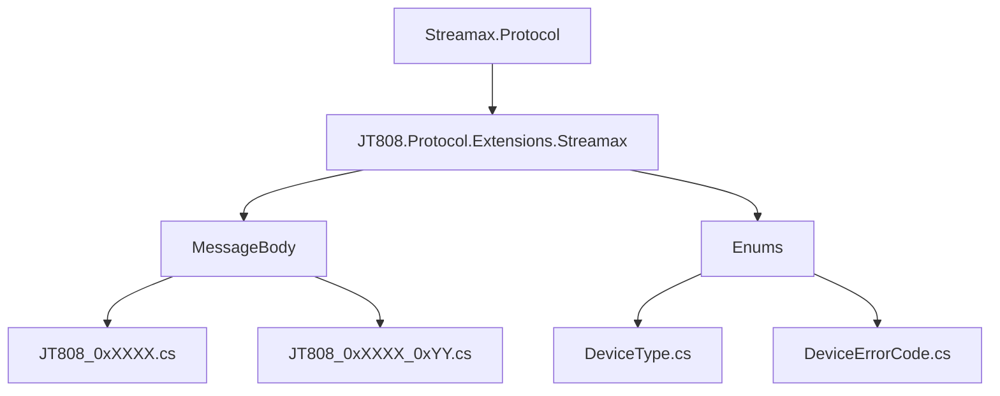
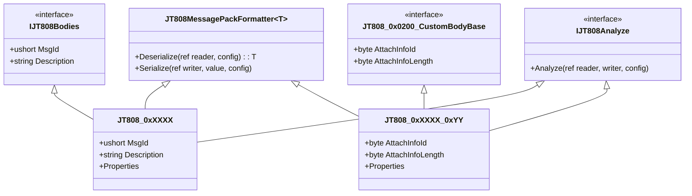
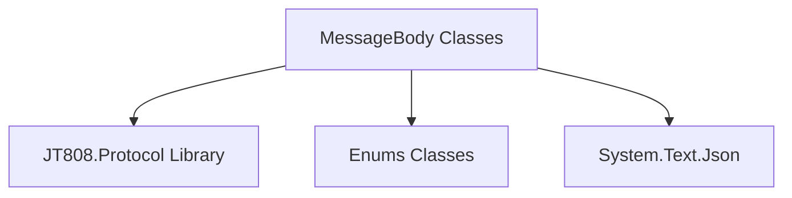

# MessageBody 消息体扩展模块


# MessageBody 消息体扩展模块

## 目录
1. [引言](#引言)
2. [项目结构概览](#项目结构概览)
3. [核心组件](#核心组件)
4. [架构概览](#架构概览)
5. [详细组件分析](#详细组件分析)
    5.1. [命名规则](#命名规则)
    5.2. [功能划分](#功能划分)
    5.3. [与协议的对应关系](#与协议的对应关系)
6. [依赖分析](#依赖分析)
7. [性能考量](#性能考量)
8. [故障排除指南](#故障排除指南)
9. [结论](#结论)
10. [参考文献](#参考文献)

## 引言
本文档旨在详细阐述 `Streamax.Protocol` 仓库中 `MessageBody` 目录下的消息体扩展类。这些类是基于 JT/T 808 协议的扩展实现，用于处理特定于 Streamax 设备的自定义消息体。通过理解这些类的命名规则、功能划分以及它们与 JT/T 808 协议的对应关系，可以为后续深入分析具体消息体提供基础。

## 项目结构概览
`Streamax.Protocol` 项目主要实现了 JT/T 808 协议的扩展功能。`MessageBody` 目录是该项目中的核心部分，它包含了所有自定义消息体的定义。


**图1: 项目核心目录结构概览**

如上图所示，`Streamax.Protocol` 解决方案中的 `JT808.Protocol.Extensions.Streamax` 项目是实现协议扩展的核心。其中，`MessageBody` 目录存放了所有自定义消息体的定义，而 `Enums` 目录则包含了消息体中可能使用到的枚举类型。

## 核心组件
`MessageBody` 目录下的每个 `.cs` 文件都代表一个特定的消息体或消息体的附加信息。这些类通常实现 `JT808Bodies` 接口，并继承 `JT808MessagePackFormatter` 泛型基类，负责消息体的序列化和反序列化。此外，它们可能还会实现 `IJT808Analyze` 接口，用于在解析过程中提供详细的分析信息。

## 架构概览
该模块的架构遵循 JT/T 808 协议的消息结构，将每个消息体或附加信息封装为一个独立的类。这种设计使得消息体的定义清晰、易于维护和扩展。


**图2: 消息体类结构示意图**

上图展示了消息体类的基本结构。`JT808_0xXXXX` 代表主消息体类，它直接实现了 `IJT808Bodies` 接口，并提供了 `MsgId` 和 `Description`。`JT808_0xXXXX_0xYY` 代表附加信息类，它通常实现 `JT808_0x0200_CustomBodyBase` 这样的特定消息的附加信息接口，并包含 `AttachInfoId` 和 `AttachInfoLength`。所有消息体类都继承自 `JT808MessagePackFormatter` 以处理序列化和反序列化，并可能实现 `IJT808Analyze` 用于分析。

## 详细组件分析

### 命名规则
`MessageBody` 目录下的文件和类遵循一套清晰的命名规则，这直接反映了它们在 JT/T 808 协议中的作用和对应关系：

1.  **主消息体类命名**:
    *   格式：`JT808_0xXXXX.cs`
    *   说明：`0xXXXX` 直接对应 JT/T 808 协议中的消息 ID。这类文件定义了该消息 ID 对应的完整消息体结构。
    *   示例：
        *   `JT808_0x0B0B.cs` 对应消息 ID `0x0B0B` (设备故障上报) [^1]。
        *   `JT808_0x8B01.cs` 对应消息 ID `0x8B01` (下发报警附件) [^3]。

2.  **附加信息/扩展消息体类命名**:
    *   格式：`JT808_0xXXXX_0xYY.cs`
    *   说明：这类命名通常表示该消息体是 `0xXXXX` 消息的附加信息或特定扩展字段。`0xYY` 通常是附加信息 ID (`AttachInfoId`)。
    *   示例：
        *   `JT808_0x0200_0x14.cs` 对应消息 ID `0x0200` (位置信息汇报) 的附加信息 `0x14` (视频相关报警) [^2]。
        *   `JT808_0x0200_0x17.cs` 对应消息 ID `0x0200` (位置信息汇报) 的附加信息 `0x17` (IO状态量) [^4]。
        *   `JT808_0x0200_0xE4.cs` 对应消息 ID `0x0200` (位置信息汇报) 的附加信息 `0xE4` (自定义扩展信息) [^5]。

### 功能划分
根据命名规则和代码内容，这些消息体类可以清晰地划分为两类主要功能：

1.  **独立消息体 (Main Message Bodies)**：
    *   这些类代表 JT/T 808 协议中一个完整的、独立的命令或上报消息。
    *   它们通常包含 `MsgId` 属性，直接指示其对应的协议消息 ID。
    *   示例：
        *   `JT808_0x0B0B` (设备故障上报) [^1]：用于上报设备的故障信息。
        *   `JT808_0x8B01` (下发报警附件) [^3]：用于平台向设备下发报警附件相关指令。
        *   `JT808_0x0B01` (车辆注册请求) [^6]：用于设备向平台发送注册请求。

2.  **附加信息/扩展消息体 (Attached Information/Extended Message Bodies)**：
    *   这些类不作为独立的消息存在，而是作为某个主消息体（最常见的是 `0x0200` 位置信息汇报）的附加信息字段。
    *   它们通常包含 `AttachInfoId` 属性，用于标识该附加信息的类型。
    *   示例：
        *   `JT808_0x0200_0x14` (视频相关报警) [^2]：作为 `0x0200` 消息的附加信息，报告视频相关的报警状态。
        *   `JT808_0x0200_0x17` (IO状态量) [^4]：作为 `0x0200` 消息的附加信息，报告设备的IO状态。
        *   `JT808_0x0200_0xE4` (自定义扩展信息) [^5]：作为 `0x0200` 消息的附加信息，用于传输自定义的扩展数据。

### 与协议的对应关系
`MessageBody` 目录下的所有类都与 JT/T 808 协议紧密相关，体现在以下几个方面：

1.  **消息 ID 映射**:
    *   每个主消息体类都通过 `MsgId` 属性明确指定了其对应的 JT/T 808 协议消息 ID。
    *   每个附加信息类通过其命名中的 `0xXXXX` 部分关联到主消息，并通过 `AttachInfoId` 属性明确其在主消息中的具体类型。
    *   例如，`JT808_0x0B0B` 类中的 `public ushort MsgId => 0x0B0B;` 直接声明了它对应的协议消息 ID [^1]。
    *   `JT808_0x0200_0x14` 类中的 `public byte AttachInfoId { get; set; } = 0x14;` 声明了它是 `0x0200` 消息的附加信息，ID 为 `0x14` [^2]。

2.  **数据结构定义**:
    *   每个类内部的属性（如 `DeviceType`, `DeviceAddress`, `AlarmTag` 等）都严格按照 JT/T 808 协议或 Streamax 扩展协议中定义的数据字段和数据类型进行设计。
    *   例如，`JT808_0x0B0B` 类包含了 `DeviceType` (设备类型), `DeviceAddress` (设备地址), `DeviceVersion` (设备版本), `DeviceErrorCode` (故障编码), `Time` (时间) 等字段，这些都直接对应协议中设备故障上报消息的结构 [^1]。

3.  **序列化与反序列化**:
    *   所有消息体类都继承自 `JT808MessagePackFormatter<T>`，并实现了 `Serialize` 和 `Deserialize` 方法。
    *   这些方法负责将对象实例转换为符合 JT/T 808 协议规范的字节流，或将字节流解析为对应的对象实例。这确保了设备与平台之间数据传输的正确性。
    *   例如，`JT808_0x0B0B` 的 `Serialize` 方法按协议规定的顺序写入字节，`Deserialize` 方法则按顺序读取字节 [^1]。

    ```csharp
    // JT808_0x0B0B.cs 中的序列化示例
    public override void Serialize(ref JT808MessagePackWriter writer, JT808_0x0B0B value, IJT808Config config)
    {
        writer.WriteByte(value.DeviceType);
        writer.WriteByte(value.DeviceAddress);
        writer.WriteString(value.DeviceVersion);
        writer.WriteByte(value.DeviceErrorCode);
        writer.WriteDateTime_yyMMddHHmmss(value.Time);
    }
    ```
    [^1]: [JT808_0x0B0B.cs](https://github.com/lishewen/Streamax.Protocol/blob/master/JT808.Protocol.Extensions.Streamax/MessageBody/JT808_0x0B0B.cs#L66-L72)

4.  **协议分析与调试**:
    *   许多消息体类实现了 `IJT808Analyze` 接口，并提供了 `Analyze` 方法。
    *   `Analyze` 方法用于在消息解析过程中生成可读的 JSON 格式分析结果，这对于调试和理解协议数据非常有用。
    *   例如，`JT808_0x0200_0x14` 的 `Analyze` 方法会详细解析 `AlarmTag` 字段的每个位，并输出对应的报警信息 [^2]。

    ```csharp
    // JT808_0x0200_0x14.cs 中的 Analyze 示例
    public void Analyze(ref JT808MessagePackReader reader, Utf8JsonWriter writer, IJT808Config config)
    {
        // ... (省略部分代码)
        writer.WriteStartArray($"[{value.AlarmTag.ReadNumber()}]视频报警标志位");
        writer.WriteStringValue((value.AlarmTag & 01) > 0 ? "视频信号丢失报警" : "视频信号丢失报警解除");
        writer.WriteStringValue((value.AlarmTag & 02) > 0 ? "主存储器故障报警" : "主存储器故障报警解除");
        // ... (省略其他报警位)
        writer.WriteEndArray();
    }
    ```
    [^2]: [JT808_0x0200_0x14.cs](https://github.com/lishewen/Streamax.Protocol/blob/master/JT808.Protocol.Extensions.Streamax/MessageBody/JT808_0x0200_0x14.cs#L22-L37)

## 依赖分析
`MessageBody` 目录下的消息体类主要依赖于以下几个核心组件：
*   **`JT808.Protocol` 库**: 提供 `JT808MessagePackFormatter` 基类、`IJT808Analyze` 接口、`JT808MessagePackReader` 和 `JT808MessagePackWriter` 等核心工具，用于消息的序列化、反序列化和分析。
*   **`JT808.Protocol.Extensions.Streamax.Enums` 命名空间**: 提供了消息体中使用的各种枚举类型，如 `DeviceType`、`DeviceAddress`、`DeviceErrorCode` 等，确保数据的一致性和可读性。
*   **`System.Text.Json`**: 用于在 `Analyze` 方法中生成 JSON 格式的分析输出。

这些依赖关系使得消息体类能够高效地处理协议数据，并与整个协议框架无缝集成。


**图3: 消息体类依赖关系图**

## 性能考量
在消息体的设计中，序列化和反序列化是性能的关键点。`JT808MessagePackFormatter` 及其内部的 `JT808MessagePackReader` 和 `JT808MessagePackWriter` 经过优化，旨在提供高效的字节流处理能力。通过直接操作字节数组和避免不必要的内存分配，可以确保在处理大量消息时保持良好的性能。

## 故障排除指南
*   **消息解析失败**: 检查消息体的字节流是否与对应的类定义（字段顺序、类型、长度）严格匹配。特别注意字符串的编码和长度前缀。
*   **`Analyze` 方法输出异常**: 确认 `Analyze` 方法中的逻辑是否正确地解析了每个字段，特别是位字段和枚举值的映射。
*   **`MsgId` 或 `AttachInfoId` 不匹配**: 确保在发送或接收消息时，消息 ID 或附加信息 ID 与代码中定义的 `MsgId` 或 `AttachInfoId` 一致。

## 结论
`MessageBody` 目录下的消息体扩展类是 `Streamax.Protocol` 项目的核心组成部分，它们通过遵循清晰的命名规则、明确的功能划分以及与 JT/T 808 协议的紧密对应，实现了对协议的有效扩展。这些类的设计考虑了数据结构的准确性、序列化反序列化的高效性以及协议分析的便利性，为后续更具体的协议消息体文档奠定了坚实的基础。

## 参考文献

[^1]: [JT808_0x0B0B.cs](https://github.com/lishewen/Streamax.Protocol/blob/master/JT808.Protocol.Extensions.Streamax/MessageBody/JT808_0x0B0B.cs)
[^2]: [JT808_0x0200_0x14.cs](https://github.com/lishewen/Streamax.Protocol/blob/master/JT808.Protocol.Extensions.Streamax/MessageBody/JT808_0x0200_0x14.cs)
[^3]: [JT808_0x8B01.cs](https://github.com/lishewen/Streamax.Protocol/blob/master/JT808.Protocol.Extensions.Streamax/MessageBody/JT808_0x8B01.cs)
[^4]: [JT808_0x0200_0x17.cs](https://github.com/lishewen/Streamax.Protocol/blob/master/JT808.Protocol.Extensions.Streamax/MessageBody/JT808_0x0200_0x17.cs)
[^5]: [JT808_0x0200_0xE4.cs](https://github.com/lishewen/Streamax.Protocol/blob/master/JT808.Protocol.Extensions.Streamax/MessageBody/JT808_0x0200_0xE4.cs)
[^6]: [JT808_0x0B01.cs](https://github.com/lishewen/Streamax.Protocol/blob/master/JT808.Protocol.Extensions.Streamax/MessageBody/JT808_0x0B01.cs)
