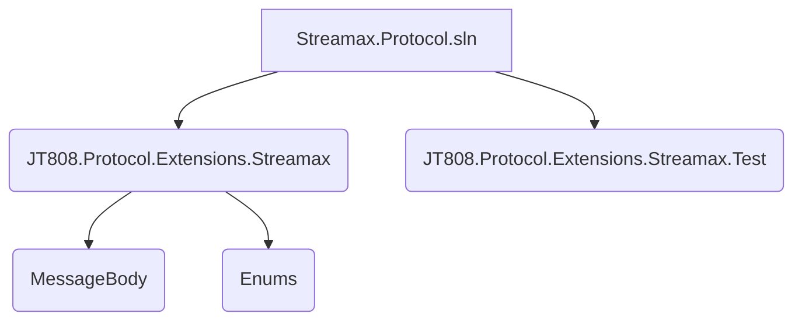
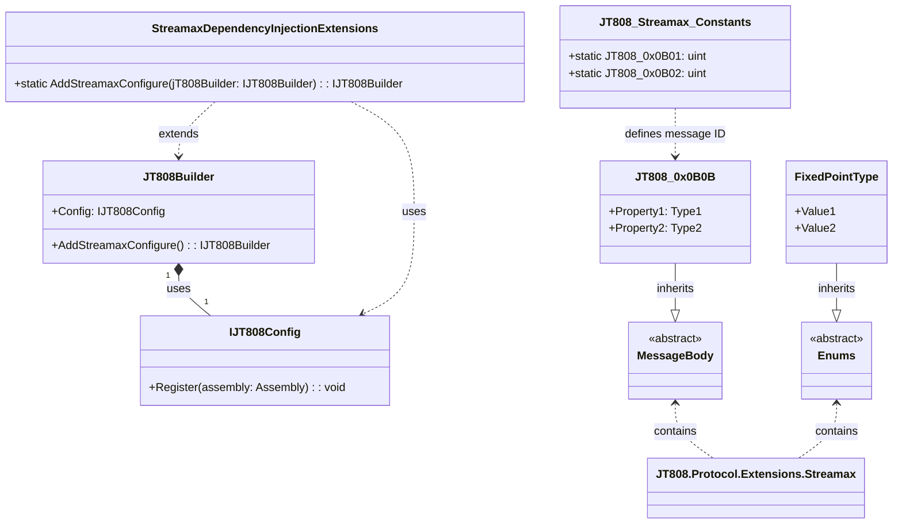
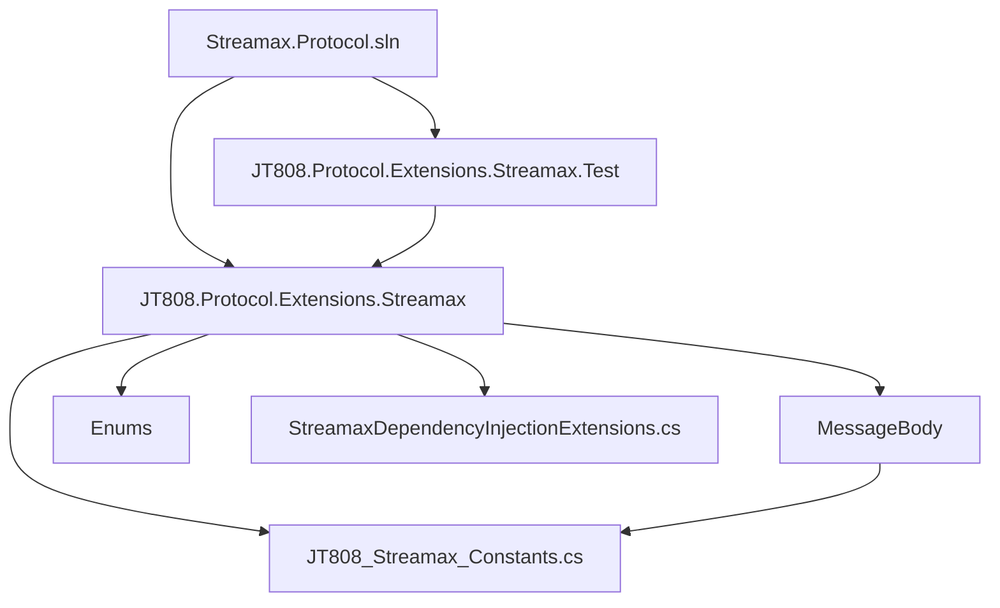

# 目录结构与模块说明

# 目录结构与模块说明

## 1. 引言
本文档旨在全面介绍 Streamax.Protocol 项目的目录结构、核心模块及其功能。通过本文档，读者可以快速理解项目的整体架构、各部分的职责以及如何进行扩展和维护。

## 2. 项目结构
该项目主要围绕 `JT808.Protocol.Extensions.Streamax` 命名空间展开，包含了协议扩展、测试以及相关的枚举定义。



## 3. 核心组件

### 3.1 `Streamax.Protocol.sln`
这是整个解决方案文件，用于管理和构建项目中的所有子项目。

### 3.2 `JT808.Protocol.Extensions.Streamax`
该目录是项目的核心，包含了对 JT808 协议的 Streamax 扩展实现。它定义了 Streamax 设备特有的消息体结构和相关常量、枚举。

#### 3.2.1 `MessageBody` 目录
此目录包含了 Streamax 扩展协议中定义的所有自定义消息体结构。每个文件通常对应一个特定的 JT808 消息ID，例如 `JT808_0x0B0B.cs` 可能定义了 ID 为 `0x0B0B` 的消息体结构。这些消息体用于解析和封装特定业务数据。

#### 3.2.2 `Enums` 目录
此目录定义了 Streamax 扩展协议中使用的各种枚举类型，例如 `FixedPointType.cs`、`DispatchType.cs` 等。这些枚举用于表示协议中的各种状态、类型或标志，提高了代码的可读性和可维护性。

#### 3.2.3 `JT808_Streamax_Constants.cs`[^1]
该文件定义了 Streamax 扩展协议中使用的常量，特别是自定义消息的命令字（消息ID）。例如，`JT808_0x0B01` 和 `JT808_0x0B02` 分别表示“运营登记”和“到离站信息上报”的命令字。这有助于统一管理和引用协议中的固定数值。

#### 3.2.4 `StreamaxDependencyInjectionExtensions.cs`[^2]
该文件包含了 Streamax 扩展协议的依赖注入扩展方法。`AddStreamaxConfigure` 方法用于将当前程序集注册到 `JT808Builder` 中，使得 JT808 协议框架能够识别并加载 Streamax 扩展中定义的消息体和相关组件。这简化了在应用程序中使用 Streamax 扩展的配置过程。

### 3.3 `JT808.Protocol.Extensions.Streamax.Test`
该目录包含了针对 Streamax 扩展协议的单元测试。每个测试文件通常对应一个特定的消息体或功能，例如 `JT808_0x8B0A_Test.cs` 用于测试 ID 为 `0x8B0A` 的消息。这些测试用例确保了协议解析和封装的正确性。

## 4. 架构概述



该项目的架构基于 JT808 协议框架进行扩展。`JT808.Protocol.Extensions.Streamax` 模块通过依赖注入的方式与 JT808 框架集成，实现了对 Streamax 特定协议消息的解析和封装。`MessageBody` 目录下的类定义了具体的协议消息结构，而 `Enums` 目录则提供了协议中使用的各种枚举常量。`JT808_Streamax_Constants` 文件集中管理了 Streamax 扩展的协议消息ID。

## 5. 详细组件分析

### 5.1 `JT808_Streamax_Constants.cs`[^1]

该文件是一个静态类，用于定义 Streamax 扩展协议中使用的常量。这些常量通常是 JT808 协议的命令字（消息ID），用于唯一标识特定的消息类型。

```csharp
namespace JT808.Protocol.Extensions.Streamax
{
    public static class JT808_Streamax_Constants
    {
        /// <summary>
        /// 运营登记
        /// </summary>
        public const uint JT808_0x0B01 = 0x0B01;
        /// <summary>
        /// 到离站信息上报
        /// </summary>
        public const uint JT808_0x0B02 = 0x0B02;
    }
}
```
通过使用常量，可以避免硬编码消息ID，提高代码的可读性和可维护性。当协议更新时，只需修改此文件中的常量定义即可。

### 5.2 `StreamaxDependencyInjectionExtensions.cs`[^2]

该文件提供了一个扩展方法 `AddStreamaxConfigure`，用于在 JT808 协议框架中注册 Streamax 扩展。

```csharp
using System;
using System.Collections.Generic;
using System.Reflection;
using System.Text;

namespace JT808.Protocol.Extensions.Streamax
{
    public static class StreamaxDependencyInjectionExtensions
    {
        public static IJT808Builder AddStreamaxConfigure(this IJT808Builder jT808Builder)
        {
            jT808Builder.Config.Register(Assembly.GetExecutingAssembly());
            return jT808Builder;
        }
    }
}
```
`AddStreamaxConfigure` 方法接收一个 `IJT808Builder` 实例，并通过调用其 `Config.Register(Assembly.GetExecutingAssembly())` 方法，将当前程序集（即包含 Streamax 扩展消息体和相关定义的程序集）注册到 JT808 框架中。这使得 JT808 框架能够在运行时发现并加载 Streamax 扩展中定义的自定义消息体，从而实现对 Streamax 协议的支持。

## 6. 依赖分析


- `Streamax.Protocol.sln` 依赖于 `JT808.Protocol.Extensions.Streamax` 和 `JT808.Protocol.Extensions.Streamax.Test`，是整个解决方案的入口。
- `JT808.Protocol.Extensions.Streamax.Test` 依赖于 `JT808.Protocol.Extensions.Streamax`，因为它需要测试 Streamax 扩展协议的实现。
- `JT808.Protocol.Extensions.Streamax` 内部，`MessageBody` 中的消息体定义可能会引用 `JT808_Streamax_Constants.cs` 中定义的常量。
- `StreamaxDependencyInjectionExtensions.cs` 依赖于 `IJT808Builder` 接口，以便将 Streamax 扩展注册到 JT808 协议框架中。

## 7. 性能考量
该项目主要关注协议的解析和封装，性能优化通常涉及以下方面：
- **消息体序列化/反序列化效率：** 确保消息体的编码和解码过程高效，避免不必要的内存分配和数据拷贝。
- **常量查找：** 使用静态常量可以提高查找效率，避免重复计算。
- **依赖注入：** 依赖注入框架通常会有一定的启动开销，但在运行时可以提高模块的解耦性和可测试性。

## 8. 故障排除指南
- **消息解析失败：** 检查消息体定义是否与实际协议规范一致，特别是字段类型、长度和顺序。
- **依赖注入错误：** 确保 `AddStreamaxConfigure` 方法在应用程序启动时被正确调用，并且相关的程序集已正确加载。
- **常量定义冲突：** 避免在不同文件中定义相同的常量，建议统一使用 `JT808_Streamax_Constants.cs`。

## 9. 结论
Streamax.Protocol 项目为 JT808 协议提供了 Streamax 特定的扩展，通过清晰的目录结构、模块化的设计和依赖注入机制，实现了对自定义消息的灵活支持。该项目易于理解和扩展，为开发基于 JT808 协议的 Streamax 设备通信应用提供了坚实的基础。

## 10. 参考文献
[^1]: [JT808_Streamax_Constants.cs](https://github.com/lishewen/Streamax.Protocol/blob/master/JT808.Protocol.Extensions.Streamax/JT808_Streamax_Constants.cs)
[^2]: [StreamaxDependencyInjectionExtensions.cs](https://github.com/lishewen/Streamax.Protocol/blob/master/JT808.Protocol.Extensions.Streamax/StreamaxDependencyInjectionExtensions.cs)