# 测试用例详解


# 测试用例详解

## 目录
1. [引言](#引言)
2. [项目结构](#项目结构)
3. [核心组件](#核心组件)
4. [架构概览](#架构概览)
5. [详细测试用例分析](#详细测试用例分析)
6. [测试扩展与自定义指南](#测试扩展与自定义指南)
7. [结论](#结论)
8. [参考文献](#参考文献)

## 引言
本文档旨在详细阐述 `Streamax.Protocol` 项目中 JT/T808 协议扩展的测试用例。通过对每个测试用例的深入分析，包括其测试目标、输入输出、验证逻辑以及与协议实现的关联，帮助读者全面理解该协议扩展的功能和验证方式。此外，本文还将提供如何扩展和自定义测试的指导，以便用户能够根据自身需求进行开发和验证。

## 项目结构
该项目主要围绕 JT/T808 协议进行扩展，特别是针对 Streamax 设备的自定义协议。测试用例集中在 `JT808.Protocol.Extensions.Streamax.Test` 目录下，每个文件通常对应一个特定的 JT/T808 消息 ID 的测试。


## 核心组件
本项目的核心在于 `JT808Serializer` 类，它负责 JT/T808 协议消息的序列化（将对象转换为字节流或十六进制字符串）和反序列化（将字节流或十六进制字符串转换为对象）。为了支持 Streamax 的自定义协议，项目通过依赖注入机制，利用 `AddJT808Configure()` 和 `AddStreamaxConfigure()` 方法来配置 `JT808Serializer`，使其能够识别和处理 Streamax 特有的消息体。

## 架构概览
测试框架的架构围绕 `JT808Serializer` 展开，通过 Xunit 进行测试。每个测试类都通过 `ServiceCollection` 构建一个配置了 Streamax 扩展的 `JT808Serializer` 实例。

```mermaid
classDiagram
    class JT808Serializer {
        +Serialize(object): byte[]
        +Analyze(byte[]): object
    }
    class IJT808Config
    class ServiceCollection
    class AddJT808Configure
    class AddStreamaxConfigure
    class JT808_0x8B0A_Test {
        -JT808Serializer JT808Serializer
        +JT808_0x8B0A_Test()
        +Json()
    }
    class JT808_0x0B0B_Test {
        -JT808Serializer JT808Serializer
        +JT808_0x0B0B_Test()
        +Json()
    }
    class JT808_0x8B05_Test {
        -JT808Serializer JT808Serializer
        +JT808_0x8B05_Test()
        +Json()
    }
    class JT808_0x0200_Test {
        -JT808Serializer JT808Serializer
        +JT808_0x0200_Test()
        +Json()
    }
    class JT808_0x0B04_Test {
        -JT808Serializer JT808Serializer
        +JT808_0x0B04_Test()
        +Json()
    }
    class JT808_0x0B02_Test {
        -JT808Serializer JT808Serializer
        +JT808_0x0B02_Test()
        +Json()
    }
    class JT808_0x8B09_Test {
        -JT808Serializer JT808Serializer
        +JT808_0x8B09_Test()
        +Json()
    }
    class JT808_0x0B01_Test {
        -JT808Serializer JT808Serializer
        +JT808_0x0B01_Test()
        +Json()
    }
    class JT808_0x0B09_Test {
        -JT808Serializer JT808Serializer
        +JT808_0x0B09_Test()
        +Json()
    }
    class JT808_0x8B01_Test {
        -JT808Serializer JT808Serializer
        +JT808_0x8B01_Test()
        +Json()
    }
    class JT808_0x0B05_Test {
        -JT808Serializer JT808Serializer
        +JT808_0x0B05_Test()
        +Json()
    }
    class JT808_0x8B02_Test {
        -JT808Serializer JT808Serializer
        +JT808_0x8B02_Test()
        +Json()
        +Hex()
    }
    class JT808_0x0B03_Test {
        -JT808Serializer JT808Serializer
        +JT808_0x0B03_Test()
        +Json()
    }

    ServiceCollection --> AddJT808Configure
    ServiceCollection --> AddStreamaxConfigure
    AddJT808Configure --|> IJT808Config
    AddStreamaxConfigure --|> IJT808Config
    IJT808Config <.. JT808Serializer
    JT808_0x8B0A_Test ..> JT808Serializer
    JT808_0x0B0B_Test ..> JT808Serializer
    JT808_0x8B05_Test ..> JT808Serializer
    JT808_0x0200_Test ..> JT808Serializer
    JT808_0x0B04_Test ..> JT808Serializer
    JT808_0x0B02_Test ..> JT808Serializer
    JT808_0x8B09_Test ..> JT808Serializer
    JT808_0x0B01_Test ..> JT808Serializer
    JT808_0x0B09_Test ..> JT808Serializer
    JT808_0x8B01_Test ..> JT808Serializer
    JT808_0x0B05_Test ..> JT808Serializer
    JT808_0x8B02_Test ..> JT808Serializer
    JT808_0x0B03_Test ..> JT808Serializer

    JT808_0x8B0A_Test ..> JT808_0x8B0A
    JT808_0x0B0B_Test ..> JT808_0x0B0B
    JT808_0x8B05_Test ..> JT808_0x8B05
    JT808_0x0200_Test ..> JT808_0x0200_0x14
    JT808_0x0200_Test ..> JT808_0x0200_0x17
    JT808_0x0200_Test ..> JT808_0x0200_0xE4
    JT808_0x0200_Test ..> JT808_0x0200_0x16
    JT808_0x0200_Test ..> JT808_0x0200_0x15
    JT808_0x0B04_Test ..> JT808_0x0B04
    JT808_0x0B02_Test ..> JT808_0x0B02
    JT808_0x8B09_Test ..> JT808_0x8B09
    JT808_0x0B01_Test ..> JT808_0x0B01
    JT808_0x0B09_Test ..> JT808_0x0B09
    JT808_0x8B01_Test ..> JT808_0x8B01
    JT808_0x0B05_Test ..> JT808_0x0B05
    JT808_0x8B02_Test ..> JT808_0x8B02
    JT808_0x0B03_Test ..> JT808_0x0B03
```


上图展示了测试类、序列化器以及协议消息体之间的关系。每个测试类都依赖于 `JT808Serializer` 来执行序列化或反序列化操作，并直接或间接地与特定的 JT/T808 消息体类（如 `JT808_0x8B0A`）相关联。

## 详细测试用例分析
以下是对 `JT808.Protocol.Extensions.Streamax.Test` 目录下各测试文件的详细说明。每个测试文件通常包含一个或多个测试方法，用于验证特定 JT/T808 消息的序列化和反序列化功能。

### 1. `JT808_0x8B0A_Test.cs`[^1]
*   **测试目标**: 验证 `0x8B0A` 消息的序列化和反序列化功能。
*   **输入**:
    *   序列化输入: 一个 `JT808_0x8B0A` 对象实例，包含 IP 地址、端口、用户名和密码等信息。
    *   反序列化输入: 由上述对象序列化生成的十六进制字符串。
*   **输出**:
    *   序列化输出: `JT808_0x8B0A` 对象的十六进制字符串表示。
    *   反序列化输出: 从十六进制字符串解析得到的 `JT808_0x8B0A` 对象。
*   **验证逻辑**: 测试通过调用 `JT808Serializer.Serialize()` 将对象转换为十六进制字符串，再调用 `JT808Serializer.Analyze()` 将该十六进制字符串反序列化回对象。验证过程隐式地确保了序列化和反序列化操作能够成功执行且不抛出异常，表明协议解析器能够正确处理 `0x8B0A` 消息的结构。
*   **与协议实现的关联**: 该测试直接关联到 `JT808_0x8B0A` 消息，该消息体定义在 `JT808.Protocol.Extensions.Streamax/MessageBody/JT808_0x8B0A.cs`[^2] 中，通常用于 Streamax 设备连接信息的上报。

### 2. `JT808_0x0B0B_Test.cs`[^3]
*   **测试目标**: 验证 `0x0B0B` 消息的反序列化功能。
*   **输入**: 一个预定义的十六进制字符串 `"7e0b0b000a0000000007240f8c01000006200927060557f77e"`。
*   **输出**: 从十六进制字符串解析得到的对象。
*   **验证逻辑**: 测试通过调用 `JT808Serializer.Analyze()` 对输入的十六进制字符串进行反序列化。验证过程隐式地确保了反序列化操作能够成功执行。
*   **与协议实现的关联**: 该测试关联到 `JT808_0x0B0B` 消息，其消息体定义在 `JT808.Protocol.Extensions.Streamax/MessageBody/JT808_0x0B0B.cs`[^4] 中。

### 3. `JT808_0x8B05_Test.cs`[^5]
*   **测试目标**: 验证 `0x8B05` 消息的反序列化功能。
*   **输入**: 一个预定义的十六进制字符串 `"7E8B050010000000000032003901210429070150343641303039344500C57E"`。
*   **输出**: 从十六进制字符串解析得到的对象。
*   **验证逻辑**: 测试通过调用 `JT808Serializer.Analyze()` 对输入的十六进制字符串进行反序列化。
*   **与协议实现的关联**: 该测试关联到 `JT808_0x8B05` 消息，其消息体定义在 `JT808.Protocol.Extensions.Streamax/MessageBody/JT808_0x8B05.cs`[^6] 中。

### 4. `JT808_0x0200_Test.cs`[^7]
*   **测试目标**: 验证 `0x0200` 消息（位置信息汇报）的反序列化功能，特别是其中包含的 Streamax 扩展字段。
*   **输入**: 一个复杂的十六进制字符串，代表一个包含多种 Streamax 扩展信息的 `0x0200` 消息。
*   **输出**: 从十六进制字符串解析得到的包含位置信息及扩展字段的对象。
*   **验证逻辑**: 测试通过调用 `JT808Serializer.Analyze()` 对输入的十六进制字符串进行反序列化。此测试的重要性在于 `0x0200` 是 JT/T808 标准协议中的核心消息，该测试验证了 Streamax 如何在该标准消息中嵌入和解析其自定义扩展。
*   **与协议实现的关联**: 该测试关联到标准的 `JT808_0x0200` 消息，并特别验证了与 Streamax 扩展消息体（如 `JT808_0x0200_0x14.cs`[^8], `JT808_0x0200_0x17.cs`[^9], `JT808_0x0200_0xE4.cs`[^10], `JT808_0x0200_0x16.cs`[^11], `JT808_0x0200_0x15.cs`[^12]）的兼容性和正确解析。

### 5. `JT808_0x0B04_Test.cs`[^13]
*   **测试目标**: 验证 `0x0B04` 消息的反序列化功能。
*   **输入**: 一个预定义的十六进制字符串 `"7E0B040028000000000102040D00000BFE0D125C11300165CC3406A14930002301900134200928092712007B2244223A32307D010A00327E"`。
*   **输出**: 从十六进制字符串解析得到的对象。
*   **验证逻辑**: 测试通过调用 `JT808Serializer.Analyze()` 对输入的十六进制字符串进行反序列化。
*   **与协议实现的关联**: 该测试关联到 `JT808_0x0B04` 消息，其消息体定义在 `JT808.Protocol.Extensions.Streamax/MessageBody/JT808_0x0B04.cs`[^14] 中。

### 6. `JT808_0x0B02_Test.cs`[^15]
*   **测试目标**: 验证 `0x0B02` 消息的反序列化功能。
*   **输入**: 一个预定义的十六进制字符串 `"7E0B02002A0000000006220375000001EC03020000002505840166583406A25AB90023000000CC220527110205000D2EC10001010100006F7E"`。
*   **输出**: 从十六进制字符串解析得到的对象。
*   **验证逻辑**: 测试通过调用 `JT808Serializer.Analyze()` 对输入的十六进制字符串进行反序列化。
*   **与协议实现的关联**: 该测试关联到 `JT808_0x0B02` 消息，其消息体定义在 `JT808.Protocol.Extensions.Streamax/MessageBody/JT808_0x0B02.cs`[^16] 中。

### 7. `JT808_0x8B09_Test.cs`[^17]
*   **测试目标**: 验证 `0x8B09` 消息的反序列化功能。
*   **输入**: 一个预定义的十六进制字符串 `"7E8B09002D0000000007581071006601210429071030000001680000000101000000002104290710302104290710300000000000000000000000B47E"`。
*   **输出**: 从十六进制字符串解析得到的对象。
*   **验证逻辑**: 测试通过调用 `JT808Serializer.Analyze()` 对输入的十六进制字符串进行反序列化。
*   **与协议实现的关联**: 该测试关联到 `JT808_0x8B09` 消息，其消息体定义在 `JT808.Protocol.Extensions.Streamax/MessageBody/JT808_0x8B09.cs`[^18] 中。

### 8. `JT808_0x0B01_Test.cs`[^19]
*   **测试目标**: 验证 `0x0B01` 消息的反序列化功能。
*   **输入**: 一个预定义的十六进制字符串 `"7e0b01000d0000000007920f4c000000dc656530343736643500597e"`。
*   **输出**: 从十六进制字符串解析得到的对象。
*   **验证逻辑**: 测试通过调用 `JT808Serializer.Analyze()` 对输入的十六进制字符串进行反序列化。
*   **与协议实现的关联**: 该测试关联到 `JT808_0x0B01` 消息，其消息体定义在 `JT808.Protocol.Extensions.Streamax/MessageBody/JT808_0x0B01.cs`[^20] 中。

### 9. `JT808_0x0B09_Test.cs`[^21]
*   **测试目标**: 验证 `0x0B09` 消息的反序列化功能。
*   **输入**: 一个预定义的十六进制字符串 `"7e0b09000c00000000005000210000082a0006200927062036457e"`。
*   **输出**: 从十六进制字符串解析得到的对象。
*   **验证逻辑**: 测试通过调用 `JT808Serializer.Analyze()` 对输入的十六进制字符串进行反序列化。
*   **与协议实现的关联**: 该测试关联到 `JT808_0x0B09` 消息，其消息体定义在 `JT808.Protocol.Extensions.Streamax/MessageBody/JT808_0x0B09.cs`[^22] 中。

### 10. `JT808_0x8B01_Test.cs`[^23]
*   **测试目标**: 验证 `0x8B01` 消息的反序列化功能。
*   **输入**: 一个预定义的十六进制字符串 `"7E8B01004E000000000115F4830000000000003131350002010000000021042907000000000000000000000000000000000000C7EBD3DA37B5E330B7D6B7A2B3B53B7B54533A332C4F54533A312C4F543A36307D0100210429070009C97E"`。
*   **输出**: 从十六进制字符串解析得到的对象。
*   **验证逻辑**: 测试通过调用 `JT808Serializer.Analyze()` 对输入的十六进制字符串进行反序列化。
*   **与协议实现的关联**: 该测试关联到 `JT808_0x8B01` 消息，其消息体定义在 `JT808.Protocol.Extensions.Streamax/MessageBody/JT808_0x8B01.cs`[^24] 中。

### 11. `JT808_0x0B05_Test.cs`[^25]
*   **测试目标**: 验证 `0x0B05` 消息的反序列化功能。
*   **输入**: 一个预定义的十六进制字符串 `"7e0b05001500000000076400790000000a6636396566613464002009270609340301677e"`。
*   **输出**: 从十六进制字符串解析得到的对象。
*   **验证逻辑**: 测试通过调用 `JT808Serializer.Analyze()` 对输入的十六进制字符串进行反序列化。
*   **与协议实现的关联**: 该测试关联到 `JT808_0x0B05` 消息，其消息体定义在 `JT808.Protocol.Extensions.Streamax/MessageBody/JT808_0x0B05.cs`[^26] 中。

### 12. `JT808_0x8B02_Test.cs`[^27]
*   **测试目标**: 验证 `0x8B02` 消息的反序列化和序列化功能。
*   **输入**:
    *   `Json` 测试: 一个预定义的十六进制字符串 `"7E8B020006000000000115F484000000000200E97E"`。
    *   `Hex` 测试: 一个 `JT808Package` 对象实例，包含消息头 (`MsgId = 0x8B02`, `ManualMsgNum = 10`, `TerminalPhoneNo = "00000009999"`) 和 `JT808_0x8B02` 消息体 (`GprsId = 0`, `TrafficType = 2`, `Additional = string.Empty`)。
*   **输出**:
    *   `Json` 测试: 从十六进制字符串解析得到的对象。
    *   `Hex` 测试: `JT808Package` 对象的十六进制字符串表示。
*   **验证逻辑**:
    *   `Json` 测试: 调用 `JT808Serializer.Analyze()` 对输入的十六进制字符串进行反序列化。
    *   `Hex` 测试: 调用 `JT808Serializer.Serialize()` 将构造的 `JT808Package` 对象序列化为十六进制字符串。
    两种测试都隐式地验证了操作的成功执行。
*   **与协议实现的关联**: 该测试关联到 `JT808_0x8B02` 消息，其消息体定义在 `JT808.Protocol.Extensions.Streamax/MessageBody/JT808_0x8B02.cs`[^28] 中。此文件是唯一一个同时包含消息的序列化和反序列化测试的用例。

### 13. `JT808_0x0B03_Test.cs`[^29]
*   **测试目标**: 验证 `0x0B03` 消息的反序列化功能。
*   **输入**: 一个预定义的十六进制字符串 `"7e0b0300240000000007940036000000dc02010000001c04016635c206a28276002700c80111200927060933000000ed9a347e"`。
*   **输出**: 从十六进制字符串解析得到的对象。
*   **验证逻辑**: 测试通过调用 `JT808Serializer.Analyze()` 对输入的十六进制字符串进行反序列化。
*   **与协议实现的关联**: 该测试关联到 `JT808_0x0B03` 消息，其消息体定义在 `JT808.Protocol.Extensions.Streamax/MessageBody/JT808_0x0B03.cs`[^30] 中。

## 测试扩展与自定义指南

用户可以根据以下步骤扩展和自定义测试用例：

1.  **创建新的测试类**:
    在 `JT808.Protocol.Extensions.Streamax.Test` 项目下，创建一个新的 C# 类文件，例如 `JT808_0xXXXX_Test.cs` (其中 `XXXX` 是您要测试的消息 ID)。

2.  **设置测试环境**:
    在新创建的测试类中，复制现有测试类的构造函数逻辑，以确保 `JT808Serializer` 正确配置了 Streamax 扩展。
    ```csharp
    using Microsoft.Extensions.DependencyInjection;
    using Xunit;
    // 引入您要测试的消息体命名空间
    using JT808.Protocol.Extensions.Streamax.MessageBody;
    using System; // 如果需要用到ToHexBytes()等扩展方法

    public class JT808_0xXXXX_Test
    {
        readonly JT808Serializer JT808Serializer;

        public JT808_0xXXXX_Test()
        {
            ServiceCollection serviceDescriptors = new();
            // 确保添加了JT808和Streamax的配置
            serviceDescriptors.AddJT808Configure().AddStreamaxConfigure();
            IJT808Config jT808Config = serviceDescriptors.BuildServiceProvider().GetRequiredService<IJT808Config>();
            JT808Serializer = new JT808Serializer(jT808Config);
        }

        // ... 您的测试方法
    }
    ```

3.  **编写反序列化测试 (Analyze)**:
    如果您有一个已知的十六进制协议数据包，并希望验证其是否能正确解析为对象，可以编写一个反序列化测试方法。
    ```csharp
    [Fact]
    public void Analyze_KnownHexString_ShouldParseCorrectly()
    {
        // 替换为您的消息的实际十六进制字符串
        string hexString = "7e...";
        // 调用Analyze方法进行反序列化
        var resultObject = JT808Serializer.Analyze(hexString.ToHexBytes());

        // 在此处添加断言 (Assertions) 来验证解析结果的正确性
        // 例如: Assert.NotNull(resultObject);
        // Assert.IsType<JT808_0xXXXX>(resultObject);
        // Assert.Equal(expectedValue, ((JT808_0xXXXX)resultObject).PropertyName);
    }
    ```

4.  **编写序列化测试 (Serialize)**:
    如果您希望验证一个对象是否能正确序列化为符合协议规范的十六进制数据包，可以编写一个序列化测试方法。
    ```csharp
    [Fact]
    public void Serialize_Object_ShouldGenerateCorrectHexString()
    {
        // 实例化您要测试的消息体对象，并填充数据
        JT808_0xXXXX messageBody = new JT808_0xXXXX
        {
            // 填充消息体的属性
            Property1 = "value1",
            Property2 = 123
        };

        // 如果您的消息需要一个完整的JT808包结构（包含消息头等），可以这样构建：
        JT808Package package = new JT808Package
        {
            Header = new JT808Header
            {
                MsgId = 0xXXXX, // 您的消息ID
                TerminalPhoneNo = "12345678901",
                // 其他消息头属性
            },
            Bodies = messageBody
        };

        // 调用Serialize方法进行序列化
        string generatedHexString = JT808Serializer.Serialize(package).ToHexString();

        // 在此处添加断言来验证生成的十六进制字符串是否符合预期
        // 例如: Assert.Equal("7e...", generatedHexString);
    }
    ```

5.  **添加断言 (Assertions)**:
    虽然示例代码中很多测试只是简单地执行了 `Analyze` 或 `Serialize` 并将结果存储到变量中，但在实际的测试中，强烈建议使用 `Xunit` 提供的 `Assert` 类来明确验证输出的正确性。例如，您可以断言反序列化后的对象属性值是否符合预期，或者序列化后的十六进制字符串是否与已知正确值匹配。

通过遵循上述步骤，用户可以轻松地为新的 JT/T808 消息或现有消息的不同场景添加测试用例，从而确保协议实现的健壮性和准确性。

## 结论
`Streamax.Protocol` 项目中的测试用例提供了一个清晰的框架，用于验证 JT/T808 协议及其 Streamax 扩展的序列化和反序列化功能。通过对每个测试用例的详细分析，我们了解了其测试目标、输入输出和验证逻辑，以及它们如何与底层的协议消息体实现相关联。这些测试是确保协议正确解析和构建的关键组成部分。同时，本文提供的扩展和自定义测试指南将帮助开发者更好地利用该框架进行进一步的开发和验证工作。

## 参考文献
[^1]: [JT808_0x8B0A_Test.cs](https://github.com/lishewen/Streamax.Protocol/blob/master/JT808.Protocol.Extensions.Streamax.Test/JT808_0x8B0A_Test.cs)
[^2]: [JT808_0x8B0A.cs](https://github.com/lishewen/Streamax.Protocol/blob/master/JT808.Protocol.Extensions.Streamax/MessageBody/JT808_0x8B0A.cs)
[^3]: [JT808_0x0B0B_Test.cs](https://github.com/lishewen/Streamax.Protocol/blob/master/JT808.Protocol.Extensions.Streamax.Test/JT808_0x0B0B_Test.cs)
[^4]: [JT808_0x0B0B.cs](https://github.com/lishewen/Streamax.Protocol/blob/master/JT808.Protocol.Extensions.Streamax/MessageBody/JT808_0x0B0B.cs)
[^5]: [JT808_0x8B05_Test.cs](https://github.com/lishewen/Streamax.Protocol/blob/master/JT808.Protocol.Extensions.Streamax.Test/JT808_0x8B05_Test.cs)
[^6]: [JT808_0x8B05.cs](https://github.com/lishewen/Streamax.Protocol/blob/master/JT808.Protocol.Extensions.Streamax/MessageBody/JT808_0x8B05.cs)
[^7]: [JT808_0x0200_Test.cs](https://github.com/lishewen/Streamax.Protocol/blob/master/JT808.Protocol.Extensions.Streamax.Test/JT808_0x0200_Test.cs)
[^8]: [JT808_0x0200_0x14.cs](https://github.com/lishewen/Streamax.Protocol/blob/master/JT808.Protocol.Extensions.Streamax/MessageBody/JT808_0x0200_0x14.cs)
[^9]: [JT808_0x0200_0x17.cs](https://github.com/lishewen/Streamax.Protocol/blob/master/JT808.Protocol.Extensions.Streamax/MessageBody/JT808_0x0200_0x17.cs)
[^10]: [JT808_0x0200_0xE4.cs](https://github.com/lishewen/Streamax.Protocol/blob/master/JT808.Protocol.Extensions.Streamax/MessageBody/JT808_0x0200_0xE4.cs)
[^11]: [JT808_0x0200_0x16.cs](https://github.com/lishewen/Streamax.Protocol/blob/master/JT808.Protocol.Extensions.Streamax/MessageBody/JT808_0x0200_0x16.cs)
[^12]: [JT808_0x0200_0x15.cs](https://github.com/lishewen/Streamax.Protocol/blob/master/JT808.Protocol.Extensions.Streamax/MessageBody/JT808_0x0200_0x15.cs)
[^13]: [JT808_0x0B04_Test.cs](https://github.com/lishewen/Streamax.Protocol/blob/master/JT808.Protocol.Extensions.Streamax.Test/JT808_0x0B04_Test.cs)
[^14]: [JT808_0x0B04.cs](https://github.com/lishewen/Streamax.Protocol/blob/master/JT808.Protocol.Extensions.Streamax/MessageBody/JT808_0x0B04.cs)
[^15]: [JT808_0x0B02_Test.cs](https://github.com/lishewen/Streamax.Protocol/blob/master/JT808.Protocol.Extensions.Streamax.Test/JT808_0x0B02_Test.cs)
[^16]: [JT808_0x0B02.cs](https://github.com/lishewen/Streamax.Protocol/blob/master/JT808.Protocol.Extensions.Streamax/MessageBody/JT808_0x0B02.cs)
[^17]: [JT808_0x8B09_Test.cs](https://github.com/lishewen/Streamax.Protocol/blob/master/JT808.Protocol.Extensions.Streamax.Test/JT808_0x8B09_Test.cs)
[^18]: [JT808_0x8B09.cs](https://github.com/lishewen/Streamax.Protocol/blob/master/JT808.Protocol.Extensions.Streamax/MessageBody/JT808_0x8B09.cs)
[^19]: [JT808_0x0B01_Test.cs](https://github.com/lishewen/Streamax.Protocol/blob/master/JT808.Protocol.Extensions.Streamax.Test/JT808_0x0B01_Test.cs)
[^20]: [JT808_0x0B01.cs](https://github.com/lishewen/Streamax.Protocol/blob/master/JT808.Protocol.Extensions.Streamax/MessageBody/JT808_0x0B01.cs)
[^21]: [JT808_0x0B09_Test.cs](https://github.com/lishewen/Streamax.Protocol/blob/master/JT808.Protocol.Extensions.Streamax.Test/JT808_0x0B09_Test.cs)
[^22]: [JT808_0x0B09.cs](https://github.com/lishewen/Streamax.Protocol/blob/master/JT808.Protocol.Extensions.Streamax/MessageBody/JT808_0x0B09.cs)
[^23]: [JT808_0x8B01_Test.cs](https://github.com/lishewen/Streamax.Protocol/blob/master/JT808.Protocol.Extensions.Streamax.Test/JT808_0x8B01_Test.cs)
[^24]: [JT808_0x8B01.cs](https://github.com/lishewen/Streamax.Protocol/blob/master/JT808.Protocol.Extensions.Streamax/MessageBody/JT808_0x8B01.cs)
[^25]: [JT808_0x0B05_Test.cs](https://github.com/lishewen/Streamax.Protocol/blob/master/JT808.Protocol.Extensions.Streamax.Test/JT808_0x0B05_Test.cs)
[^26]: [JT808_0x0B05.cs](https://github.com/lishewen/Streamax.Protocol/blob/master/JT808.Protocol.Extensions.Streamax/MessageBody/JT808_0x0B05.cs)
[^27]: [JT808_0x8B02_Test.cs](https://github.com/lishewen/Streamax.Protocol/blob/master/JT808.Protocol.Extensions.Streamax.Test/JT808_0x8B02_Test.cs)
[^28]: [JT808_0x8B02.cs](https://github.com/lishewen/Streamax.Protocol/blob/master/JT808.Protocol.Extensions.Streamax/MessageBody/JT808_0x8B02.cs)
[^29]: [JT808_0x0B03_Test.cs](https://github.com/lishewen/Streamax.Protocol/blob/master/JT808.Protocol.Extensions.Streamax.Test/JT808_0x0B03_Test.cs)
[^30]: [JT808_0x0B03.cs](https://github.com/lishewen/Streamax.Protocol/blob/master/JT808.Protocol.Extensions.Streamax/MessageBody/JT808_0x0B03.cs)
