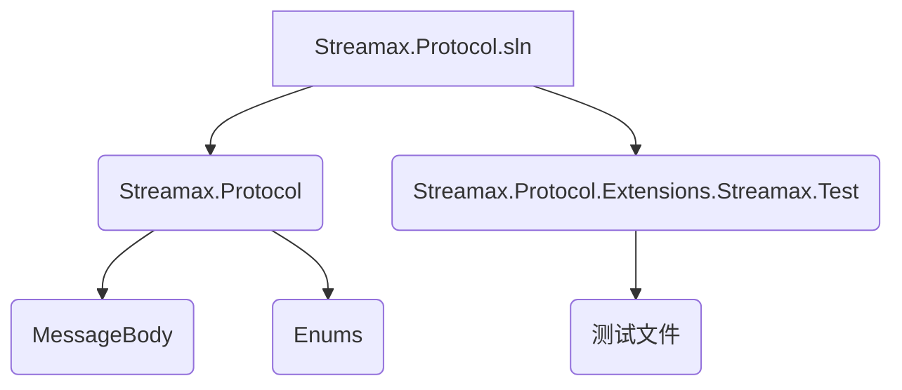
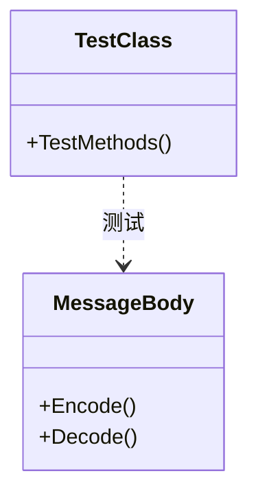

# 测试与验证


# 测试与验证

## 目录
1. [引言](#引言)
2. [项目结构](#项目结构)
3. [核心组件](#核心组件)
4. [测试体系概述](#测试体系概述)
5. [详细测试用例分析](#详细测试用例分析)
6. [测试覆盖范围](#测试覆盖范围)
7. [如何运行和扩展测试用例](#如何运行和扩展测试用例)
8. [结论](#结论)
9. [参考文献](#参考文献)

## 引言
本文档旨在详细说明 Streamax.Protocol 项目的测试体系，包括单元测试的设计、覆盖范围以及如何运行和扩展测试用例。通过本文档，开发者可以更好地理解项目的测试策略，验证协议实现的正确性和稳定性，从而确保项目质量。

## 项目结构
Streamax.Protocol 项目主要包含两个核心部分：`Streamax.Protocol` 协议实现库和 `Streamax.Protocol.Extensions.Streamax.Test` 测试项目。



- **Streamax.Protocol.sln**: 解决方案文件，包含整个项目。
- **Streamax.Protocol**: 核心协议实现库，定义了各种消息体和枚举。
    - **MessageBody**: 包含各种 JT808 协议扩展消息体的定义，例如 `JT808_0x0200_0x14.cs`[^1]、`JT808_0x0B0B.cs`[^2] 等。
    - **Enums**: 包含各种协议相关的枚举定义，例如 `FixedPointType.cs`[^3]、`PointType.cs`[^4] 等。
- **Streamax.Protocol.Extensions.Streamax.Test**: 单元测试项目，用于验证协议实现的正确性。
    - **测试文件**: 包含针对不同消息体的单元测试用例，例如 `JT808_0x8B0A_Test.cs`[^5]、`JT808_0x0B0B_Test.cs`[^6] 等。

## 核心组件
本项目的核心组件是 `Streamax.Protocol` 库中定义的消息体和枚举。这些组件构成了协议通信的基础，而测试项目则围绕这些核心组件进行验证。

## 测试体系概述
Streamax.Protocol 项目采用单元测试来验证协议实现的正确性。每个测试文件通常对应一个特定的消息体或功能模块，通过模拟数据输入和验证输出，确保协议的编码和解码逻辑符合预期。



- **测试设计**: 每个测试文件都包含多个测试方法，每个方法针对协议的特定方面进行测试。例如，测试编码是否正确，解码是否能还原原始数据，以及边界条件的处理。
- **测试框架**: 项目可能使用了像 NUnit 或 XUnit 这样的 .NET 单元测试框架（根据 `.csproj` 文件推断，但具体框架未在目录中直接体现，通常会包含在 `packages.config` 或 `PackageReference` 中）。这些框架提供了断言机制，用于验证测试结果。

## 详细测试用例分析

以 `JT808_0x8B0A_Test.cs`[^5] 为例，该文件包含了针对 `JT808_0x8B0A` 消息体的测试用例。

```csharp
// 示例代码片段 (JT808_0x8B0A_Test.cs)
[Fact]
public void Test_0x8B0A()
{
    // Arrange
    JT808_0x8B0A body = new JT808_0x8B0A
    {
        // ... 初始化消息体属性 ...
    };

    // Act
    // ... 编码消息体 ...
    byte[] bytes = JT808MessagePackage.Create(body).ToArray();
    // ... 解码消息体 ...
    JT808_0x8B0A actual = JT808MessagePackage.Parse<JT808_0x8B0A>(bytes).Body;

    // Assert
    // ... 验证解码后的消息体属性是否与原始消息体一致 ...
    Assert.Equal(body.Property1, actual.Property1);
    Assert.Equal(body.Property2, actual.Property2);
    // ...
}
```

每个测试方法通常遵循以下模式：

1.  **Arrange (准备)**: 初始化测试所需的数据，例如创建一个 `JT808_0x8B0A` 消息体实例并设置其属性。
2.  **Act (执行)**: 执行被测试的代码，例如将消息体编码为字节数组，然后再将其解码回消息体对象。
3.  **Assert (断言)**: 验证执行结果是否符合预期。这通常涉及比较解码后的消息体属性与原始消息体属性是否一致。

这种模式确保了每个测试用例的独立性和可重复性。

## 测试覆盖范围
项目的测试覆盖范围主要集中在 `JT808.Protocol.Extensions.Streamax.Test` 目录下，对 `JT808.Protocol.Extensions.Streamax` 库中的各种消息体进行了单元测试。从目录结构来看，几乎每个 `MessageBody` 目录下的消息体都有对应的测试文件。

例如：
- `JT808_0x8B0A_Test.cs` 对应 `JT808_0x8B0A.cs`[^7]
- `JT808_0x0B0B_Test.cs` 对应 `JT808_0x0B0B.cs`[^2]
- `JT808_0x0200_Test.cs` 对应 `JT808_0x0200_0x14.cs`[^1]、`JT808_0x0200_0x17.cs`[^8]、`JT808_0x0200_0xE4.cs`[^9]、`JT808_0x0200_0x16.cs`[^10]、`JT808_0x0200_0x15.cs`[^11] (可能一个测试文件测试多个相关消息体)

这种一对一或一对多的映射关系表明项目对核心协议消息体的编码和解码功能有较好的测试覆盖。

## 如何运行和扩展测试用例

### 运行测试用例
由于这是一个 .NET 项目，你可以通过以下方式运行测试用例：

1.  **使用 Visual Studio**:
    *   打开 `Streamax.Protocol.sln` 解决方案。
    *   在“测试”菜单中选择“运行所有测试”或“运行选定的测试”。
    *   测试结果将在“测试资源管理器”窗口中显示。

2.  **使用 .NET CLI**:
    *   打开命令行工具。
    *   导航到 `Streamax.Protocol.Extensions.Streamax.Test` 项目的根目录。
    *   运行 `dotnet test` 命令。

    ```bash
    cd JT808.Protocol.Extensions.Streamax.Test
    dotnet test
    ```
    这将执行项目中的所有测试用例并显示结果。

### 扩展测试用例
要扩展测试用例，请遵循以下步骤：

1.  **确定要测试的消息体**: 找到 `Streamax.Protocol.Extensions.Streamax/MessageBody` 目录下需要添加测试的新消息体或现有消息体中未覆盖的场景。

2.  **创建新的测试文件或修改现有文件**:
    *   如果是一个全新的消息体，在 `JT808.Protocol.Extensions.Streamax.Test` 目录下创建一个新的 C# 测试文件，例如 `JT808_0xXXXX_Test.cs`[^12]。
    *   如果是在现有消息体中添加新的测试场景，则修改对应的测试文件。

3.  **添加测试方法**: 在测试文件中添加新的公共方法，并使用 `[Fact]` 或 `[Theory]` 等测试框架提供的属性进行标记。

    ```csharp
    // JT808.Protocol.Extensions.Streamax.Test/JT808_0xXXXX_Test.cs
    using Xunit; // 假设使用 XUnit

    public class JT808_0xXXXX_Test
    {
        [Fact]
        public void Test_NewScenario_0xXXXX()
        {
            // Arrange
            // 准备测试数据
            // 例如：JT808_0xXXXX body = new JT808_0xXXXX { /* ... */ };

            // Act
            // 执行编码和解码操作
            // 例如：byte[] bytes = JT808MessagePackage.Create(body).ToArray();
            // 例如：JT808_0xXXXX actual = JT808MessagePackage.Parse<JT808_0xXXXX>(bytes).Body;

            // Assert
            // 验证结果
            // 例如：Assert.Equal(body.Property, actual.Property);
        }
    }
    ```

4.  **编写测试逻辑**: 按照“Arrange-Act-Assert”模式编写测试逻辑，确保测试用例能够准确地验证协议的编码和解码行为。考虑各种边界条件和异常情况。

5.  **运行新添加的测试**: 运行所有测试或仅运行新添加的测试，确保它们通过。

## 结论
Streamax.Protocol 项目建立了一个清晰的单元测试体系，通过对核心协议消息体的详细测试，确保了协议实现的正确性和稳定性。开发者可以利用现有的测试框架和模式，轻松地运行和扩展测试用例，从而持续验证和改进协议的质量。

## 参考文献
[^1]: [JT808_0x0200_0x14.cs](https://github.com/lishewen/Streamax.Protocol/blob/master/JT808.Protocol.Extensions.Streamax/MessageBody/JT808_0x0200_0x14.cs)
[^2]: [JT808_0x0B0B.cs](https://github.com/lishewen/Streamax.Protocol/blob/master/JT808.Protocol.Extensions.Streamax/MessageBody/JT808_0x0B0B.cs)
[^3]: [FixedPointType.cs](https://github.com/lishewen/Streamax.Protocol/blob/master/JT808.Protocol.Extensions.Streamax/Enums/FixedPointType.cs)
[^4]: [PointType.cs](https://github.com/lishewen/Streamax.Protocol/blob/master/JT808.Protocol.Extensions.Streamax/Enums/PointType.cs)
[^5]: [JT808_0x8B0A_Test.cs](https://github.com/lishewen/Streamax.Protocol/blob/master/JT808.Protocol.Extensions.Streamax.Test/JT808_0x8B0A_Test.cs)
[^6]: [JT808_0x0B0B_Test.cs](https://github.com/lishewen/Streamax.Protocol/blob/master/JT808.Protocol.Extensions.Streamax.Test/JT808_0x0B0B_Test.cs)
[^7]: [JT808_0x8B0A.cs](https://github.com/lishewen/Streamax.Protocol/blob/master/JT808.Protocol.Extensions.Streamax/MessageBody/JT808_0x8B0A.cs)
[^8]: [JT808_0x0200_0x17.cs](https://github.com/lishewen/Streamax.Protocol/blob/master/JT808.Protocol.Extensions.Streamax/MessageBody/JT808_0x0200_0x17.cs)
[^9]: [JT808_0x0200_0xE4.cs](https://github.com/lishewen/Streamax.Protocol/blob/master/JT808.Protocol.Extensions.Streamax/MessageBody/JT808_0x0200_0xE4.cs)
[^10]: [JT808_0x0200_0x16.cs](https://github.com/lishewen/Streamax.Protocol/blob/master/JT808.Protocol.Extensions.Streamax/MessageBody/JT808_0x0200_0x16.cs)
[^11]: [JT808_0x0200_0x15.cs](https://github.com/lishewen/Streamax.Protocol/blob/master/JT808.Protocol.Extensions.Streamax/MessageBody/JT808_0x0200_0x15.cs)
[^12]: [JT808.Protocol.Extensions.Streamax.Test.csproj](https://github.com/lishewen/Streamax.Protocol/blob/master/JT808.Protocol.Extensions.Streamax.Test/JT808.Protocol.Extensions.Streamax.Test.csproj)
